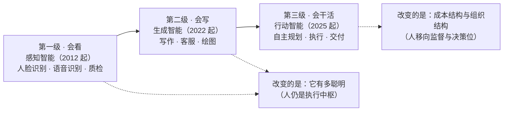

## 1.1 三级跳：会看、会写、会干活

理解人工智能的商业本质，最有效的办法不是追逐每周更新的模型动态，而是把过去十余年的技术演进压缩成一条主线。本书把这条主线概括为"三级跳"：会看、会写、会干活。三级之间不是简单的性能升级，而是商业含义完全不同的三种能力。

### 1.1.1 第一级：感知智能，机器"会看"

2012 年，深度学习方法在 ImageNet 图像识别竞赛中以领先第二名约十个百分点的错误率优势夺冠，通常被视为本轮人工智能浪潮的起点。此后十年，感知智能陆续进入产业：人脸识别用于身份核验与门禁支付，语音识别撑起呼叫中心的转写与质检，机器视觉在产线上挑出有缺陷的工件。

感知智能解决的问题，是把物理世界的信号变成机器可处理的判断——照片里是谁、这句话说了什么、这个轮毂有没有裂纹。它的商业形态是单点功能：嵌进既有流程的某一个环节，替代一双眼睛或一对耳朵。对企业而言，它的采购与集成逻辑同传统软硬件几乎没有区别。

### 1.1.2 第二级：生成智能，机器"会写"

2022 年 11 月 ChatGPT 发布，标志着第二级到来。以大模型为底座的生成智能，第一次让机器能够"造出"东西：写文案、答客服、画海报、生成代码。与感知智能相比，它有两个新性质。一是通用：同一个模型既能写周报也能改合同，不再是"一个场景训练一个模型"。二是零门槛：自然语言本身就是操作界面，任何会打字的员工都能立刻使用——ChatGPT 上线约两个月，月活跃用户即被估算突破一亿（瑞银基于第三方流量数据的测算），普及速度在消费级应用史上空前。

但必须看清一点：前两级尽管了不起，改变的都只是"它有多聪明"。无论识别准确率多高、文字生成多流畅，产出仍然要由人来核对、修改、拼装进业务流程——人始终是执行链条的中枢，AI 是外挂在人身上的效率放大器。

### 1.1.3 第三级：行动智能，机器"会干活"

2025 年前后，智能体（AI Agent，指能够自主规划步骤、调用工具、执行任务并交付结果的 AI 系统）开始规模化进入企业，这是第三级：行动智能。它与前两级的分界，用一句话即可概括：能回答的只是助手，能交付的才是员工。助手替人省下的是"查资料"的成本；而数字员工接走的是"把这件事办成"的整份工作——接任务、定方案、调工具、动手执行、自我检查、出错纠正，一个完整闭环（其工作机制详见第二章[六步闭环](../02_agent/2.2_work_loop.md)，[智能体的定义](../02_agent/2.1_definition.md)亦在该章展开）。

为什么只有第三级才称得上生产力的质变？因为它第一次改动了企业的两样底层结构。其一是成本结构：执行类任务的单位成本，从"人力时薪"的量级向"算力账单"的量级迁移，这笔账的具体算法见[第三章](../03_why_now/3.2_cost_curve.md)。其二是组织结构：当执行可以委托给数字员工，人就从执行位移向定义任务、验收结果、承担责任的监督位，部门的编制逻辑与岗位的价值排序都需要重排。

下图把三级跳放在同一张图上，标出每一级的代表能力与它真正改变的东西。

图1-1 AI 能力三级跳示意

两点说明。
第一，三级是叠加而非替代的关系：产线上的视觉质检模型不会因为智能体出现而失效，生成式工具也仍在大量岗位上发挥作用；图中年份是公认的标志性节点，而非能力的突变点。
第二，这张图对管理者的用法是"定位"：你的企业里正在讨论的那个"AI 项目"，落在哪一级？如果答案停留在前两级，那么讨论的还只是效率工具，归口在部门预算即可；只有落到第三级，它才触及成本与组织这两个必须由一把手拍板的议题。
