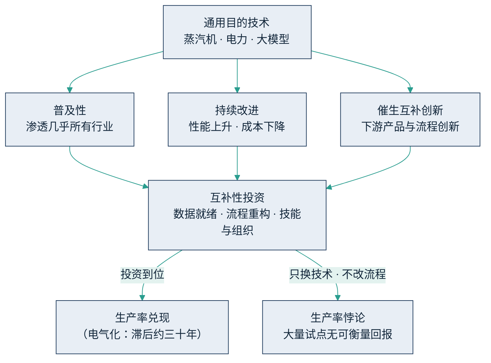

## 1.2 大模型：新的通用目的技术

上一节把智能体放在三级跳的顶端，本节回到它的底座——大模型（在海量语料上预训练、可通过自然语言调用的通用 AI 模型），回答一个更基础的问题：这项技术在经济学意义上属于哪一类？答案决定了企业应当用什么心智模型对待它。本节只讨论经济属性；大模型的技术机理与局限，留给[第四章](../04_llm/README.md)。

### 1.2.1 通用目的技术的三个特征

经济学家 Bresnahan 与 Trajtenberg 在 1995 年提出[“通用目的技术”](https://www.nber.org/papers/w4148)（General Purpose Technology）的概念——巧合的是，缩写同样是 GPT——用来指称蒸汽机、电力、计算机这类为数不多、却能重塑整个经济的技术。它们的共同特征有三：一是普及性，能渗透进几乎所有行业与环节，而非局限于单一用途；二是持续改进，性能不断提升、成本不断下降；三是催生互补创新，技术本身并不直接创造大部分价值，而是引发下游一波又一波围绕它的产品、流程与组织创新。

大模型逐条符合这三个特征。
- 论普及性：凡是以语言、文字、代码为载体的工作——这几乎覆盖所有白领流程——都在它的射程之内。
- 论持续改进：据斯坦福 HAI[《AI 指数报告 2025》](https://hai.stanford.edu/ai-index/2025-ai-index-report)，以在 MMLU 基准（一套覆盖数十个学科的选择题“统考”，常用来衡量模型的知识水平）上达到 GPT-3.5（初代 ChatGPT 背后的模型）水平为固定标尺，推理成本——此处“推理”指调用模型生成回答的运行开销（inference），是业内的习惯叫法——从 2022 年 11 月的约 20 美元/百万词元（词元 token 是大模型处理与计费的基本文本单位）降至 2024 年 10 月的约 0.07 美元，两年间下降超过 280 倍；[Epoch AI](https://epoch.ai/data-insights/llm-inference-price-trends) 对多个基准的追踪显示，达到固定能力水平的价格每年下降数倍到数十倍不等，视基准与能力档位而异——而前沿能力的价格走势恰好相反，这组“成本分化”的完整账目见 [3.2](../03_why_now/3.2_cost_curve.md)。
- 论催生互补创新：围绕大模型已经长出智能体、[RAG](../05_agent_tech/5.3_rag.md)（检索增强生成）、工具调用与 [MCP](../05_agent_tech/5.5_mcp_a2a.md) 等互操作协议构成的一整层应用生态，其图谱见第五、六章。

### 1.2.2 电气化的教训：生产率悖论

通用目的技术有一条反直觉的规律：潜力越大，兑现越慢。经济史学家 Paul David 在 1990 年的经典研究[《发电机与计算机》](https://www.jstor.org/stable/2006600)中复盘了电气化：电动机在十九世纪八十年代末已经商用，但美国制造业的生产率直到二十世纪二十年代才出现跃升，中间隔了约三十年。原因不在技术，而在工厂：早期企业只是把蒸汽机替换成一台大电机，厂房仍沿用围绕中央传动轴设计的旧布局，收益自然甚微；直到新一代工程师围绕“每台设备配一个小电机”重新设计车间、重排物料动线与班组分工，电力的红利才真正兑现。结论可以浓缩成一句话：通用目的技术的回报，滞后于互补性投资——只换动力源、不改厂房与流程，几乎等于白换。

这条规律预先解释了本书第九章的核心数字：研究显示（MIT NANDA 2025 年初步研究，样本与方法有限），约 95% 的企业 AI 试点未形成可衡量的利润影响。看过电气化的历史就不会对此惊讶——大多数企业正处在“换了电机、没改厂房”的阶段。这组数字的口径、成因与破解方法，见 [9.1](../09_landing/9.1_why_fail.md) 与 [9.3](../09_landing/9.3_workflow_rebuild.md)。

下图把三特征与生产率悖论连成一条因果链：决定回报的不是技术本身，而是互补性投资是否到位。

图1-2 通用目的技术的回报滞后于互补性投资示意

### 1.2.3 模型走向公共品，稀缺的是你的数据

“持续改进”这一特征还有一层战略推论。闭源模型的多家供应商在激烈竞价；DeepSeek、Qwen、Llama 等开放权重模型（模型参数公开、可下载并私有化部署的模型）与闭源前沿的能力差距，在多数公开基准上已明显收窄（据多家评测机构截至 2026 年年中的追踪，口径为基准测试成绩，不等于全部真实任务表现）。对绝大多数企业任务，市场上几乎总能找到“够用且更便宜”的选项。大模型正在变成像水和电一样的公共品：按用量付费、供应商可切换、人人都能接入。

公共品意味着一个冷静的推论：你的竞争对手用的模型，和你的一样好。差异化不可能来自人人都买得到的东西。真正稀缺的，是模型没有、也买不到的：企业几十年沉淀的专有数据、老师傅脑子里的隐性知识、被市场验证过的业务流程。它们既是 AI 落地中最大的成本项（[9.2](../09_landing/9.2_data_readiness.md) 将展开），也是对手抄不走的护城河。仍用水电作比：发电厂不属于你，但用电做出什么产品，由你自己的配方决定。这个比喻还可以再往前推半步：普通能力的词元会像水电一样便宜到不值得计较，相当一部分推理可能就发生在手机、电脑这样的端侧设备上，大模型公司则越来越像发电厂和自来水厂——这对企业组织形态意味着什么，留到 [12.4](../12_governance/12.4_ai_native.md) 再展开。
