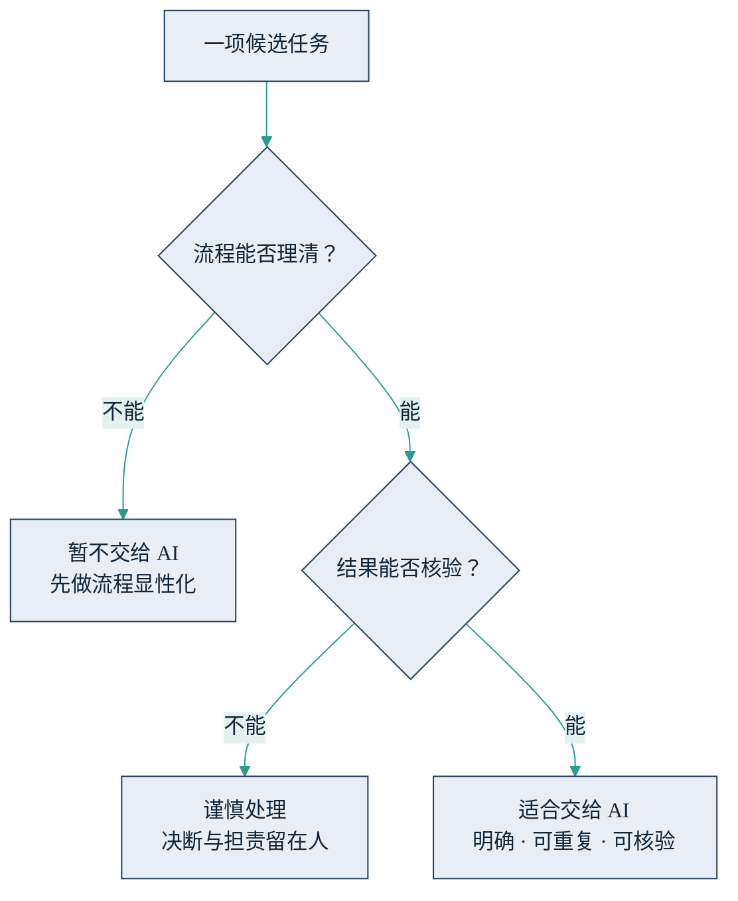

## 1.3 能力边界：能做什么与不能做什么

前两节讲了智能体的潜力与大模型的经济属性，本节转向另一半事实：它有边界。对管理者而言，一张可靠的边界地图，比满腔热情更有价值——把不该交的任务交出去，代价往往比不用 AI 更高。本节只从商业现象层面回答“截至 2026 年年中，AI 适合接手什么、不适合接手什么”；任务判据的操作化细化见 [2.4](../02_agent/2.4_scenarios.md)，出错背后的技术成因见 [4.3](../04_llm/4.3_hallucination.md)，一项任务值不值得做的经济判据见 [7.5](../07_value/7.5_real_vs_fake.md)。

先看它擅长的一类：明确、可重复、结果可核验的任务。典型如客服应答、对账、报告初稿、数据查询、会议纪要、代码草稿。这些任务的共同点是：流程能写成一份清楚的规程，产出有明确的对错标准或质量标准，抽查即可验证。这类“标准、重复、对错查得清”的活，交给 AI 是靠谱的，而且往往一上线就能看到量级级别的效率变化。

再看它目前不适合的一类：需要价值判断的、开放式的、需要有人担责的任务。典型如独立完成一桩并购尽调并给出结论、在无人监督下直接操作资金或对外承诺、需要拿捏分寸的人事沟通与客户危机处理。这些任务要么没有标准答案，要么出错代价极高且必须有明确的责任人——而 AI 既不能签字，也不能担责。

把两类任务放在一起对比，差异一目了然。

| 维度 | 适合交给 AI | 不适合交给 AI |
|---|---|---|
| 任务定义 | 明确，可写成规程 | 开放，依赖情境与判断 |
| 重复性 | 高频、可重复 | 低频、一事一议 |
| 结果核验 | 有对错或质量标准，可抽查 | 无标准答案，难以事后验证 |
| 出错代价 | 可控，可回滚 | 高昂，需有人担责 |
| 人的角色 | 定义任务、验收结果 | 全程决断、承担后果 |

表中最容易被误读的，是“复杂度”这个缺席的维度——它被有意排除了。这条边界的关键，恰恰不在任务“有多复杂”，而在两个问题：流程能否理清、结果能否核验。两个反例可以说明。其一，复杂但适合：把上千份历史合同按新模板逐一摘要归档，步骤繁多、工作量巨大，但规则清楚、抽查可验，AI 干得又快又稳。其二，简单但不适合：给一位愤怒的大客户回一句道歉，只是一句话的事，却没有标准答案，效果无法事前核验，错了只能由人收拾。复杂度吓不住 AI，模糊性才是它的天敌。

这条边界还有一个常被忽略的性质：它切开的往往不是整个岗位，而是任务内部的环节。同一桩尽职调查，资料收集、数据核对、初稿撰写是明确且可核验的环节，完全可以交给 AI；结论判断与对外签发是担责环节，必须留在人手里。因此“这个岗位能不能用 AI”在多数情况下是个假问题，真问题是“这件事里哪一段可以交出去”。把任务拆到环节层面再套用判据，可用的空间往往比整体观感宽得多——这也是后文反复出现的“AI 交初稿、人来签发”模式的由来。

据此可以把边界判断收敛成一张两问的流程图。

图1-3 能力边界的两问判断示意

最后必须强调：这条边界是动态的。2024 年还无法稳定完成的多步骤任务，到 2026 年已能规模化交付；模型每一次升级，“流程能理清、结果能核验”的任务集合就向外扩一圈。但判据本身的结构是稳定的——变化的是任务集合，不是那两个问题。因此这张地图的正确用法，不是背下一份“能与不能”的清单（清单每年都会过期），而是学会对每一项候选任务提出这两问。至于边界之内如何放心授权、边界之上如何由人把关，属于落地方法，见 [9.5](../09_landing/9.5_trust_control.md) 的“像带新人一样带 AI”。
