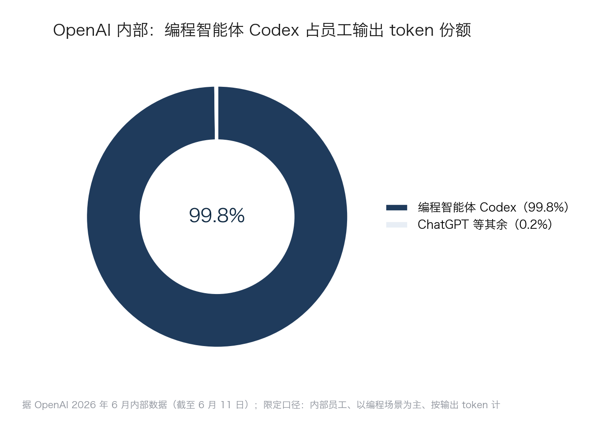
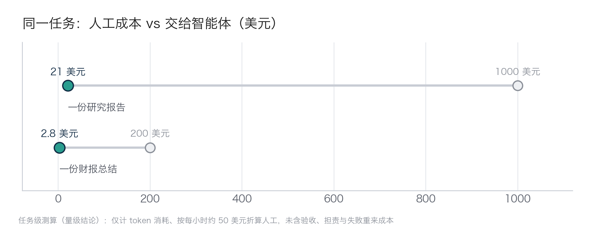

## 2.1 从助手到员工：智能体是什么

关于智能体，最常见的误会是把它当成“又一次工具升级”——聊天机器人的加强版。这个理解会让企业错判整件事的量级。先看时间上的分水岭：2024 年的大模型，主要还在“动嘴”——在对话框里回答问题、生成文字；从 2025 年起，智能体开始“动手”——查数据、跑流程、操作系统，把一件事从头办成。再看能力上的分水岭，一句话就能分清：**能回答的，只是助手；能交付的，才是员工。**

### 2.1.1 一条分界线：回答与交付

助手的本质是“咨询”。它替企业省下的，是“查资料”的成本——一个能听懂人话、给出连贯答案的搜索引擎。这很有价值，但价值有限：查完资料之后，理解、执行、核对、交付，仍然全部由人完成。

员工的本质是“接受派任务”。它替代的，是“把这件事完成”所对应的那份人力。而作为数字形态的员工，它还有三个人类员工不具备的特质：**全天候**——不休假、不下班，随叫随到；**会学习**——把每一次任务中沉淀的知识、话术、流程规则积累进企业知识库，越用越顺手；**能分身**——同一名“数字员工”可以同时复制出几十份并行干活，旺季扩编、淡季收缩，几乎没有招聘与解雇成本。

两者的差别可以用下表概括。

| 维度 | 助手（回答） | 员工（交付） |
|---|---|---|
| 交互方式 | 一问一答 | 接任务、交结果 |
| 替代的成本 | 查资料、起草的时间 | 完成整件事的人力 |
| 商业本质 | 更好用的搜索与写作工具 | 一种新型数字劳动力 |
| 验收方式 | 人自己判断答案好坏 | 像验收员工工作一样验收交付物 |

这条分界线不是修辞，而是算账口径的分界：助手改善的是人的效率，员工改变的是任务的成本结构——后者才会真正触动企业的成本、组织与竞争壁垒。也正因如此，本书有一个贯穿全书的判断：对多数企业而言，这一轮 AI 落地价值兑现的主战场，已经转向智能体——预测式 AI（如销量预测、信用评分）、内容生成等应用仍有各自的价值，也会继续创造回报，但真正能改变成本结构与组织结构的，是能把任务从头办成、可以按交付物验收的智能体。这不是说“上 AI 就等于上智能体”，而是说：如果只做前者，企业得到的多半是效率改善；要触及第七章讨论的那笔“劳动力级”的账，绕不开后者。

### 2.1.2 智能体的正式定义

本书对智能体给出如下定义：**智能体（AI Agent）是能够自主感知环境、规划步骤、调用工具并采取行动，以完成给定目标的 AI 系统。**

拆开看三个动词。“感知”指读懂任务要求和周边信息——邮件、单据、系统里的数据；“规划”指把目标自主拆解成可执行的步骤，而不是等人下达每一步指令；“行动”指真正操作工具与系统并交付结果。这三个动词，正对应[第一章“三级跳”](../01_essence/1.1_three_leaps.md)中“会干活”这最后一跳。

定义里最关键的词是“目标”。给助手的是问题，给智能体的是目标加验收标准——就像给员工派活：说清楚要什么结果、什么算合格，而不是口述每一个操作。至于智能体在技术上如何实现感知、规划与行动，[第五章](../05_agent_tech/README.md)会逐项拆解，此处不展开。

### 2.1.3 两个实证：头部已经翻篇

第一个实证来自造 AI 的公司自己。据 [OpenAI 2026 年 6 月发布的内部数据](https://openai.com/index/how-agents-are-transforming-work/)，截至 2026 年 6 月 11 日，其员工在 ChatGPT 与编程智能体 Codex 两类产品上产生的输出 token（词元，大模型计量和计费文本的基本单位）中，Codex 的占比约达 99.8%——包括法务、招聘等非技术部门，日常工作也已转向“派活给智能体”。这个近乎垄断的份额，直观呈现在下图里。

图2-1 OpenAI 内部编程智能体占员工输出 token 份额示意

当然这个场景未必通用：一是 OpenAI 内部员工，不代表普通企业；二是以编程场景为主；三是按“输出 token”口径统计，而非按任务数或工时。可以看到，造 AI 的公司自己，内部工作方式都已经从“问答”翻篇到“派活”——这代表着趋势所在。

第二个实证是任务级的成本对比。一组任务级的成本测算（2025 年公开材料与作者接触的任务实测，无公开可核出处，仅取量级结论）显示：同样一份研究报告，人工成本约 1000 美元，交给智能体约 21 美元；一份财报总结，约 200 美元对约 2.8 美元。把这两组对比画成哑铃图，成本从人工端坍塌到智能体端的落差一目了然。

图2-2 任务级成本对比：人工与智能体示意

这里按每小时约 50 美元折算人工、只计算 token 消耗的测算，没有包含验收、担责以及失败重来的代价——这些“人还得管”的成本，第七章会专门算。但即便把这些都加回去，两个量级的差距依然成立。成本曲线为什么会走到这一步、以及“同等能力降价与前沿能力涨价并存”的分化，见 [3.2 成本分化](../03_why_now/3.2_cost_curve.md)。

把定义和实证放在一起，结论已经清楚：智能体不是更聪明的问答框，而是第一次可以按“劳动力”来理解和定价的软件。接下来的问题是——这名“员工”究竟是怎么干活的。
