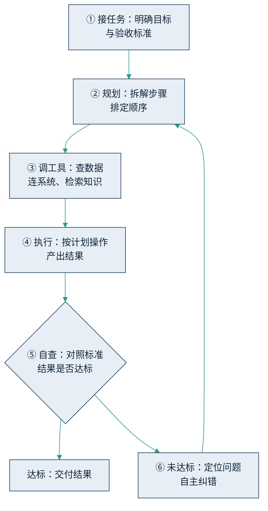

## 2.2 智能体如何工作：六步闭环

要理解智能体怎么干活，最省力的办法是把它想象成一名真的员工，看它如何走完一个完整的工作闭环。这个闭环有六步：

1. **接任务**：明确目标和验收标准。这一步的质量一半取决于派活的人——目标含糊，员工再能干也交不出对的东西。管理者如何把任务“派清楚”，是 [4.2 与 AI 协作](../04_llm/4.2_delegation.md) 的主题。
2. **规划**：把目标自主拆解成步骤，排定先后顺序。这背后依靠的是模型的推理能力，机制见 [5.1 思维链与推理模型](../05_agent_tech/5.1_cot.md)。
3. **调工具**：根据计划调取所需的资源——查数据库、调用业务系统、检索企业知识库、访问外部信息。让 AI “长出手来”的技术是工具调用，拆解见 [5.2](../05_agent_tech/5.2_tool_use.md)；让它用上企业知识的技术是 [RAG](../05_agent_tech/5.3_rag.md)。
4. **执行**：按计划实际操作，产出中间结果与最终交付物。
5. **自查**：对照验收标准检查自己的产出——数字是否勾稽、格式是否合规、有没有遗漏项。
6. **纠错**：一旦发现问题，自己定位原因、修正方案，回到规划或执行环节重来，直到结果达标或者升级求助。

用一个具体场景走一遍。假设把“生成本月供应商对账报告”交给一个智能体：它先确认任务口径（哪些供应商、截至哪天、差异如何呈现）；然后规划路径——取 ERP 应付数据、取银行流水、逐笔比对、汇总差异、成稿；接着调用相应系统接口取数；执行比对并起草报告；自查时发现某供应商的付款笔数对不上；于是回头检查，定位到该供应商在两个系统里编码不一致，修正匹配规则后重跑，最终交付一份差异清单勾稽完整的报告。整个过程中，人做的只有两件事：开头把任务说清楚，结尾对交付物验收。

下图把这个闭环画出来。注意“自查—纠错”形成的回路：这是智能体区别于普通自动化脚本的关键——脚本遇到异常就停在原地，智能体会尝试自己把路走通。

图2-3 智能体工作的六步闭环示意

这个闭环划出了一条对管理者极为关键的界线：**给系统接上一个 AI，与造出一名能独立交付的数字员工，完全是两码事。** 前者是在旧系统上加一个问答窗口，只覆盖闭环的第一步和第四步的一半——能听懂问题、能生成内容；后者是六步全部走通——会规划、会动手、会自查、会纠错。市场上大量自称“智能体”的产品，实际停在前者。

由此可以得到一张简单的鉴别清单。评估任何一个内部方案或供应商产品时，问三个问题：它会不会自己把任务拆成步骤？出了错，它能不能自己发现并纠正？它的交付物能不能不经人工转录、直接进入下游业务流程？只要有一个答案是否定的，那就是助手而不是员工——不是不能用，而是预期和定价都应当按助手来设。

这三问的答案，不必听供应商说——他们口头都会答“能”。真正管用的办法，是拿一件自家的真实小任务让它现场跑一遍，会不会拆、能不能纠、交付物接不接得上，一试便知；至于如何把这样一次试跑设计成一场正式的 POC 验收，见 [6.3 选型与谈判](../06_ecosystem/6.3_sourcing.md)。

还有一点需要预先交代：闭环里的“自查”一步，实际效果参差不齐——智能体的自查能发现格式与勾稽层面的错误，却未必能发现方向性的错误。因此企业级部署都会在智能体的自查之外再加一道独立的质检线（评测集、抽检、监控），这套方法见 [6.5 评估与运维](../06_ecosystem/6.5_evaluation.md)；而闭环每一步的技术实现与失灵模式，是第五章的任务。本章只需要记住这个判断：六步走不通闭环的，都还称不上数字员工。
