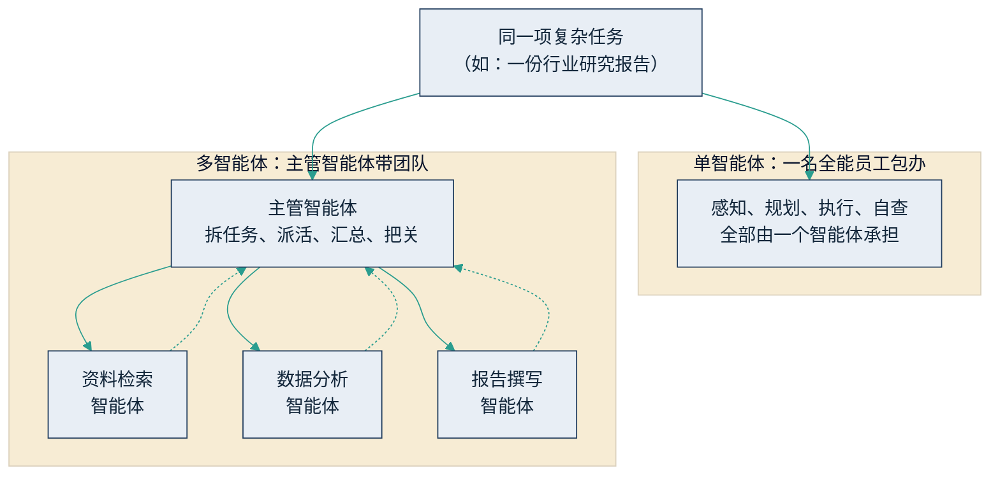

## 2.3 从单智能体到多智能体协作

一名员工再能干，也有极限。企业从来不是靠一个超级员工运转的，而是靠分工明确的团队。智能体的演进遵循同一条路径：从单智能体，走向多智能体协作。

### 2.3.1 为什么一个“全能员工”不够用

用团队的常识就能理解单智能体的四个局限。第一，**任务装不下**。再强的员工，一次能装进脑子里的信息也是有限的；任务一长、材料一多，前面的细节就开始丢。智能体同样受“一次能处理的信息量”约束。第二，**专业有分工**。检索、分析、撰写、审校，各是各的手艺；对智能体而言，不同环节适合用能力与成本不同的模型和配置，让“贵的干难活、便宜的干粗活”。第三，**并行出速度**。一个人只能顺序干活，团队可以同时开工——十个检索智能体并行查十个方向，时间就是原来的十分之一。第四，**权限要隔离**。企业不会把所有系统权限交给一个人；同理，把查询、写入、审批的权限分给不同的智能体，出错的爆炸半径就小得多。

解决方案与人类组织如出一辙：设一名**主管智能体**。它像项目经理——接到复杂任务后先拆解，把子任务分派给各个专岗智能体，过程中协调进度，最后汇总结果、把关质量。这种按流程调度多个智能体协同工作的机制，术语叫“编排”（orchestration）。下图对比了两种形态。

图2-4 单智能体与多智能体编排的对比示意

### 2.3.2 团队更强，也更贵

多智能体不是纸面概念，头部厂商已给出可查证的工程实证。据 [Anthropic 2025 年 6 月的工程博客](https://www.anthropic.com/engineering/multi-agent-research-system)（内部评测口径），其研究系统采用“主管—工作者”结构，由一个主管智能体带多个并行子智能体做复杂调研，在其内部评测中的表现比同等条件下的单智能体高约 90%；但代价同样明确——token 消耗约为普通对话的 15 倍。这个数字对管理者的含义，仍然是团队的常识：团队比单人强，也比单人贵，还多出协调成本。只有任务价值足够高（尽调级调研、竞争情报、文献综述），“上团队”才算得过账。

趋势层面，多智能体编排在 2026 年已从前沿实践变成主流议程。Gartner 在 [2025 年 10 月发布的 2026 年十大战略技术趋势](https://www.gartner.com/en/newsroom/press-releases/2025-10-20-gartner-identifies-the-top-strategic-technology-trends-for-2026)中，将“多智能体系统”单列为一项；此前其还[预测](https://www.gartner.com/en/newsroom/press-releases/2025-08-26-gartner-predicts-40-percent-of-enterprise-apps-will-feature-task-specific-ai-agents-by-2026-up-from-less-than-5-percent-in-2025)：到 2026 年底，40% 的企业应用将内嵌任务型 AI 智能体，而 2025 年这一比例还不足 5%。必须强调，这是**预测**而非已发生的事实；同样出自 Gartner 的另一项预测——到 2027 年底超过 40% 的智能体项目将被取消——提醒我们“上了智能体”与“出了结果”之间还隔着整个落地过程，归因分析见 [9.1](../09_landing/9.1_why_fail.md)。

团队要协作，还得有共同语言。人类团队靠邮件、工单和会议纪要；智能体团队则依赖标准化协议——让智能体接上企业工具与数据的 MCP，以及让智能体之间互相对话的 A2A。这两个“通用插座”的机制与生态，见 [5.5](../05_agent_tech/5.5_mcp_a2a.md)；承载编排的开源框架与商业平台如何选型，见 [6.1](../06_ecosystem/6.1_opensource.md) 与 [6.2](../06_ecosystem/6.2_platforms.md)，本节不展开。

管理者需要带走的判断有两条。其一，多智能体编排本质上是把管理学问题写进了软件：分工是否清晰、接口是否明确、谁对最终结果负责——这些问题在人类组织里答不好，在智能体团队里同样答不好。其二，不要为了“多”而多：单智能体能干成的事，加一个团队只会加成本；先用一名数字员工把闭环跑通，再谈组建团队，才是正确的次序。
