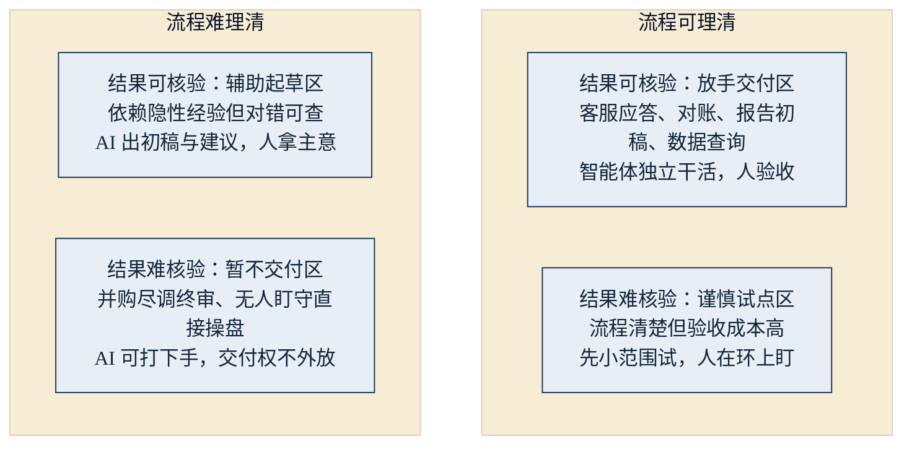

## 2.4 适用场景：这条边界画在哪里

[1.3 节](../01_essence/1.3_boundary.md)从商业层面描述了这一代 AI “能做什么与不能做什么”的现象。本节把那条边界落成一把任务级的尺子：拿到任何一个候选场景，管理者都能当场做出“能不能交给智能体”的初步判断。

先说结论：这条边界不在于任务“有多复杂”，而在于两点——**流程能不能理清，结果能不能核验。**

### 2.4.1 两个维度：流程可理清，结果可核验

**维度一：流程可理清。** 指这件事能不能被拆成明确的步骤、规则和输入输出。判断时问自己：如果要写一份让新员工照着就能干的操作手册，写得出来吗？很多岗位的核心本事长在老师傅的脑子里、藏在“看情况”三个字里——这类隐性经验没有显性化之前，智能体接不住。

**维度二：结果可核验。** 指产出的对错好坏，能不能以可接受的成本判断。有标准答案的（数据查询）、有勾稽关系的（对账）、有明确指标可抽检的（客服解决率、满意度），都算可核验；而“这个判断五年后才知道对不对”或者“好坏全凭资深合伙人的手感”，就是难核验。

两个维度交叉，得到四个区域。引出下图：判断一个场景，先问流程、再问结果，落进哪个格子，答案就出来了。

图2-5 智能体适用场景的两维判据示意

### 2.4.2 正例与反例

把四个典型正例与两个反例放进同一张表，用这把尺子逐一验证：

| 任务 | 流程可理清？ | 结果可核验？ | 判定 |
|---|---|---|---|
| 客服应答 | 知识库加话术，可显性化 | 解决率、满意度、可抽检 | 适合交付 |
| 对账 | 规则明确、步骤固定 | 勾稽关系天然可验 | 适合交付 |
| 报告初稿 | 结构与素材来源清楚 | 由人验收定稿 | 适合交付 |
| 数据查询 | 口径定义清楚即可 | 结果可直接核对 | 适合交付 |
| 并购尽调终审 | 清单可列，权衡难显性化 | 成败数年后才见分晓 | 不适合交付 |
| 无人盯守直接操盘 | 策略可写，异常场景理不尽 | 核验发生在损失之后 | 不适合交付 |

注意“报告初稿”里“初稿”二字——它本身就是一种核验安排：智能体交付、人来定稿。这提示了一个通用技巧：很多任务整体不可交付，但拆开之后，其中“流程清、可核验”的环节可以交付。

再看两个反例为什么不行。并购尽调的终审，难点不在资料量——资料整理、条款初筛、风险点罗列，智能体完全可以打下手；不能交出去的是最后那一层价值权衡与签字担责，而且其对错短期内无从核验。无人盯守直接操盘则败在另一头：操作不可逆、实时发生、错误代价极高，等到“核验”发生时，损失已经落地。换句话说，反例挡在门外的不是 AI 的参与，而是“终审权”和“无人盯守”这两件事。

还有一个提醒：即便是标准正例，边界内也有沟坎。客服应答是教科书级的正例，但本书第八章将完整复盘的 [Klarna 案例](../08_cases/8.5_klarna.md)显示，复杂、带情绪的工单一度让账面漂亮的 AI 客服栽了跟头——正例成立的前提，是把可交付的“量”与必须留给人的“价值判断”切分清楚。

### 2.4.3 这把尺子的适用范围

两点说明。第一，边界是动态的：模型能力每上一个台阶、企业数据就绪度每补一分，都会有任务从右边的格子挪进“放手交付区”。但判据本身是稳定的——变的是任务落在哪个格子，不变的是“先问流程、再问核验”这两问。也正因边界在以可测的速度向外移动（[3.1](../03_why_now/3.1_conditions.md) 引述的 METR 数据给出了这条斜率），这把尺子的正确用法不是“一次判定、永久归档”，而是对落在边界附近的场景——谨慎试点区与辅助起草区——建立每 6—12 个月重跑一次的复评节奏：模型能力或数据就绪度每上一个台阶，就把相关场景重新过一遍尺子。静态的判据，要配一套滚动的纪律（战略层每半年重排一次场景格的做法见 [10.4](../10_strategy/10.4_decision_matrix.md)）。第二，这把尺子只回答“能不能做”，不回答“值不值得做”。一个场景能交付但一年只发生三次，多半不值得投入；“值不值”需要另一把经济尺子——高频、结构化、可审计，留待 [7.5 真机会与伪需求](../07_value/7.5_real_vs_fake.md)展开。至于智能体为什么恰恰在“难核验”的地方容易出错，技术成因见 [4.3](../04_llm/4.3_hallucination.md)；确认场景在边界之内后，如何像带新人一样逐步放权，方法见 [9.5](../09_landing/9.5_trust_control.md)。

一句话收束本节：判断智能体用在哪里，不要问这件事有多复杂，要问流程理不理得清、结果核不核验得了。
