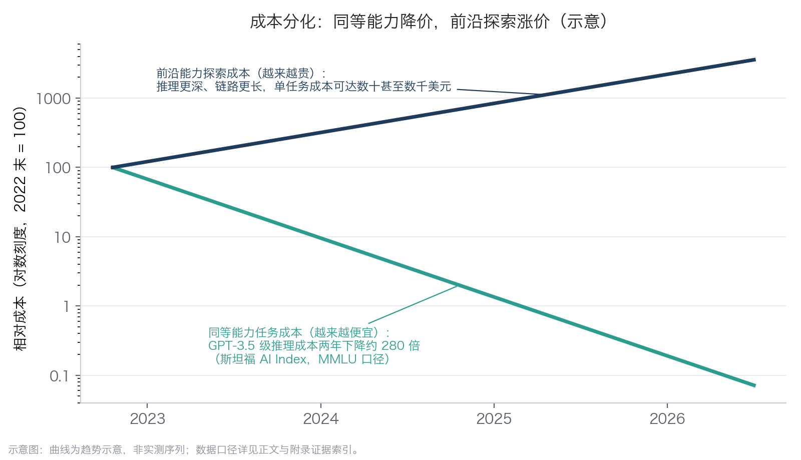

# 3.2 成本分化：降价与涨价并存

上一节把“成本下探”列为拐点的第二个条件，这一节把这笔账算细。先破一个最常见的误区：很多管理者评估 AI 成本时，盯着“词元单价”看（词元 token 是模型计费的基本文本单位，释义见 [1.2](../01_essence/1.2_llm_base.md)、[4.1](../04_llm/4.1_next_token.md)）。词元单价确实在逐年下调，各家厂商的降价公告也最容易登上新闻，但它不是企业真正该算的账——正如评估电气化不能只看每度电价。该算的是：\*\*完成同等难度的一件事，总共花多少钱。\*\*一件真实任务往往包含多轮推理、多次工具调用与失败重试，词元消耗量与所选模型档次高度相关；任务之外，还有数据准备、运营监控与风险成本（完整的算账框架见 [7.3](../07_value/7.3_cost_benefit.md)）。

任务级的证据 [2.1](../02_agent/2.1_definition.md) 已经给出：同一件事——一份行业研究报告、一份财报摘要——交给智能体办，产出成本比人工低约两个量级（口径与局限，包括这只是特定任务的实测样本、只计词元成本而未含验收与担责代价，均已在 2.1 交代，此处不重复）。与此相关的另一个方向性证据——模型厂商内部的用量已从对话压倒性地转向智能体任务——同样已在 2.1 交代口径。两条证据放在一起，指向同一个判断：完成一件事的成本正在被重估。

真正值得管理者记住的，是同一时期存在两条方向相反的成本曲线。

## 3.2.1 下行曲线：同等能力越来越便宜

在固定的能力水平上，完成同等难度基准任务的价格，按特定基准的估算每年下降约 5 至 10 倍——去年这个活的成本，今年只剩零头。[Epoch AI 对六个基准的测算](https://epoch.ai/data-insights/llm-inference-price-trends)给出了更宽的区间：依基准与分数线不同，年降幅约 9 至 900 倍，中位数约 50 倍。不同口径下数字浮动很大，但方向高度一致。驱动因素至少有四个：算法与推理引擎的效率提升、开源模型的贴身竞争、把大模型能力“蒸馏”进更小更便宜的模型（用大模型生成的数据训练小模型），以及推理芯片的持续迭代。

## 3.2.2 上行曲线：前沿能力越来越贵

另一头，最强的那批前沿模型，完成一件事的成本不降反升——按特定基准的估算，每年上涨约 3 至 18 倍。原因主要不是单价，而是“想得更深”：推理模型完成高难任务时会生成成千上万的内部推理词元，消耗量比普通问答高出一到两个数量级。极端的例子来自 [ARC Prize 团队对 OpenAI o3 高算力档的测算](https://arcprize.org/blog/oai-o3-pub-breakthrough)：在高难基准上，单题成本可达数千美元。也有研究者按“运行前沿级模型的实际成本”口径估算，涨幅约为每年两倍。不同方法给出的数字差异很大——这本身就说明，两条曲线都是特定基准与估算方法下的趋势参照，不是物理定律，不能拿去当铁律外推；但“低端持续变便宜、高端持续变贵”的方向，在 2024—2026 年间被反复验证。

两条曲线放在一起，构成本章最重要的一幅图景：同等能力的价格坍塌与前沿能力的价格攀升同时发生。下图把两条轨道画在同一张对数坐标上，剪刀差一目了然。

图3-1 成本分化示意（示意图：曲线为趋势走向，非实测序列；各项数字的口径与区间见正文）

## 3.2.3 笔者的观察框架：溢价词元与普通词元

对这两条曲线，笔者还有一种更贴近采购直觉的读法，作为一线产业观察供读者参考——它不是行业标准术语，也没有严格的测量支撑。企业买到的“智能”，其实是两种词元。一种是**溢价词元**：由最前沿模型产出，智力密度高、单价昂贵，胜在能啃下别的模型啃不动的活——最难的研发问题、最深的分析、最含糊的需求，适合攻坚。另一种是**普通词元**：由已经成熟的能力产出，单价低廉、供给充沛，适合大批量铺在常规任务上——分类、抽取、应答、初稿。

关键在于，两者不是两个市场，而是同一条传送带的两端：今天的溢价能力，过不了多久就会“掉价”为普通能力。按笔者的观察，这个能力窗口差大约在三到六个月的量级——必须说明，这是经验估计，不是测量值，不同任务领域的窗口长短差异很大。这里说的是同一能力从溢价档掉到普通档的降价节奏（包括闭源厂商自家的轻量档与蒸馏产品），不同于开放权重模型追平闭源旗舰的时滞——后者见 [4.4](../04_llm/4.4_model_choice.md)，按任务约为数月到两年。窗口的存在，恰好把两条曲线缝在了一起：上行曲线上的买家，付的是“抢先几个月用上最强智力”的时间差；下行曲线上的买家，等的是同一批能力掉价之后再大规模铺开。于是判断标准变得很朴素：只有那些早几个月做成、就能改变竞争位置的任务，才配得上溢价词元；其余的绝大多数任务，普通词元足矣。这也为 [4.4](../04_llm/4.4_model_choice.md) 的“按任务分级配模型”策略提供了另一重根据——分级不是抠成本的小技巧，而是对“智能供给正在分层”这一事实的直接回应。

## 3.2.4 管理含义：想清楚站在哪一头

低端越来越便宜、高端越来越贵，对企业是一道必须作答的选择题。绝大多数企业任务——客服应答、单据处理、报告初稿、信息核对——属于“够用即可”的一侧：不需要最强模型，只需要稳定跨过质量线的模型。站在下行曲线上，等价成本每年跌去大半，去年评估为“算不过账”的场景，今年可能已是真机会。由此得出一条纪律：任何“上 AI 划不划算”的结论都自带保质期，这笔账应当至少每年重算一次，并体现在预算节奏里（见 [10.5](../10_strategy/10.5_pacing_reporting.md)）。

少数高价值任务——复杂研发、深度分析、事关重大的决策支持——则值得为前沿能力付溢价，但要能明确回答“这一单是否值这个价”，并把模型档次与任务难度匹配起来，而不是全公司统一采购最贵的档位（模型选择的商业考量见 [4.4](../04_llm/4.4_model_choice.md)）。成本分化还有一个容易被忽略的推论：把 AI 预算当作一条均匀增长的直线来规划，会在两个方向上同时出错——低端任务的单位预算应当越花越少、覆盖面越铺越宽；高端任务的预算则要为“更贵但更强”留出弹性。降价与涨价并存，说到底是同一件事的两面：智能的供给在分层，企业要做的是把每一层用在配得上它的问题上。
