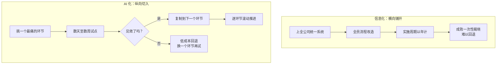

## 3.3 AI 化与信息化：这一轮不一样

经历过信息化浪潮的中国企业管理者，在判断 AI 时机时最自然的参照系，就是当年上 ERP、MES、OA 的经验。而这个参照系恰恰容易导出错误结论——把这一轮想象成又一场"数年周期、千万投入、伤筋动骨"的大工程，进而选择"再等等，等别人趟出路来"。两轮浪潮的部署逻辑其实相反。这也是需要专门为中国企业语境写透的一节：欧美商学院教材很少讨论"信息化欠账"这个变量，而它恰恰是大量中国企业（尤其是制造业与中小企业）面对 AI 时最真实的起点。

### 3.3.1 信息化：横向铺开的大工程

信息化的价值来自"打通"——让订单、库存、财务、人事在同一套系统里流转。这个价值逻辑决定了它的实施方式必须横向铺开：统一数据口径、全员改流程、各部门同步切换，牵一发而动全身。于是实施周期以年计（大型 ERP 项目常需一至三年，行业经验值），投入是大额一次性的（许可证加实施费），一旦失败几乎不可回退。当年"上 ERP 找死、不上 ERP 等死"的调侃，说的就是这种投入大、风险高、见效慢的结构。这种结构也决定了信息化天然是"一把手工程"加"预算工程"：没有高层拍板与大额立项，什么都不会发生——它塑造了一代管理者对"上系统"的决策习惯。这套逻辑本身没有错，它是流程标准化时代的必然。问题在于，很多企业把这段记忆原样平移到了 AI 上，用"三年规划、全面推进"的姿势去对待一个结构完全不同的事物，结果不是动作太慢，就是干脆不动。

### 3.3.2 AI 化：纵向切入的小手术

这一轮 AI 化的落地单元不是"全公司系统"，而是"单个环节"：一条客服队列、一道质检工序、一类合同的初审、一个报价流程。从最痛、最具体的环节切进去，最快数天到数周就能看到效果；不满意，停用即可回到原流程，沉没成本主要是少量服务费和时间。宁波银行是一个典型样本：不改造老系统、直接对接 AI 做风控数据整合，风险识别时间从 24 小时缩短到 2 小时（公开报道口径，案例详见 [8.2](../08_cases/8.2_finance.md)）。

之所以能纵向切入，背后是三个结构性变化。其一，自然语言成了接口：不必先完成系统集成，业务人员用日常语言就能把任务和上下文交给智能体。其二，智能体能直接消费非结构化信息——文档、邮件、聊天记录、图片，而这些恰恰是传统信息化覆盖不到的地带；换句话说，信息化处理的是已经进系统的数据，AI 化能处理还没进系统的工作。其三，商业模式变了：按用量付费替代一次性巨额许可证，试错的门票从"百万级预算审批"降到了"部门经费"。

两种模式的差异，可以用一张表收拢：

| 维度 | 信息化（横向铺开） | AI 化（纵向切入） |
|---|---|---|
| 落地单元 | 全公司统一系统 | 单个业务环节 |
| 前置条件 | 先统一数据口径、再造流程 | 挑定一个环节即可启动 |
| 实施周期 | 以年计 | 以天、周计 |
| 投入方式 | 大额一次性（许可证＋实施） | 小额按用量，试点级预算 |
| 失败代价 | 高，几乎不可回退 | 低，停用即回退 |
| 见效方式 | 全线切换后集中兑现 | 单点快速验证、逐点复制 |
| 组织动员 | 全员参与的一把手工程 | 小团队试点，成了再扩 |

表中每一行的差异都指向同一个事实：门槛的结构变了。下图进一步把两条路径的走法画出来。

图3-2 信息化横向铺开与 AI 化纵向切入对比示意

### 3.3.3 纵向切入不是免修课

必须防止对"这一轮不一样"的三种误读。第一，数据治理的功课躲不掉。信息化欠账仍然限制 AI 化的天花板：数据散在纸面、微信群和互不相通的表格里，智能体就找不到可以接入的"数字神经"。变化在于补课方式——不必先停下来修三年路，而可以围绕选定环节按需补数据，把治理拆成分期付款（详见 [9.2](../09_landing/9.2_data_readiness.md)）。第二，单点见效不等于规模化会自动发生：从试点走向规模化，仍然绕不开工作流重构这一关（[9.3](../09_landing/9.3_workflow_rebuild.md)）。第三，快速试错必须配上止损纪律，否则会走向另一个极端——处处试点、处处不了了之（[9.6](../09_landing/9.6_exit_discipline.md)）。

信息化与 AI 化因此是互补资产，而非替代关系：信息化底子好的企业，AI 化跑得更快；底子薄的企业，则第一次有了"边干活、边补课"的选项，而不是被挡在门外——甚至可以让 AI 项目反过来倒逼数据补课，一个环节一个环节地清欠。

门槛结构的变化，最终改变了正确的启动姿势：这件事不需要等一个"三年规划"来批准，规划驱动让位于实验驱动——本周挑定一个环节，下周就可以动手（具体操作见[起步五步法](../09_landing/9.4_five_steps.md)）。这是"为什么是现在"的第二层答案：不是风口催人，而是试错从未如此便宜。
