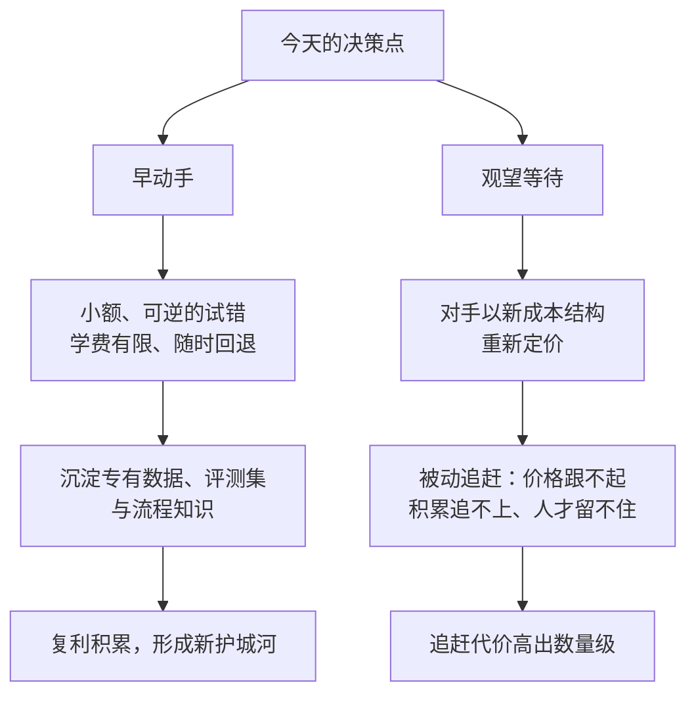

## 3.4 先发优势与不对称风险

前三节回答了"为什么现在能做"，这一节回答另一半问题："现在不做，会怎样？"讨论这个问题，绕不开企业史上两个著名的名字——它们的共同点是：技术都攥在自己手里，仍然输了。

### 3.4.1 两个反面教材：技术都在手里

先看柯达。世界上第一台数码相机原型，正是 1975 年由柯达工程师史蒂文·萨森（Steven Sasson）造出来的；此后数十年，柯达持续持有大量数码影像专利，技术从未离手。但胶卷业务的利润太厚，每一轮资源分配，理性的选择都是投给看得见回报的旧业务。等到数码浪潮彻底掀翻胶卷市场，2012 年柯达申请破产保护——淘汰它的，恰恰是它自己发明的技术。

再看诺基亚。2007 年前后，诺基亚约占全球智能手机出货量的一半；iPhone 与 Android 重构行业之后，到 2013 年将手机业务出售给微软之前，其份额已跌至约 3%（按智能手机出货量口径）。诺基亚同样不是没看见：触屏原型、应用生态的内部研究和预警都存在，但存量系统的包袱、既有的考核体系与部门利益，让"转身"在每一个季度的决策里都显得不划算。

### 3.4.2 组织惯性：在位者的理性陷阱

这两个故事常被讲成"傲慢与迟钝"，但克莱顿·克里斯坦森（Clayton Christensen）在《创新者的窘境》（1997）中给出的解释更冷峻。他研究的对象是颠覆式创新——从低端或边缘市场切入、初期性能不如主流方案、但改进速度更快的技术路线。他的核心发现是：在位企业输给颠覆者，往往不是因为管理糟糕，而恰恰因为管理"太好"——倾听最大的客户、把资源投向利润率最高的业务、按现有考核奖励确定性。每个决策单独看都正确，叠加起来却让组织系统性低估新曲线。资源、流程与价值观共同构成组织惯性：不是看不见，而是看见了也转不了身。柯达和诺基亚输的不是技术，是惯性。

这一诊断对应的处方——企业如何主动执行"自我颠覆"——放在第十章[三大战略](../10_strategy/10.3_three_strategies.md)中展开。本节只取它对"时机"的含义：面对新的技术曲线，等待从来不是中性的选项。旧业务每多一个好季度，组织惯性就加厚一分，转身的成本就更高一分。

### 3.4.3 风险不对称：早动手与晚追赶不是对称的赌注

把颠覆理论放到智能体语境下，有一个重要差别对在位者其实是好消息：这一轮的试错成本结构，前所未有地友好。3.3 节已经说明，AI 化可以纵向切入、天级见效、随时回退——这意味着"早动手"不再等于"下重注"。早动手的实质，是用小额、可逆的投入购买三样东西：认知（哪些环节真能数量级提效）、数据（沉淀专有语料与评测集）、组织肌肉（员工和流程学会与数字员工协作）。交一点学费、踩几个坑，坑都不大，性质上接近持续买入低价的期权（与 [10.5](../10_strategy/10.5_pacing_reporting.md) "可逆的小额，多下注"同一逻辑）。

而晚追赶的代价是另一个量级。一旦对手用新的成本结构完成重构——同样的服务，边际成本低出一截——追赶者将同时面对三重困境：价格跟不起，因为毛利结构不同；积累追不上，因为专有数据、评测集与流程知识需要时间沉淀，而时间不可压缩（这正是[价值迁移](../07_value/7.1_value_shift.md)之后新护城河的构成）；人心留不住，客户与人才都会向新范式迁移。买到同一个模型只要一天，让模型在自己的业务里真正有用，要以年计——差距正是在这段不可压缩的时间里拉开的。

下图把两条路径的分岔画在同一张图上：分岔点不在未来，就在当下的决策。

图3-3 早动手与晚追赶的不对称风险示意

### 3.4.4 先发优势属于"早且对"

最后一层辨析：先发优势并不来自"先买了工具"。模型正在变成公共品，工具人人可得，抢先采购本身不构成任何壁垒。真正产生复利的，是早入场者沉淀下来的东西——可核验的任务真正上线运行、成本切实下降、专有数据与知识持续积累，这三个信号才标记出"正确的先发"。反过来，把聊天机器人挂上官网就宣称"智能化"的伪先发，既不积累数据也不改造流程，只消耗组织的耐心与信任。先发优势属于"早且对"的企业，不属于"早而乱"的企业。

因此，本章的结论不是焦虑式的"赶紧全面上 AI"，而是一种清醒的紧迫感：小步、可逆、可核验地开始，但必须现在开始——因为风险是不对称的，早动手的代价，远小于晚追赶。
