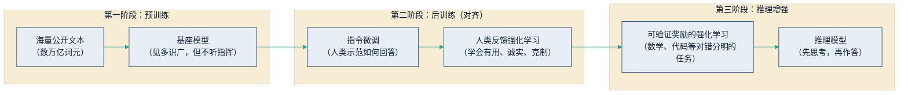

## 4.1 从预测下一个词到涌现能力

第一章从经济属性出发，把大模型定义为一种新的通用目的技术（见 [1.2](../01_essence/1.2_llm_base.md)）。本节转入技术机理：这台"通用机器"内部究竟在做什么？为什么规模做大之后，能力会发生质变？理解这两个问题不需要数学，但它是读懂本章后三节的前提——大模型的强大与它的失灵，出自同一个机制。

### 4.1.1 一个简单得出人意料的机制

大模型的核心机制可以用一句话说完：给定一段文字，预测下一个词元（token，模型处理文本的基本单位，中文里大致相当于一个字到一个词）最可能是什么，把预测结果接到原文后面，再预测下一个，如此循环，直到生成完整回答。手机输入法的联想功能做的是同一件事，差别只在量级：输入法基于个人几年的输入习惯猜下一个词，大模型基于互联网规模的语料——数以万亿计词元的书籍、网页、论文与代码。

一个看似低级的机制，何以产生"智能"？关键在于：要把下一个词预测得足够准，死记硬背远远不够。预测"384 乘以 12 等于"后面的数字，需要会算术；预测一份合同下一段的措辞，需要掌握法律文书的结构；预测侦探小说结尾"凶手是"后面的名字，需要读懂前文的全部线索。为了在预测任务上拿高分，模型被迫把语法、事实、逻辑与文体压缩进自身参数——它掌握的不是一份可逐条检索的资料库，而是人类公开文本中隐含的统计结构。

这个机制带来两个管理者必须记住的推论。其一，输出是逐词生成的概率行为：模型在每一步从多个候选词中按概率选取，同一个问题问两遍，答案可能不同——这是 [4.3](4.3_hallucination.md) 讨论幻觉与不确定性的根源。其二，模型的知识边界由训练语料决定：语料里没有的内容（企业内部数据、语料截止日期之后的新闻），它并不知道，但机制上仍会"接着往下写"。

### 4.1.2 训练过程：从预训练到对齐

训练过程用一段话可以说清。第一阶段是预训练：让模型在海量公开文本上反复做"填词"练习，这一阶段消耗绝大部分算力与资金，产出一个"见多识广但不听指挥"的基座模型——它只会续写文本，不会好好回答问题。第二阶段是后训练（也称对齐）：先用人类撰写的示范问答做指令微调，教会它按指令办事；再让人类对模型的不同回答做偏好排序、以此训练（业内称 RLHF，基于人类反馈的强化学习），把它调教得有用、诚实、克制。2024 年底以来，行业普遍叠加了第三阶段：在数学、代码这类对错可自动判定的任务上，以结果正确与否为奖励做大规模强化学习，训练出"先思考、再作答"的推理模型。下图概括了这条流水线。

图4-1 大模型训练三阶段流水线示意

对管理者的含义：市面上各家模型的"性格"差异——有的谨慎、有的健谈、有的擅长代码——主要来自后训练配方，而非基座能力的天壤之别。这也解释了为什么同一家供应商能从一个基座衍生出多个档位的产品线，为 [4.4](4.4_model_choice.md) 的选型讨论埋下伏笔。

### 4.1.3 规模定律、涌现与 2026 年的现状

支撑过去几年天量算力投资的实证依据，是规模定律（scaling laws）：OpenAI 研究者于 2020 年发现，模型性能随参数量、数据量与算力的增加而平滑、可预测地提升（[Kaplan 等，2020](https://arxiv.org/abs/2001.08361)）。"可预测"三个字至关重要——它让"投入十倍算力能换来多少能力"第一次成为可事前测算的工程问题，而非赌博。

更引人注目的是涌现能力（emergent abilities）：谷歌研究者 2022 年观察到，多步算术、复杂指令遵循等能力，在模型规模跨过某个阈值之前几乎为零，跨过之后突然出现（[Wei 等，2022](https://arxiv.org/abs/2206.07682)）。需要说明，学界对"涌现"是否为度量方式造成的假象仍有争论（[Schaeffer 等，2023](https://arxiv.org/abs/2304.15004)）；但对管理者而言，两派结论的实践含义一致：模型能力的提升可能是非线性的，六个月前"AI 做不了这件事"的结论，需要定期重新验证——把它当作一条保质期只有半年的判断来管理。

到 2026 年年中，行业重心已明显从"更大的预训练"转向"更深的后训练与推理"：深度推理能力已成为主流旗舰模型的标配，通常以可调节的"思考深度"形式提供，用更长的思考时间换更高的答案质量。一个标志性事件是 2025 年 9 月 DeepSeek-R1 论文登上《自然》杂志封面，成为首个通过同行评审的主流大模型（[Nature，2025](https://www.nature.com/articles/s41586-025-09422-z)），其核心方法正是上述以可验证结果为奖励的强化学习。推理模型如何工作、思维链意味着什么，[5.1](../05_agent_tech/5.1_cot.md) 专门展开。
