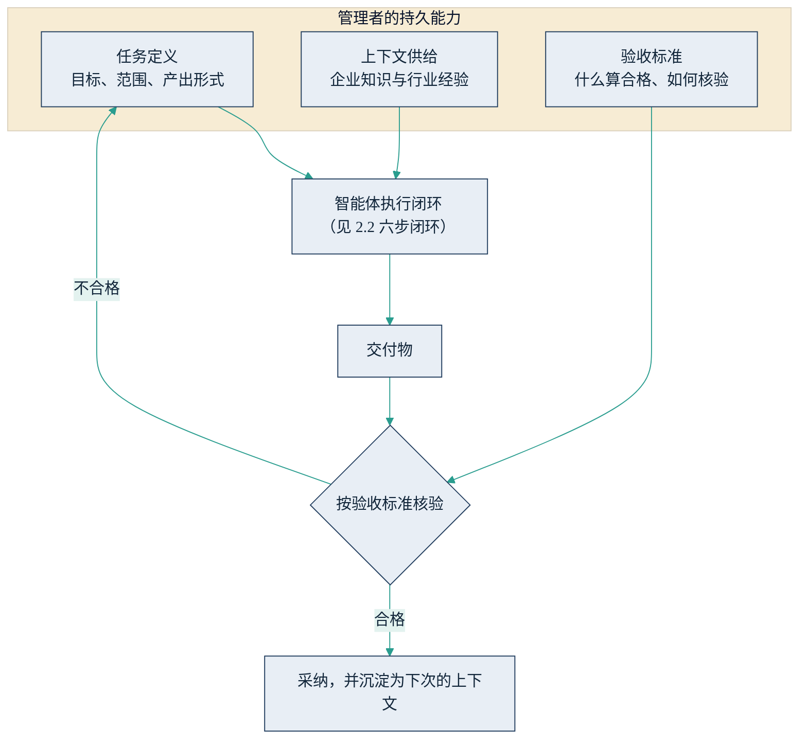

## 4.2 与 AI 协作：从提示到任务委托

理解机理之后，最实际的问题是如何与这台机器高效协作。2023 年前后，业界的标准答案是"提示工程"；到 2026 年，这个答案已经过时了一半——过时的是措辞技巧，留下来的是委托纪律。本节先交代提示工程的来龙去脉，再给出管理者真正需要长期持有的三件事，最后用一好一差两种"派活"方式做对比。

### 4.2.1 提示工程：一段有用的历史

提示工程（prompt engineering）指通过精心设计输入文本来引导模型产出期望结果的方法：给出参考示例、设定角色（"你是一位资深财务分析师"）、规定步骤与输出格式。在早期模型能力较弱、对措辞高度敏感的阶段，这些技巧的回报确实可观，"提示工程师"一度成为热门职位。但此后两个变化持续压缩了技巧的价值：一是模型对模糊表达的容错能力大幅提高，推理模型会主动澄清歧义、自行规划步骤；二是在智能体架构下，与模型的大部分"对话"由系统自动组装——检索哪些资料、带上哪些历史记录，由[上下文工程](../05_agent_tech/5.4_context_eng.md)负责，而非人工斟酌字句。咒语式的技巧在贬值，但提示工程留下了一笔遗产：清晰定义任务的纪律。这笔遗产正是下面三件事的起点。

### 4.2.2 持久的三件事：任务定义、上下文供给、验收标准

把 AI 当作一名能力很强、但完全不了解你企业的新员工，"派活"的质量就取决于三件管理者本来就该擅长的事。

第一，任务定义：目标是什么、范围到哪里、产出物长什么样、做到多深算够。"帮我看看竞品"这样的指令，人类下属会追问，模型多半会猜——猜出一份流畅而无用的通用报告。任务定义的颗粒度，决定了智能体六步闭环（见 [2.2](../02_agent/2.2_work_loop.md)）第一步"接任务"的质量，而第一步的偏差会被后面五步逐级放大。

第二，上下文供给：模型读过大半个互联网，却没读过你的企业：战略意图、内部数据、客户历史，以及行业里那些"不成文"的判断标准。单次交互中，这些信息要装进模型的上下文窗口（模型一次能读入的信息量上限）；规模化的供给则依靠 [RAG](../05_agent_tech/5.3_rag.md) 与[记忆系统](../05_agent_tech/5.4_context_eng.md)。但工程手段解决的是"怎么给"，"给什么"始终是业务判断——哪些经验值得沉淀为文档、哪些数据与当前任务相关，恰恰依赖行业经验。这也是全书题眼在本章的投影：行业经验不会被模型取代，它以上下文的形式成为模型的燃料。

第三，验收标准：什么样的产出算合格、如何核验、由谁核验。事前给出可检查的规格——"所有数字注明来源与日期""区分事实与推断"——远比事后挑毛病高效。验收标准同时是一道风控闸门，[4.3](4.3_hallucination.md) 会说明它为什么不可省略；它在组织层面的版本，就是 [9.5](../09_landing/9.5_trust_control.md) "像带新人一样带 AI"的四原则。

下图给出三件事与执行闭环的关系：任务定义与上下文供给决定输入质量，验收标准决定输出能否被放心采纳，不合格则修订任务定义重来——这本身就是一个管理闭环。

图4-2 任务委托三要素与验收闭环示意

### 4.2.3 一好一差：两种"派竞品分析"的方式

同一件事——让 AI 做一份竞品分析——两种派法的差距，足以说明全部道理。

差的派法只有一句话："写一份 A 公司的竞品分析，要专业、全面。"好的派法把三件事各交代清楚。任务定义：为下季度定价评审准备决策材料，聚焦 B、C 两家近两个季度在中端市场的定价与渠道动作，产出三页纪要加一张对比表，结论按"对我方定价的含义"组织。上下文供给：附上我方产品线价格表、近两季丢单记录、上月渠道商反馈纪要，并说明我方明年的主推产品线。验收标准：所有外部数字标注来源与日期，无法核实的信息显式标注"未核实"，区分"对方已做的事"与"对其意图的推测"，由市场总监按此清单核验后再上会。

值得警惕的是，差的派法同样会得到一份看起来专业的报告——流畅的辞藻掩盖了内容的通用与数字的可疑，下一节将解释这份"自信"从何而来。而好的派法中没有任何提示词技巧，它只是一次合格的任务委托；把执行者换成人类下属，它同样成立。这正是本节的结论：与 AI 协作的持久能力，不是学会一门新话术，而是把管理者本已具备的委托能力，以更高的精度执行出来。
