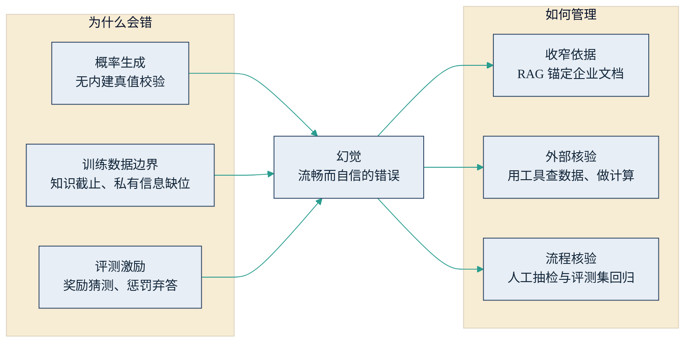

## 4.3 幻觉、知识截止与不确定性

上一节示例中"数字可疑"四个字，指向大模型最著名的缺陷——幻觉（hallucination）：模型以流畅、自信的语言输出与事实不符的内容。它不是偶发故障，而是 [4.1](4.1_next_token.md) 所述生成机制的内生副产品。本节拆解其技术成因，说明它为什么不可根除、却完全可以管理，最后落到对验收环节的具体含义。全书四次讨论"边界"，本节承担的是技术成因层；商业现象、任务判据与经济判据分别见 [1.3](../01_essence/1.3_boundary.md)、[2.4](../02_agent/2.4_scenarios.md) 与 [7.5](../07_value/7.5_real_vs_fake.md)。

### 4.3.1 三层技术成因

第一层：概率生成，且没有内建的真值校验。模型逐词生成文本，优化目标是"最像训练语料中会出现的话"，而不是"与事实相符的话"——它内部没有一个对照事实库逐句核对的检查器。知识以参数间统计关联的形式存储：高频事实（如"法国的首都"）关联极强，几乎不会错；长尾事实（某细分市场某年的份额数字）关联微弱，但模型仍会按语言的"形"补上一个像模像样的数字。幻觉在形式上与正确回答毫无差别——同样流畅、同样自信——这正是它的危险之处。

第二层：训练数据的边界。每个模型都有知识截止日期（knowledge cutoff，训练语料收集的截止时点），此后发生的事它一无所知；企业的私有信息更是天然不在公开语料之内。麻烦在于，模型的默认行为不是回答"我不知道"，而是基于旧世界与统计惯性继续往下写——问它上个月的行业动态，它可能给出一份以两年前格局为底本的"最新分析"。

第三层：训练与评测的激励。OpenAI 研究者 2025 年的论文《语言模型为何幻觉》给出了一个重要补充：主流评测普遍按"答对得分、弃答零分、答错不额外扣分"计分，模型因此被训练成敢猜的考生——猜测的期望得分永远高于承认不知道（[Kalai 等，2025](https://openai.com/index/why-language-models-hallucinate/)）。这一层成因意味着，幻觉部分是行业评测文化的产物，也因此可以通过改变激励而改善——该论文发表后，多家评测基准已开始奖励"诚实弃答"。

### 4.3.2 不可根除，但可管理

只要以概率方式生成开放式语言，错误率就不可能压到零——前引论文对此给出了理论论证。近两年前沿模型的幻觉率明显下降，模型也开始学会表达不确定性、主动拒答（各家评测口径不一，横向比较需谨慎），但任何"零幻觉"的商业宣传都应当存疑。对企业而言，正确的问题不是"怎么消除幻觉"，而是"在哪些环节、以什么成本，把幻觉控制到可接受的水平"。

缓解路径有三条，层层递进。一是收窄依据：用 [RAG](../05_agent_tech/5.3_rag.md) 把回答锚定在企业文档与数据库上，让模型"开卷作答"并给出引用出处——能大幅降低事实类幻觉，但检索会有遗漏、模型会有误读，降低不等于归零。二是外部核验：凡能用工具的就不靠记忆——查数据库、调用计算器、运行代码，把"模型认为"替换成"系统查到"（见 [5.2 工具调用](../05_agent_tech/5.2_tool_use.md)）。三是流程核验：关键输出保留人工抽检，重要结论要求双源交叉，上线前后用评测集持续回归（见 [6.5](../06_ecosystem/6.5_evaluation.md)）。下图把成因与对策连成一张图。

图4-3 幻觉的三层成因与三条管理路径示意

### 4.3.3 给管理者的验收含义

幻觉的存在改变的不是"能不能用"，而是"怎么验收"。落到操作层面是三条。

其一，按错误成本给任务分级。错误成本低、结果易核验的任务（内部初稿、头脑风暴、代码草稿）可以放开使用；事实密集且错误代价高的输出——对外承诺、合规表述、财务数字——必须保留人工核验位，即 [9.5](../09_landing/9.5_trust_control.md) 所说的"人在环上"。这与 [2.4](../02_agent/2.4_scenarios.md) 的任务判据一脉相承：结果可核验，本来就是选择场景的前提。

其二，把核验要求写进任务委托。上一节的验收标准在此落地：要求标注来源、区分事实与推断、显式标注"未核实"，等于把一部分核验成本转移给模型自己承担，人只需复核标记处。

其三，供应商尽调时追问口径。听到"我们的模型准确率 99%"，应当追问：在什么评测集上、什么任务类型、如何统计弃答？警惕用"通用问答准确率"回应"专业领域可靠性"的偷换——这也是 [6.5](../06_ecosystem/6.5_evaluation.md) 强调企业要自建评测集的原因。

成熟的组织不会期待幻觉消失，而是把它当作一项已知的工艺参数——像制造业对待不良率那样：测量它，为它设计冗余，并持续压低它。
