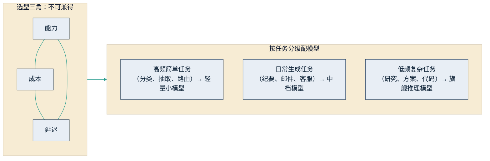
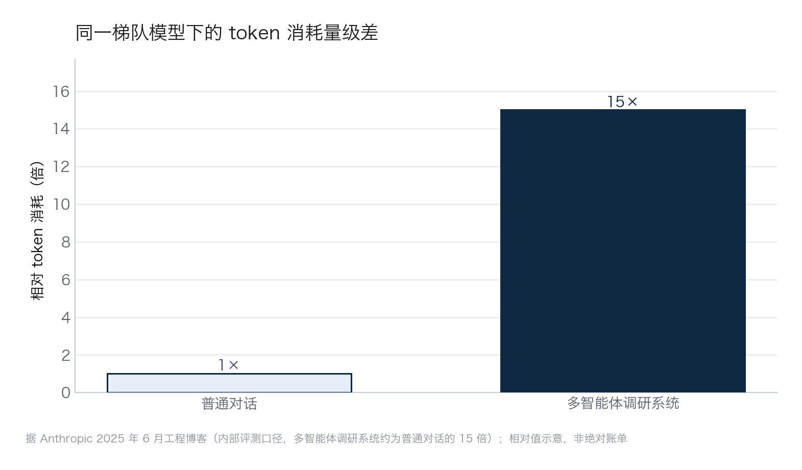

## 4.4 模型选择的商业考量

2026 年 4 月，Uber 的工程团队撞上了一件出乎财务意料的事：向工程师铺开智能体编程工具才几个月，全年的 AI 工具预算就提前见了底。事后复盘会发现，问题不在某一次糟糕的采购，而在一连串看似无害的日常选择——都用最强的模型、都开着最费词元的模式、谁也没盯着账单。这正是"用哪个模型"这个决策的分量所在：它表面上是一道技术选择题，实际却牵动能力、成本、风险的全局。2026 年的市场把选择空间铺得前所未有地宽——闭源 API、开放权重、国产模型、大小档位——选对了是杠杆，选错了就是上面那张提前耗尽的预算表。本节给出三个决策视角与一张要点表，帮你把这道题答得更稳；供应商评估与合同谈判的操作细节由 [6.3](../06_ecosystem/6.3_sourcing.md) 承接，部署方式与数据合规的匹配见 [6.4](../06_ecosystem/6.4_deployment.md)。

### 4.4.1 能力、成本、延迟三角

模型选型的第一性约束是一个三角：能力（任务完成质量与推理深度）、成本（词元单价乘以调用量）、延迟（响应速度，旗舰推理模型深思一题可达分钟级）。三者不可兼得：最强的模型必然更贵、更慢；实时客服要求秒级响应，就得让渡部分能力；夜间批量处理的任务则可以用慢而便宜的通道。同等能力的调用价格仍在逐年快速下探（据 [Epoch AI 的价格追踪](https://epoch.ai/data-insights/llm-inference-price-trends)，固定基准成绩口径），此处只需记住：三角在动，但三角关系本身不变。

由此得出成本工程的第一杠杆：按任务分级配模型。同一厂商产品线内，旗舰档与轻量档的单价差通常在一到两个数量级（各厂商公开定价页口径）。高频简单任务——分类、信息抽取、意图路由——用小模型绰绰有余；日常生成任务——纪要、邮件、客服话术——中档模型即可；只有低频复杂任务——深度研究、方案设计、代码工程——才值得动用旗舰推理模型。实践中最常见的浪费，恰恰是"一个旗舰模型包打天下"：能力过剩与成本失控并存。分级配模，其实就是把 [3.2](../03_why_now/3.2_cost_curve.md) 的两条成本曲线搬进企业内部——市场在分层供给便宜与昂贵的词元，企业就按任务分层消费。下图概括这一匹配逻辑。

图4-4 能力—成本—延迟三角与任务分级配模示意

回到开篇 Uber 那张提前耗尽的预算表——它敲响的警钟，其实是本节最容易被忽略的一环：选型不只是选模型，还要管用量。要害在量级差：智能体式任务一次调用就要反复思考、检索、生成，词元消耗远高于普通对话，[2.3](../02_agent/2.3_multi_agent.md) 引用的 Anthropic 内部评测里，多智能体调研系统的词元消耗约为普通对话的 15 倍。这个倍数落到账单上尤为触目——即便单价相同，同一梯队模型跑一次智能体式调研也可能烧掉十几次普通对话的钱，下图把这道量级差画在一起。

图4-5 token 消耗量级差示意（据 Anthropic 2025 年 6 月工程博客，内部评测口径；相对值示意，非绝对账单）

账单会因此比预算模型跑得快得多。Uber 后来给每人每款工具设了约 1500 美元的月度上限来止血（同类案例与出处详见 [7.4.3](../07_value/7.4_budget.md)），但真正的解法是把管控前移：用量看板、人均上限与分级路由，应当与选型同步落地，而不是等预算见底再补。

### 4.4.2 闭源 API 与开放权重：两条路线

第二个视角是获取方式。闭源 API 路线：模型部署在供应商云端，企业按调用付费，优势是能力最前沿、免运维、随用随付，代价是数据要出企业边界、能力与价格受制于人。开放权重（open weights）路线：厂商公开模型参数文件，企业可下载后在自有算力上部署与微调；注意它不同于传统开源软件——权重公开，但训练数据与完整训练流程通常并不公开。开放权重的优势是数据不出门、可深度定制、边际成本可控，代价是自担算力与运维，且能力存在时滞：据斯坦福 HAI《2026 年人工智能指数报告》（基准测试口径），开放权重模型落后最强商用模型的时间，按任务不同约为数月到两年（[AI Index 2026](https://hai.stanford.edu/ai-index/2026-ai-index-report)）。对多数企业任务而言，这个差距的分量，已经小于"数据能否出门"这条约束。

2026 年格局最显著的事实是：开放权重的主力供给来自中国厂商。DeepSeek 以 MIT 许可发布 V3/R1 系列（MIT、下文的 Apache 2.0 都是允许免费商用与修改的宽松开源许可，企业拿来用无须付费、也无须开源自己的改动），R1 的训练方法通过《自然》同行评审（见 [4.1](4.1_next_token.md)），论文披露的成本口径——基座模型数百万美元级、推理强化阶段数十万美元级，均为算力租用口径、不含研发投入——大幅下修了行业对训练门槛的想象，也把开放模型的 API 价格拉到了闭源旗舰的零头。阿里通义千问（Qwen）以 Apache 2.0 许可发布覆盖大小尺寸的完整家族，已是全球衍生模型最多的开源模型系之一（Hugging Face 平台统计口径）；智谱 GLM、月之暗面 Kimi 等亦持续开放旗舰级权重。海外阵营中，Meta Llama 的迭代声势较 2023—2024 年明显放缓，OpenAI 则于 2025 年 8 月以 gpt-oss 系列重返开放权重。截至 2026 年年中，主流开放权重榜单的头部位置多数由中国模型占据（社区评测口径，各榜单结果有出入）。对中国企业的直接含义：私有化部署已从"能力上的妥协"变为"能力够用"的正常选项，国产模型与国产算力的组合详见 [6.4](../06_ecosystem/6.4_deployment.md)。

### 4.4.3 多模型策略与决策要点

第三个视角是供应商风险。把全部任务押在单一模型供应商上，有三重风险：谈判地位——没有替代方案的续约，价格由对方定；业务连续性——模型退役、涨价、限流都不由你控制；能力错配——大模型排行榜的头名一年数易，今天最强不等于明年最强。对策不是同时采购所有模型，而是把"可切换"设计进架构：用统一接入层（模型网关）隔离业务代码与具体模型；维护一张任务—模型映射表，明确每类任务当前用哪个模型、备选是哪个；用自有评测集验证可替换性——换模型前后跑同一套题，用数据而非感觉决定切换（见 [6.5](../06_ecosystem/6.5_evaluation.md)）。切换成本是真实的：不同模型对同一任务的行为差异需要重新调校，所以可切换性靠事前设计，而非事后祈祷。

表4-1 汇总了模型选择的决策要点，可作为与技术团队讨论的共同底稿。

| 决策维度 | 关键问题 | 决策倾向 |
|---|---|---|
| 数据敏感度 | 涉密或受监管数据是否允许出企业边界 | 不允许：开放权重私有化或合规云部署（见 6.4） |
| 能力要求 | 任务是否逼近当前模型能力上限 | 是：闭源旗舰；否：分级使用中小模型 |
| 成本结构 | 调用量是否大且可预测 | 是：自部署或包量谈判更划算；否：按量付费 |
| 延迟要求 | 是否实时交互场景 | 是：轻量模型或就近部署；否：可用慢通道换低价 |
| 团队能力 | 是否具备模型运维与评测能力 | 否：从 API 起步，能力建成后再议自部署 |
| 供应商风险 | 更换供应商的代价是否可承受 | 从第一天建评测集与统一接入层，保留第二供应商 |

这张表回答的是"技术采购怎么选"；至于某个场景该自建还是采购、该重注还是观望，那是战略问题，框架在 [10.4](../10_strategy/10.4_decision_matrix.md)。最后一条心得：模型是快速贬值的资产，选型的要义不是一次选对，而是保留每年重选的权利。
