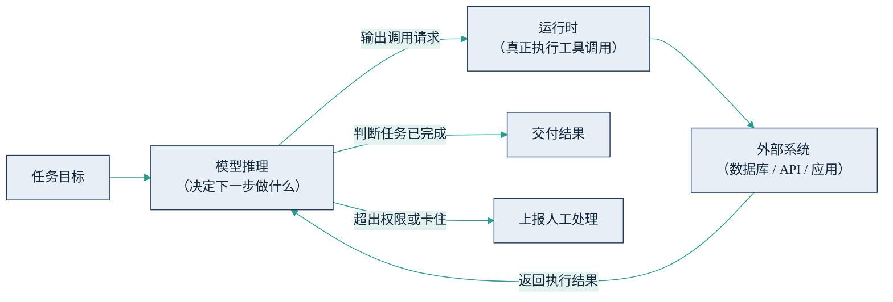

## 5.2 让 AI 动手干活：工具调用

第二章用[六步闭环](../02_agent/2.2_work_loop.md)描述了智能体如何像员工一样接活、干活、交活；本节拆开其中最关键的一环——动手。大模型本身只会生成文本：它既查不了数据库，也发不了邮件，更改不了 ERP 里的一行数据。让“会说”变成“会做”的机制，叫工具调用（tool use / function calling）。

### 5.2.1 机制直觉：模型下单，系统执行

工具调用的机制可以用一张“派工单”来理解。开发者把工具清单连同任务一起交给模型：每件工具有名称、功能说明与参数格式，例如“查询库存：输入商品编号，返回当前库存量”。模型推理后若判断需要外部能力，就不直接作答，而是输出一段结构化的调用请求——相当于填一张标准化派工单：调用哪个工具、参数填什么。真正执行的是模型之外的运行时系统：它拿着这张单子去调用真实接口，把执行结果写回模型的上下文，模型再基于结果继续推理。2023 年年中，OpenAI 率先把这一能力产品化（function calling），此后它成为主流模型经专门训练的原生能力。

两个要点值得管理者记住。第一，**模型是“下单者”，不是“执行者”**——它只产生文本形式的调用请求，真正触碰企业系统的是外部运行时。这意味着权限控制点天然位于模型之外，是安全设计得以立足的地方（详见 [5.6](5.6_security.md)）。第二，**模型靠读自然语言描述来选工具**：描述含糊，模型就会选错工具、填错参数——接口文档的质量第一次直接决定了自动化的质量。这条技术路线的概念起点，可追溯到 2022 年的 ReAct 论文（[Yao et al., 2022](https://arxiv.org/abs/2210.03629)）首次演示的“推理与行动交替”范式；此后该思路被吸收进模型原生能力与产品化框架，不再需要复杂的提示词脚手架。

### 5.2.2 agentic 执行循环

单次工具调用只是一次派工；智能体的真正形态，是把它放进循环里。下图展示了这个执行循环：模型每一轮决定下一步动作，交由运行时执行，观察结果后再决定，直到判断任务完成或需要求助。

图5-1 智能体的“推理—行动—观察”执行循环示意

第二章的六步闭环，在工程上就是这个循环的宏观表述：规划是循环的第一轮推理，自查与纠错则是模型把上一轮执行结果（包括报错信息）当作新输入重新推理。理解了循环，也就理解了智能体的两类典型失灵：一是**错误传播**——第一步查错了数据，后面每一步都在错误基础上用力，越干离目标越远；二是**循环失控**——模型反复尝试无效动作，消耗大量词元却没有进展。成熟的智能体系统因此都带有步数上限、预算上限与“卡住即上报”的工程约束，这些参数应当出现在验收清单上。

### 5.2.3 前沿：操作图形界面的 computer use

工具调用的前提是“有接口可调”，但大量企业软件没有 API，只有一个供人点击的界面。computer use（计算机操作）是对这一现实的回应：让模型看屏幕截图、移动鼠标、敲击键盘，像人一样操作图形界面。[Anthropic 于 2024 年 10 月率先发布](https://www.anthropic.com/news/3-5-models-and-computer-use)该能力的公开测试版；OpenAI 的 Operator 于 2025 年演进为 ChatGPT 的智能体模式，Google 也在 2025 年 10 月推出主打浏览器操作的 Gemini 2.5 Computer Use 模型。

截至 2026 年年中，这仍是前沿而非成熟能力：与 API 调用相比，界面操作更慢、更贵、更易出错，业界的共识是**能走接口就走接口，界面操作用来兜底无接口的存量系统**。但它的方向性意义重大：可自动化的范围从“有接口的系统”扩展到了“有屏幕的系统”。与传统 RPA（机器人流程自动化，按预设脚本模拟点击的上一代技术）相比，它不依赖写死的脚本，界面小幅改版也能自适应——这让大量“信息化半途”的老系统第一次有了被自动化接管的可能，代价是可靠性仍需逐场景验证。

### 5.2.4 管理含义

工具调用是智能体从助手变员工的分水岭，也是权力让渡的起点：给智能体接上哪些工具，等于授予它多大的行动权限。授权清单应当像给新员工开系统账号一样逐项审批，且默认从只读工具起步（安全边界见 [5.6](5.6_security.md)）。其次，智能体能力的上限往往不取决于模型，而取决于企业接口的整备度：API 是否齐全、文档是否准确、数据能否被程序化访问——信息化欠账会在这里集中现形，“接口整备”理应进入 AI 项目预算。最后，computer use 给出一条务实启示：老系统不必推倒重来也能被智能体接管，但依赖界面操作的自动化可靠性有限，适合低风险、结果可核验的场景先行试点。
