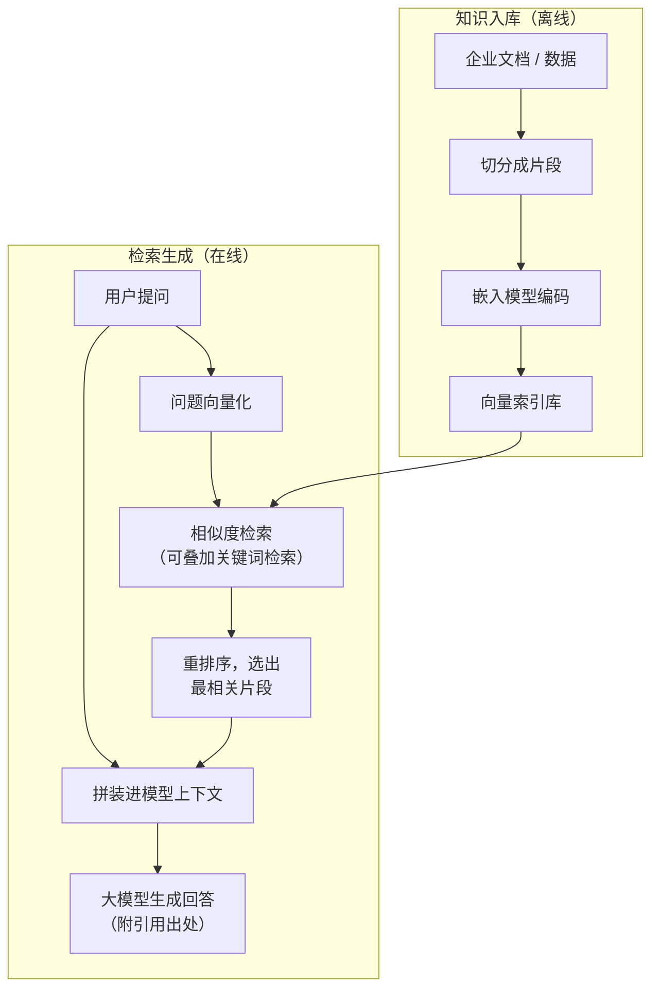

## 5.3 RAG：让 AI 用上企业知识

通用大模型对具体企业一无所知：训练数据停在某个[知识截止时点](../04_llm/4.3_hallucination.md)，而且它从未见过企业的制度文件、产品手册、历史合同与客服记录。直接拿企业问题去问它，要么答不上，要么一本正经地编造。把企业知识交给模型，工程上有两条路：把知识"训进"模型（微调），或把知识"喂给"模型（检索增强）。后者已成为企业场景的主流选择。

### 5.3.1 检索增强生成：先查资料，再作答

RAG（Retrieval-Augmented Generation，检索增强生成）的概念源于 2020 年的同名论文（[Lewis et al., 2020](https://arxiv.org/abs/2005.11401)），核心思想一句话：回答之前，先从外部知识库检索相关材料，把材料连同问题一起交给模型，让模型"基于给定材料作答"并注明出处。打个比方，这是把闭卷考试改成开卷考试——模型不必背下企业的全部知识，只需要会查、会读、会综合。

完整流程分两段，下图给出示意：离线的"知识入库"——把文档切分成适当大小的片段，用嵌入模型（embedding model，把文本变成一串数字编码，让含义相近的内容在数学上彼此"靠得近"，从而可按语义检索）编码后存入向量索引；在线的"检索生成"——用户提问被同样编码，系统按语义相似度找出最相关的片段，经重排序后拼进模型上下文，由模型生成带引用的回答。

图5-2 RAG 检索增强生成流程示意

效果好坏的关键往往在检索、不在生成：切分粒度、召回质量、排序精度、知识库本身的新旧与矛盾，任何一环出问题都是"垃圾进、垃圾出"。实践中最常见的失灵不是模型凭空编造，而是检索器递错了材料——过期制度没有下架、两份文档口径冲突、关键表格被切分得语义破碎；模型拿着错料认真作答，结论自然错得理直气壮。RAG 能大幅缓解幻觉但不能根除：模型仍可能在材料之外自由发挥，因此高风险场景应强制"回答必须带出处、出处必须可核验"。

### 5.3.2 RAG 还是微调

另一条路是微调（fine-tuning）：用企业数据继续训练模型，把知识与风格写进模型参数。两者不是竞争关系，而是分工不同。下表对比了关键维度：

| 维度 | RAG | 微调 |
|---|---|---|
| 知识更新 | 改知识库即生效，可日更 | 需重新训练，周期以周计 |
| 可追溯性 | 回答可附出处，便于审计 | 知识融进参数，无法溯源 |
| 前期成本 | 以知识库建设为主 | 需训练数据、算力与算法团队 |
| 权限隔离 | 可按人按库控制"谁能查什么" | 难以做到——知识对所有使用者一视同仁 |
| 擅长 | 事实性问答、政策查询、动态知识 | 固定风格、输出格式、领域术语习惯 |
| 典型风险 | 检索错料、知识库失治 | 知识过时、"训进去的删不掉" |

选择的经验法则：知识经常变化、回答需要出处、访问需要分权——用 RAG；要改变的是模型的语言风格、输出格式或领域行话——考虑微调；两者可以叠加。企业实务大多"先 RAG、少数才微调"，因为微调更新慢、成本高，且训进参数的知识无法按合规要求单独删除。

### 5.3.3 从向量检索到企业知识层

RAG 自身也在演进。第一代靠纯向量检索，长于语义相近、短于精确匹配（产品型号、合同编号常抓不准）；随后混合检索成为标配——向量与关键词检索并跑、再重排序，兼顾语义与精确。2024 年微软开源 [GraphRAG](https://microsoft.github.io/graphrag/)，把文档抽取成知识图谱（实体与关系的网络），能回答"跨文档关联、全局概览"类问题，代价是构建与维护成本明显更高。再往后是 agentic 检索：智能体自主决定查什么、查几轮、要不要换个思路再查——检索从固定管道变成智能体的[一种工具调用](5.2_tool_use.md)。

到 2026 年，RAG 的定位已经变化：它不再被当作一个独立的"问答机器人项目"，而是企业的**知识供给层**——为客服、销售、研发等所有智能体持续供给"干这件活所需的那份材料"，检索、记忆与工具返回的信息在同一个上下文预算里统筹取舍，与[上下文工程](5.4_context_eng.md)合流。值得澄清的是，长上下文窗口并没有让 RAG 过时：百万词元也装不下企业的全部知识，即便装得下，成本与噪声也不可接受——"先检索、再供给"仍然是必要的经济学。

### 5.3.4 管理含义

RAG 项目的成败，七分在知识库、三分在模型。真正昂贵的是把散落在文件服务器、邮箱、聊天记录与老员工头脑里的知识收拢、清洗、定版、确权——这正是 [9.2 数据就绪](../09_landing/9.2_data_readiness.md)要展开的"最大的成本、最深的护城河"。启动 RAG 项目前应当先问三件事：每类知识是否有明确的权威版本与更新责任人；权限边界是否清楚——谁可以问到什么；回答是否强制附出处以便追责。模型可以租，知识层必须自建——它沉淀下来的，是竞争对手拿不走的资产。
