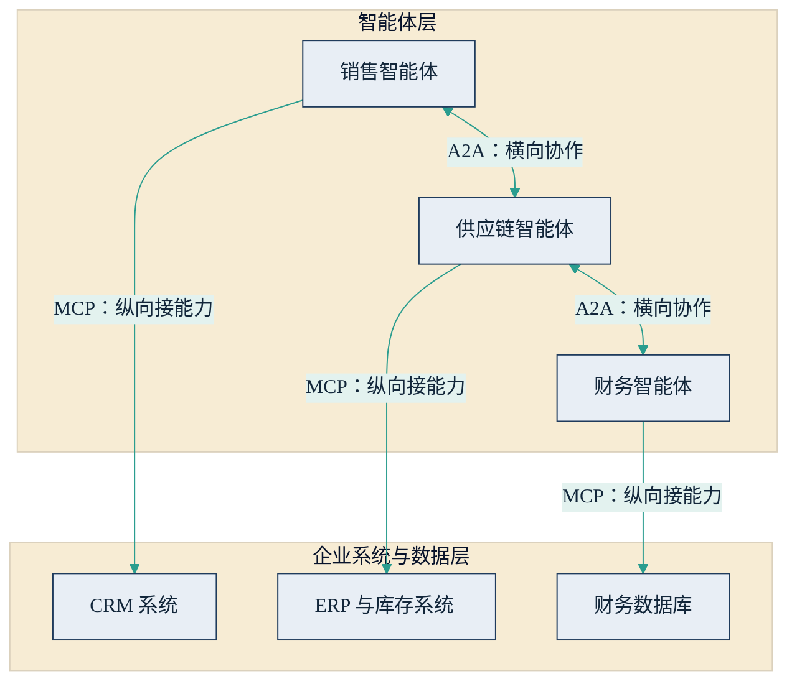

## 5.5 智能体的"通用插座"：MCP 与 A2A

前几节讲清了单个智能体如何想、如何做、如何用知识；剩下一个工程上的老大难：连接。企业里有几十上百套系统，市面上有多家模型与智能体平台，如果每个智能体对每套系统都要单独写一遍对接代码，集成工作量是"模型数 × 系统数"的乘积——这正是 USB 标准出现之前电子设备接口混乱的翻版。[2.3](../02_agent/2.3_multi_agent.md) 描绘了多智能体协作的图景；本节讲让这幅图景在工程上可行的两个开放协议：MCP 与 A2A。

### 5.5.1 MCP：纵向接能力

MCP（Model Context Protocol，模型上下文协议）由 [Anthropic 于 2024 年 11 月开源](https://www.anthropic.com/news/model-context-protocol)，为智能体连接工具与数据源定义了标准接口，常被称为"AI 应用的 USB-C"。机制一句话：任何系统把自己的能力封装成一个 MCP 服务器——以标准格式暴露工具、数据资源与提示模板；任何支持 MCP 的智能体应用即插即用。一次封装，处处可用，"M×N"的集成矩阵坍缩成"M+N"。

它的采纳速度在竞争激烈的 AI 行业堪称罕见：2025 年 3 月起，OpenAI、Google、Microsoft 相继宣布支持，竞争对手在接口层聚拢到同一个标准上。治理归属也已尘埃落定：2025 年 12 月，Anthropic [将 MCP 捐赠给 Linux 基金会](https://www.anthropic.com/news/donating-the-model-context-protocol-and-establishing-of-the-agentic-ai-foundation)旗下新设立的智能体 AI 基金会（Agentic AI Foundation，由 Anthropic、Block、OpenAI 共同发起，Google、Microsoft、AWS 等参与支持），转入厂商中立的开放治理。据 Anthropic 2025 年 12 月披露（生态口径），活跃公开 MCP 服务器已超过一万个，SDK 月下载近亿次。截至 2026 年年中，MCP 已是智能体接入工具与数据的业界事实标准。

### 5.5.2 A2A：横向做协作

MCP 解决"一个智能体向下接系统"，A2A 解决另一个层面：智能体与智能体之间怎么对话。A2A（Agent2Agent，智能体间协作协议）由 [Google 于 2025 年 4 月发布](https://developers.googleblog.com/en/a2a-a-new-era-of-agent-interoperability/)，同年 6 月[捐赠给 Linux 基金会](https://www.linuxfoundation.org/press/linux-foundation-launches-the-agent2agent-protocol-project-to-enable-secure-intelligent-communication-between-ai-agents)。它规定了智能体如何互相发现与自我介绍（通过"智能体名片"Agent Card 声明自己会做什么）、如何委托任务、如何跟踪长时间任务的进度——让不同厂商、不同框架造出的智能体能够协作，而不必属于同一家平台。

进展要按口径说：截至 2026 年 4 月项目一周年，据 [Linux 基金会公告](https://www.linuxfoundation.org/press/a2a-protocol-surpasses-150-organizations-lands-in-major-cloud-platforms-and-sees-enterprise-production-use-in-first-year)，已有超过 150 家组织参与，微软 Azure AI Foundry、亚马逊 Bedrock、谷歌云均已原生集成，并出现生产环境用例。但其规范仍处 0.3 版本阶段，大规模跨企业协作实践尚在早期——A2A 的方向已获行业背书，成熟度与普及度则尚不及 MCP，判断宜留有余地。

### 5.5.3 两层分工：一纵一横

两个协议不是竞争关系，而是一纵一横的分工：MCP 纵向"接能力"——让一个智能体用上工具与数据；A2A 横向"做协作"——让多个智能体互相委托任务。下图以一个简化的企业场景示意两层如何配合。

图5-3 MCP 纵向接能力、A2A 横向做协作的两层分工示意

设想一张大客户订单进来：销售智能体经 MCP 查 CRM 里的合同条款，经 A2A 请供应链智能体确认交期；供应链智能体经 MCP 查 ERP 库存后应答；财务智能体经 MCP 核授信额度，把风险提示回传。每个智能体向下用 MCP 拿数据、干实事，相互之间用 A2A 传任务、对进度——这正是 [2.3](../02_agent/2.3_multi_agent.md) 所述多智能体协作的通信底座。

### 5.5.4 开放标准的商业含义

接口标准化从来不只是技术事件。第一重含义是**降低锁定**：集成资产附着在开放标准上而非某家厂商的私有接口上，换模型、换平台不必重写全部对接——这直接改变了与供应商的谈判地位（供应商评估中的"可迁移性"一问，见 [6.3](../06_ecosystem/6.3_sourcing.md)）。第二重是**复用与生态**：企业把核心系统封装成 MCP 服务器是一次性投资，此后所有智能体应用共享；而未来跨企业的"智能体商务"——你的采购智能体直接与供应商的销售智能体谈交期——以 A2A 类协议为前提。第三重是历史规律：从 TCP/IP 到集装箱，接口标准化都通过压低交易成本做大整个生态，竞争焦点随之从"接口私有"转向"服务质量"。

也要留两分清醒：智能体互操作标准的竞争尚未完全终局，此前出现过的多个同类协议仍在整合之中；更重要的是，协议只解决"接得上"，不解决"该不该接"与"接了是否安全"——生态越开放，供应链风险越需要审查，这正是[下一节](5.6_security.md)的主题。

### 5.5.5 管理含义

选型清单应当加上一问：是否原生支持 MCP（以及 A2A）？不支持开放协议的平台，要按更高的退出成本折价评估。企业内部，把核心系统逐步封装成标准化服务，宜作为基础设施纳入平台规划——它决定了未来每一个智能体项目的启动速度。同时记住一条对价关系：每接入一个第三方 MCP 服务器，都等于引入一个供应链依赖，必须过安全审查，而不是"生态里有就能用"。
