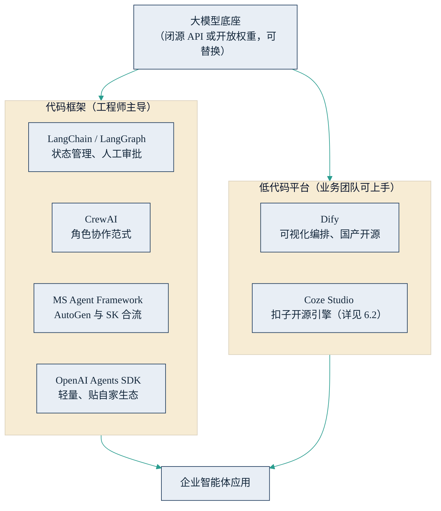

## 6.1 开源框架图谱

企业构建智能体应用，几乎不会从零开始写代码。开源框架承担了“脚手架”的角色：把[工具调用](../05_agent_tech/5.2_tool_use.md)、状态管理、多智能体协作这些通用工程问题预先解决好，让开发团队专注于业务逻辑。管理者不需要亲手使用这些框架，但有必要看懂技术团队的选择意味着什么——选定一个框架，往往同时选定了人才画像、生态依赖和后续的维护成本。

先看全景。按使用者门槛，主流开源项目大致分两层：面向工程师的代码框架，以及业务团队经过短训也能上手的可视化低代码平台。两层之下是可替换的模型底座，之上才是企业自己的应用。

图6-1 智能体开源框架生态分层示意

### 6.1.1 五个代表性项目

**LangChain / LangGraph**（[GitHub](https://github.com/langchain-ai/langgraph)｜[官网](https://www.langchain.com)）。目前企业侧采用最广的一组框架：LangChain 提供构建大模型应用的通用组件，LangGraph 专注智能体编排。两者于 2025 年 10 月同时发布 1.0 版本并承诺接口稳定；据官方发布公告，其生态月下载量约 9000 万次，Uber、LinkedIn、Klarna、摩根大通等公司在生产环境使用。它的两个核心卖点恰好对应企业最关心的问题：一是持久化状态管理——长任务中断后可从断点恢复，而不是从头重跑；二是一等公民级的 human-in-the-loop（人在回路，指在关键步骤自动暂停、等待人工批准后再继续）支持。开发商 LangChain 公司 2025 年完成 1.25 亿美元 B 轮融资（公开报道），商业化产品为调试与评估平台 LangSmith。

**CrewAI**（[GitHub](https://github.com/crewAIInc/crewAI)｜[官网](https://www.crewai.com)）。以“角色协作”为范式：把多个智能体组织成一个班组（crew），每个成员有角色、目标与背景设定，按流程协作完成任务。这套隐喻贴近管理者组建项目组的直觉，上手明显更快，适合快速验证多智能体分工的场景；GitHub 星标 2026 年上半年已超过 4 万，并有配套的商业化平台。代价是抽象层较高，对执行过程的精细控制不如 LangGraph。

**Microsoft AutoGen → Agent Framework**（[GitHub](https://github.com/microsoft/agent-framework)｜[官方文档](https://learn.microsoft.com/en-us/agent-framework/overview/)）。这条演进脉络本身就是一堂课：微软研究院 2023 年开源的 AutoGen 是多智能体协作方向的开创者之一，与面向企业集成的 Semantic Kernel 长期双线并行；2025 年 10 月，两者合流为 Microsoft Agent Framework，2026 年 4 月发布 1.0 正式版，原有两个项目转入维护期并提供迁移指南。对选型者的启示是：开源世界的“合并重组”是常态，要看厂商投入的延续性，而不只是项目当下的热度。

**Dify**（[GitHub](https://github.com/langgenius/dify)｜[官网](https://dify.ai)）。国产开源的可视化低代码平台，把模型接入、[RAG](../05_agent_tech/5.3_rag.md)、工作流编排做成拖拽式画布，非技术团队经过短训即可搭建应用。GitHub 星标超过 10 万（2026 年年中口径），长期位居同类项目第一梯队。它最适合的用法是业务部门快速做原型、验证场景价值；涉及复杂逻辑与深度定制时，仍需回到代码框架。

**OpenAI Agents SDK**（[GitHub](https://github.com/openai/openai-agents-python)｜[文档](https://openai.github.io/openai-agents-python/)）。OpenAI 于 2025 年 3 月发布的轻量框架，取代其实验性的 Swarm 项目，内建智能体间交接（handoff）、护栏与追踪能力，与 OpenAI 的模型及其可视化工具链衔接最顺。设计简洁、学习成本低，但生态倾向明显，适合已确定以 OpenAI 系模型为主的团队。

其他值得一提的项目：字节跳动 2025 年 7 月以 Apache 2.0 协议开源的 [Coze Studio](https://github.com/coze-dev/coze-studio)（扣子平台的核心引擎，商业侧见 6.2）；专注数据接入与检索的 [LlamaIndex](https://github.com/run-llama/llama_index)；Google 的 [ADK](https://github.com/google/adk-python) 与 Anthropic 的 [Claude Agent SDK](https://github.com/anthropics/claude-agent-sdk-python)，分别贴各自模型生态。更完整的清单见[附录：开源项目与平台清单](../13_appendix/projects.md)。

### 6.1.2 选型视角与结论的保质期

把上述项目放进同一张表，比较的不是技术优劣，而是“什么团队、什么阶段、该用什么”。

| 项目 | 定位 | 上手门槛 | 适用团队 |
|---|---|---|---|
| LangChain / LangGraph | 通用编排、状态管理 | 高（专业工程师） | 有专职研发、要上生产环境的团队 |
| CrewAI | 角色协作多智能体 | 中（工程师） | 快速验证多角色分工的场景 |
| MS Agent Framework | 微软系企业集成 | 中高（工程师） | .NET / Azure 技术栈的企业 |
| Dify | 可视化低代码 | 低（业务＋IT 协作） | 业务部门做原型与轻量应用 |
| OpenAI Agents SDK | 轻量、OpenAI 生态 | 中（工程师） | 已锁定 OpenAI 模型的团队 |

管理者读这张表，记三条即可。第一，框架选择本质是人才与生态的绑定：选了微软系框架就要有 .NET/Azure 人才储备，选了 LangGraph 就进入 Python 工程师市场竞争——技术团队“顺手”的选择，隐含着企业的招聘与留人成本。第二，低代码与代码框架不是二选一：常见打法是业务团队先用 Dify 一类工具把场景价值验证出来，跑通后再由工程团队用 LangGraph 一类框架重写为可监控、可回滚的生产系统——原型和产线本来就不该是同一套东西。第三，也是最重要的一条：这个领域迭代极快，AutoGen 从明星项目到并入新框架只用了两年半。本节所有“现状”核实于 2026 年年中，其中的星标数、版本号乃至项目本身，半年后都可能过时。真正做选型决策时，请以各项目官方文档的当时状态为准；本节提供的分层框架与三条判断，比任何一个具体项目名字都更耐用。
