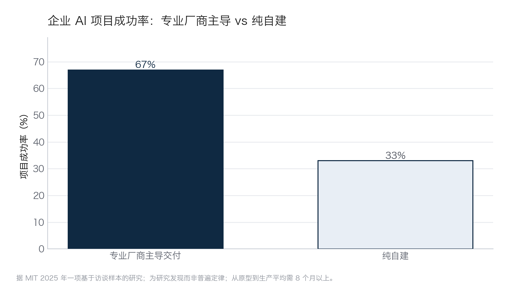

## 6.3 选型与谈判：开源、商业与供应商

供给侧摆着三条路：开源自建、商业平台、供应商定制交付——实践中多数项目是三者的混合。走哪条路之前，先看一组值得参考的数字：据 MIT 2025 年一项基于访谈样本的研究，由专业厂商主导交付的企业 AI 项目成功率约为 67%，纯自建约为 33%，且从原型走到生产平均需要 8 个月以上。两者成功率相差一倍，落差直观呈现如下图。

图6-2 专业厂商主导与纯自建的项目成功率对比示意

两点解读须同时记住：其一，这是访谈样本的研究发现，不是普遍定律；其二，它并不说明“自建不行”，而说明多数企业系统性低估了从原型到生产的工程与运维成本——外部厂商的优势不在算法，而在于同样的坑已经替别的客户踩过很多遍。

由此得出多数非科技企业的合理默认姿态：**能买不建，买了会验，验的标准自己定**。后半句比前半句更重要——67% 的成功率属于“会买”的企业；把数据、流程、验收权一并交出去的企业，即便项目“成功”，沉淀下来的能力也归供应商。本节讲的就是怎么做到“会买”。

### 6.3.1 供应商评估五问

第一问，**行业案例**。要求提供同行业、同规模、可联系的参考客户，并真的去联系——重点问上线后六个月的实际运行状况，而非签约当月的演示效果。只有精彩演示、没有可查证客户的，一律按早期产品对待：可以合作，但按试验品定价，不按成熟品付费。这条尺子在 2025—2026 年尤其要紧：Gartner 估计，市面上数千家自称“智能体”的厂商里，真正名副其实的只有约 130 家，其余多是把聊天机器人、RPA 或旧版助手重新贴牌的“智能体洗白”（agent washing）（[Gartner，2025](https://www.gartner.com/en/newsroom/press-releases/2025-06-25-gartner-predicts-over-40-percent-of-agentic-ai-projects-will-be-canceled-by-end-of-2027)，估算口径）。分辨真伪不看名字、看能不能出示跑过六个月的生产客户，以及能不能当场用 [2.2](../02_agent/2.2_work_loop.md) 的“三问”验货：会不会自己拆任务、出错能不能自纠、交付物能不能直接进下游。

第二问，**数据归属**。项目中产生的业务数据、标注数据、对话日志，所有权与使用权如何约定？供应商是否会用这些数据训练服务于其他客户——包括你的竞争对手——的模型？行业知识经由供应商外溢，是这类合作中最隐蔽的代价。

第三问，**可迁移性**。提示词、知识库、评测集、流程配置能否完整导出？底层模型能否更换？如果答案是“都绑定在我们平台上”，则要把未来的更换成本折算进当前报价。锁定不是不能接受，但必须是明码标价的锁定。

第四问，**报价结构**。订阅制、按量计费（按 token、按坐席、按解决量），还是项目制？数据准备、系统集成、上线后运维是否包含在内？要求供应商给出“第一年总拥有成本”而不是首期报价——AI 项目的成本大头常在建设费之外（框架见 [7.3 四类成本](../07_value/7.3_cost_benefit.md)）。

第五问，**退出条款**。合同终止时，数据交还与删除的时限和方式、过渡期技术支持、配置与文档的交付范围，都要落在合同文本里。评估一个供应商值不值得进门，先看它愿不愿意把“怎么送客”写清楚。

### 6.3.2 合同三底线与 POC 验收

五问是筛选，三底线是红线。无论走哪条路线，三样东西必须留在自己手里。**数据**：原始业务数据与项目沉淀的知识资产——标注、知识库、评测集——归属己方，写进合同。**流程**：业务流程逻辑必须有己方能读懂、能带走的文档，不能变成供应商专有的黑箱；否则今后每一次流程调整，都是在为对方的议价能力充值。**评估权**：验收标准、评测集与测试执行由己方主导（方法见 [6.5](6.5_evaluation.md)），供应商自测自评的成绩单不作为付款依据。

进入合作后，第一道关是 POC（proof of concept，概念验证——小范围、短周期地验证方案在真实条件下是否可行）。POC 验收抓三个要点。一是**真实数据**：用脱敏后的真实业务样本测试，谢绝供应商自备的演示数据集——演示集上的高分与生产环境的表现可以毫无关系。二是**量化 KPI**：验收指标事先写进协议，例如“客服独立解决率不低于 60%、关键信息错误率不高于 2%、单次服务成本不高于某数值”，达标线之外再无口头承诺。三是**时间盒**：以四至八周为宜，到期必须做出继续、调整或终止的显式决定，防止项目滑入“永远在试点”的状态。此外可争取两个条款：POC 费用可抵扣正式合同金额；POC 期间产生的数据与评测集归己方所有。

最后划清本节的边界：以上回答的是供给侧的“怎么挑、怎么谈”。至于某个场景究竟应该自建、采购、小注验证还是暂缓——那是需求侧的战略判断，取决于场景贴不贴核心护城河、结果能不能核验，判断框架见 [10.4 的 2×2 决策矩阵](../10_strategy/10.4_decision_matrix.md)。先用 10.4 决定“做不做、谁主导”，再用本节决定“跟谁做、怎么谈”，两把尺子配合使用。
