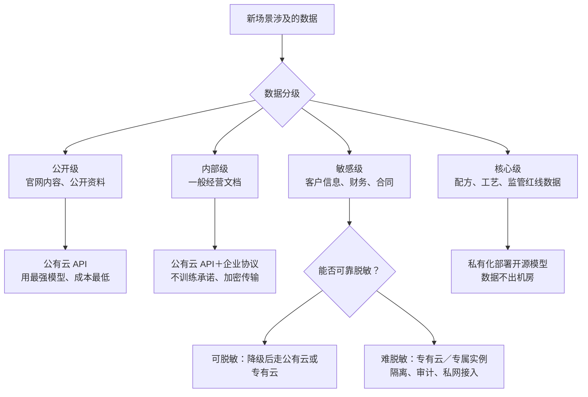

## 6.4 部署与数据安全：公有云、私有化与国产模型

"数据放出去，安不安全？"这是 AI 项目上会时董事会最常问的一句话，也常常是项目停摆的原因。这个问题无法用"安全"或"不安全"一句话回答，因为它把两个变量混在了一起：什么数据、放到哪里。把两个变量拆开，就得到一套能在董事会上讲清楚的框架：先分级，再匹配。

### 6.4.1 数据分级，部署匹配

沿着《数据安全法》确立的分类分级思路，企业实操可以简化为四级：**公开级**（官网内容、公开产品资料，泄露无损失）；**内部级**（一般经营文档、流程记录，泄露有轻微影响）；**敏感级**（客户个人信息、财务数据、合同条款，泄露触发合规与商誉风险）；**核心级**（独家配方、工艺参数、核心算法，以及涉及行业监管红线或国家安全的数据，泄露动摇竞争根基）。

部署方式对应三档。**公有云 API**：直接调用 OpenAI、Anthropic、通义、DeepSeek 等厂商接口，能力最强、成本最低、零运维；数据要离开企业边界，保障主要靠厂商合同承诺——主流厂商的企业版协议均默认不用客户数据训练模型，但条款须逐项核对。**专有云／专属实例**：云厂商为企业单独隔离计算资源，叠加加密、审计与私网接入，国内外主流云厂均有产品，是能力与隔离性的折中。**私有化部署开源模型**：模型运行在自有机房或专属托管环境，数据不出域；代价是模型能力相对最前沿有滞后，且需要自建运维能力。

分级与部署的匹配关系，用一张决策图表示。

图6-2 数据分级到部署方式的匹配决策示意

两点补充。第一，这是场景级而非企业级的决策：同一家企业完全可以三档并存——市场部用公有云生成文案，客服系统跑在专有云上，研发数据只进私有化环境。"一刀切全上云"与"一刀切全禁用"同样是偷懒。第二，脱敏是重要的降级通道：敏感数据经可靠脱敏后可按低级别处理，而脱敏能力本身属于数据治理基本功，展开见 [9.2 数据就绪](../09_landing/9.2_data_readiness.md)。

### 6.4.2 中国企业的合规叠加项

在分级匹配之上，中国企业还要叠加三层合规约束。

一是**数据出境**。依据[《促进和规范数据跨境流动规定》](https://www.cac.gov.cn/2024-03/22/c_1712776611775634.htm)（2024 年 3 月施行），个人信息与重要数据出境须走安全评估、标准合同或保护认证三条通道之一，另有豁免情形；网信办 [2026 年 1 月的政策问答](https://www.cac.gov.cn/2026-01/30/c_1771505108953002.htm)对适用情形有细化说明。特别提醒一个常被忽略的点：调用境外模型 API 处理业务数据，通常即构成数据出境场景——"我们没有海外业务"不等于"我们没有数据出境"。

二是**行业监管**。金融、医疗、政务等行业对数据不出域、系统等保、算法审查另有更严格要求，具体以行业主管部门规定为准；这也是这些行业私有化部署比例明显更高的直接原因。

三是**服务备案**。面向境内公众提供生成式 AI 服务，须按[《生成式人工智能服务管理暂行办法》](https://www.cac.gov.cn/2023-07/13/c_1690898327029107.htm)履行安全评估与备案等程序；截至 2026 年初，网信办分批公告的已备案生成式 AI 服务累计已近 800 款。仅供企业内部使用、不面向公众的私有化部署，一般理解不在备案范围内，但边界认定以主管部门解释为准。监管全景——包括欧盟 AI 法案高风险义务的最新时间表（经 2026 年"数字综合修正案"推迟至 2027 年 12 月与 2028 年 8 月）与美国动向——在 [12.2 监管地图](../12_governance/12.2_regulation.md)展开，此处不重复。

### 6.4.3 私有化的成熟度与董事会答法

到 2026 年年中，私有化部署已从"不得已的妥协"变成"可以正经评估的选项"，原因有二。一是开放权重模型（open weights，指公开模型权重供自行部署，业界也常不严格地称"开源模型"）的能力跨过了多数企业场景的可用线：DeepSeek、通义千问（Qwen）、GLM 等系列在通用任务上与闭源旗舰的差距，已缩小到多数业务场景感知不明显的程度（各家基准测试口径不一，以自身任务实测为准）。二是交付形态成熟：容器化方案与"大模型一体机"把部署周期从月压缩到周，国内主要硬件与云厂商均有整机方案。

成本直觉给一个量级参考（随硬件与模型演进变化，预算框架见 [7.4](../07_value/7.4_budget.md)）：跑中小尺寸开源模型、服务几百人规模的内部应用，硬件投入通常在数十万元量级；要以生产级并发运行数千亿参数的旗舰开源模型，则进入数百万元量级，且必须配置专职运维团队。私有化省下的是数据出域风险，付出的是能力代差与一支长期养着的队伍——这笔账要按场景算，不能按情绪算。

最后，把本节收拢成董事会上的四句话。第一句：我们的数据做了分级，多数场景只涉及公开与内部数据，用公有云最强模型，成本最低。第二句：敏感数据走脱敏或专有云，合同锁定"不训练、可审计、可删除"。第三句：核心数据私有化部署，不出机房。第四句：所有路径都留有审计日志与退出预案。数据安全不是一个买来的状态，而是分级匹配的管理动作——四句话讲得清，"安不安全"就不再是拦住项目的疑虑，而是批准预算的依据。
