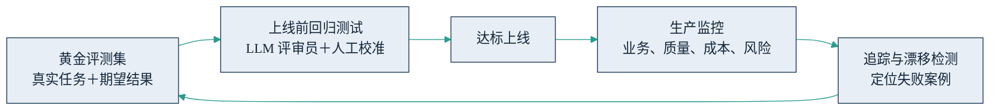

## 6.5 评估与运维：智能体的质检线

传统软件测试的前提是确定性：同样的输入必然产出同样的输出，测试通过就是通过，上线之后行为不会自己变化。大模型驱动的智能体打破了这个前提——它的输出是概率性的：同一个问题两次回答可能不同；改一句提示词，可能修好一个案例、同时悄悄弄坏三个别的案例；模型厂商升级底座版本，昨天达标的系统今天可能失灵。因此，质检必须从“上线前的一次动作”变成“贯穿全生命周期的一条产线”。业界给这条产线起了个名字：AgentOps——类比软件业的 DevOps（开发与运维一体化），指围绕智能体的评估、监控、追踪与持续迭代的工程体系。管理者不必掌握其中的工具细节，但要能对照本节的框架，检查自己的项目有没有这条线。

### 6.5.1 上线前：评测集与 LLM 评审员

质检线的地基是**黄金评测集**（golden set）：一组固定的“真实任务＋期望结果”，每次系统改动后全量重跑，用通过率判断这次改动是进步还是倒退——没有它，所有“效果变好了”都只是感觉。

评测集怎么建？不必贪大。Anthropic 的工程实践指南[《Demystifying evals for AI agents》](https://www.anthropic.com/engineering/demystifying-evals-for-ai-agents)（2026 年 1 月）给出的建议是：从 20 至 50 条源自真实失败的任务起步——早期每个改动的影响都很明显，小样本足以分辨好坏；随着系统成熟，再把生产环境新出现的失败案例持续补充进来。对管理者有两个要点。其一，评测集必须来自真实业务，理想来源是资深员工处理过的真实工单及其标准答案——这正是供应商替代不了、也是行业经验变成数字资产的具体形态。其二，评测集是企业资产，也是 6.3 所讲“评估权”的物质载体：验收谈判时手里有没有自己的评测集，议价地位完全不同。

打分怎么规模化？靠 **LLM 评审员**（LLM-as-judge）：用一个强模型按照事先写好的评分标准，自动给智能体的输出打分。它的成本远低于人工评审，可以每天评几千条。但评审员本身也是概率系统，投用前必须校准：抽样让人工与 LLM 评审员对同一批输出分别打分，确认一致率达标后再放手；[OpenAI 的官方评估指南](https://developers.openai.com/api/docs/guides/evaluation-best-practices)同样把“先对齐人工标注”列为第一原则。涉钱、涉合规的关键判断，始终保留人工抽检。

### 6.5.2 上线后：监控、追踪与闭环

上线后的监控看四类指标：**业务指标**（独立解决率、任务完成率）、**质量指标**（评审员抽检得分、投诉与差评率）、**成本指标**（单任务 token 成本、转人工率）、**风险指标**（越权尝试、异常调用，攻击面见 [5.6](../05_agent_tech/5.6_security.md)）。

监控要特别盯**漂移**（drift）——系统没改，环境变了，效果照样下滑。漂移有三个常见来源：用户问题的分布变了（新品上市、政策调整带来新问法）、模型底座变了（厂商升级或下线旧版本）、知识库过期了。应对办法是定期重跑评测集、对生产流量持续抽样评分，指标下滑即告警，而不是等客户投诉。

定位问题靠**追踪**（tracing）：完整记录智能体每一步推理、每一次[工具调用](../05_agent_tech/5.2_tool_use.md)的执行链路（LangSmith、Langfuse 等工具均以此为核心能力）。追踪的价值一是排障——出错时能定位是检索错了、推理错了还是工具错了；二是留证——执行链路就是审计与追责的证据链。

把上线前后的动作连起来，是一个持续转动的闭环。

图6-4 智能体质检闭环示意

失败案例回流评测集，评测集又约束下一次迭代——这个闭环转得越久，系统越贴合企业的真实业务，也越难被竞争对手复制。

落到操作层面，两份检查清单。上线前五条：真实业务评测集达到上线门槛规模（建设期可从 20—50 条起步，正式上线以 50 条为门槛）且归己方持有；LLM 评审员与人工打分一致率达标；高风险操作设有人工审批点；权限按最小化配置；回滚方案实际演练过。上线后五条：四类指标有看板和告警；生产流量持续抽样评分；失败案例每周回流评测集；模型或知识库变更前先跑回归测试；每月向业务负责人报告质量与成本趋势。

最后重申治理分工：本节覆盖的是**单个智能体的技术质检**。项目级的信任爬坡——人在环上、权限最小化、可回滚、小场景起步——见 [9.5](../09_landing/9.5_trust_control.md)；上升到企业制度层面的责任划分、审计与合规体系，见 [12.3](../12_governance/12.3_governance_system.md)。质检线只保证“这台机器合格”；让整个组织放心地大规模用机器，还需要后面两层。
