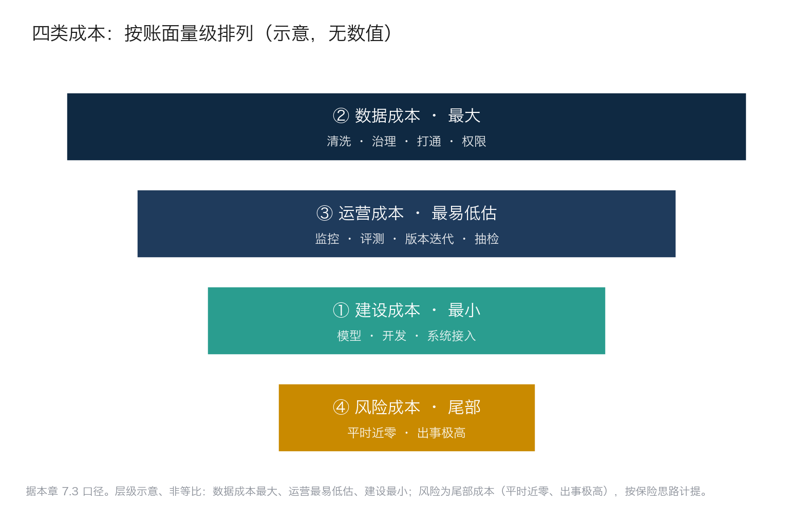
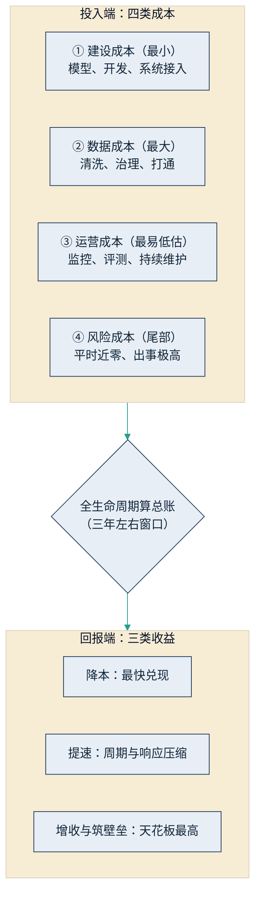

## 7.3 四类成本对三类收益

先设想一份摆上会议桌的漂亮测算：成本一栏只填了模型报价，收益一栏只算省下的人力，最后一行赫然写着"三个月回本"。这类 PPT 几乎每家公司的会议室都出现过，问题不在算错了加减法，而在两头都算窄了——分母只取了四类成本里最小的一类，分子只盯着三类收益里最先兑现的一类。有了上一节的价值坐标，本节就把这两头都撑开，给出一把完整的算账标尺：四类成本对三类收益。算窄的代价是双向的，得出的投资回报率既可能虚高、误导决策上马，也可能低估长期价值、错杀好项目。

### 7.3.1 四类成本：大多数测算只算了第一类

第一类，建设成本：模型调用或授权、应用开发、系统接入。这是报价单上最显眼的一块，却往往是四类中最小的。原因在 7.1 已经说明：模型正在变成公共品，而公共品的价格随规模与竞争持续下行。

第二类，数据成本：清洗、治理、打通、权限梳理。这是四类中最大的一块，也是多数项目真正栽跟头的地方——数据散落在纸面、聊天记录与互不相通的系统里，"接上 AI"之前先要还清多年的信息化欠账。本书将这一主题放在 [9.2](../09_landing/9.2_data_readiness.md) 专门展开，本节只需记住它在账本上的位置：最大的成本项。

第三类，运营成本：上线之后的监控、评测、模型版本更迭、提示词与知识库维护、人工抽检复核。这是最容易被低估的一块——AI 系统不是"装完就一劳永逸"的软件：模型会更新、业务会变化、输出质量会漂移，需要一条持续运转的质检线（见 [6.5](../06_ecosystem/6.5_evaluation.md)）。试点算得漂亮、扩展之后亏损，缺口常常出在这里。

第四类，风险成本：错误输出造成的赔付、合规处罚、安全事故与声誉损失。它的结构特殊——平时为零，出事极高，是典型的尾部风险。正确的处理方式不是记零，而是以类似保险的思路计提：为高风险场景保留人工审核与回滚能力，本身就是在支付"保费"。攻击面与技术防线见 [5.6](../05_agent_tech/5.6_security.md)，风险的分类与治理视角见 [12.1](../12_governance/12.1_risk_map.md)。

把四类成本按账面量级排一排，就能看清多数测算错在哪儿：报价单上最显眼的建设成本恰是最小的一块，真正的大头藏在数据与运营里，风险则是一笔平时不显、出事吞噬全年收益的尾部账。

图7-2 四类成本按账面量级排列示意

### 7.3.2 三类收益：量级差得很远

收益同样分层，且层与层之间量级悬殊。第一层，降本：最容易兑现、决策链最短，适合作为项目的第一目标与止损标尺。第二层，提速：周期压缩的价值常常大于省下的人力——报价从两天压到两小时，改变的不只是人力成本，而是成单率；风险识别从一天缩到两小时，改变的是损失敞口。提速收益容易被漏记，因为它不直接体现在任何成本科目里，需要换算成商业结果才看得见。第三层，增收与筑壁垒：做原来做不了的生意、沉淀别人拿不走的数据资产。这一层天花板最高、周期最长，一旦做成也最难被追赶——7.2 的增长与重估两张面孔都落在这一层。

### 7.3.3 把账算在同一张表上

四类成本与三类收益的全貌如下图：投入端四项性质各异，必须全部进入分母；回报端三层逐级抬高，经由全生命周期的总账关联起来。

图7-3 四类成本对三类收益的算账标尺示意

对照这张图，可以识别三种常见的错账。第一种，用建设成本对降本收益——分母只取四类中最小的一类，投资回报率被系统性高估，这是许多"三个月回本"测算的来源。第二种，漏算运营成本——试点期由项目组顺手维护，规模化后需要专职团队与评测体系，成本曲线在扩展期陡然抬头。第三种，风险成本记零——一次合规事故或重大错误输出，可能吞掉全年的降本收益。

正确的算法有两条原则。一是全生命周期口径：以三年左右的窗口累计四类成本对三类收益，而不是用上线首月的表现直接外推。二是区分费用与资产：数据治理的投入不应全部记在单个项目头上——数据就绪一次，后续多个场景都能复用，它更接近一笔跨项目的资产投资，摊到单场景的成本会随场景数量增加而下降。

这两条原则合起来，解释了本章反复出现的那个判断：最大的成本项与最深的护城河，是同一件事。模型终将人人可得，真正专属于企业的，是数据与知识——在这上面花的钱，一半是成本，一半是壁垒。至于这些钱具体是多少，是下一节的主题。
