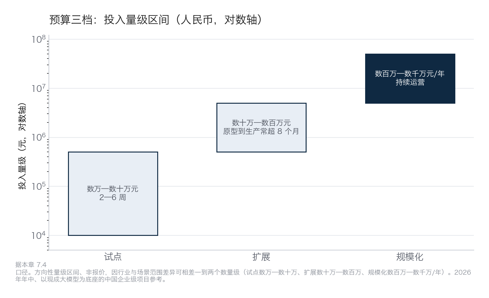
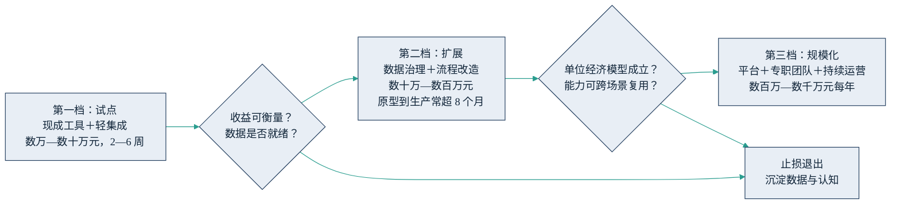

## 7.4 预算量级：试点、扩展与规模化各花多少钱

“到底要花多少钱”是管理者问得最多、却最少得到正面回答的问题。诚实的回答分两句。第一句：没有统一价目表——行业、场景范围、数据底子不同，投入可以相差一到两个数量级。第二句：量级区间是可以给的，它的用途不是编预算，而是校准预期、识别异常报价。以下区间为 2026 年年中、以现成大模型为底座的中国企业级项目的方向性参考，综合公开案例与产业实践给出，不构成任何报价依据。

### 7.4.1 三档量级与升级闸门

第一档，试点：用现成工具加轻量集成，验证单一场景的价值假设。量级在人民币数万元到数十万元，周期 2—6 周。钱主要花在工具订阅与模型调用、少量集成开发，以及最容易被忽略的一项——业务骨干投入的时间。这一档的纪律是“只验证、不建设”：不动核心系统、不做大规模数据治理，目标是拿到一个可衡量的结果（具体方法见 [9.4](../09_landing/9.4_five_steps.md) 的起步五步法）。

第二档，扩展：从“能用”走向“生产可用”。这一步真正进入数据治理与流程改造——打通数据、加固权限与安全、建立评测与监控、改写作业流程，量级升至数十万元到数百万元。时间上要有耐心：研究显示，原型到生产平均需要 8 个月以上（MIT 2025 年访谈样本口径，样本有限，仅作方向参考；同一研究也显示采用成熟厂商方案的进度通常快于纯自建）。这一档的成本大头，开始从“建设”转向“数据与人”。

第三档，规模化：多场景铺开，需要平台化能力（统一接入、评测、监控、权限）、专职团队（业务、工程、数据、风控）与持续运营，量级为每年数百万元到数千万元——注意这是持续性开支，不是一次性投入。宏观趋势可作参照：据 [Menlo Ventures 2025 年度企业生成式 AI 调研](https://menlovc.com/perspective/2025-the-state-of-generative-ai-in-the-enterprise/)（估算口径），全球企业生成式 AI 支出从 2024 年约 115 亿美元增至 2025 年约 370 亿美元、一年增至三倍多（此处 2024 年基数为 2025 报告重述后的口径，与 Menlo 2024 年报告曾引用的约 138 亿美元不同，对照旧报道时留意）；更值得看的是钱花在了哪里——2025 年过半支出（约 190 亿美元）落到直接面向使用者的应用层，而非模型本身，支出重心正从模型转向应用与运营。

| 档位 | 量级（人民币） | 周期 | 钱主要花在 |
|---|---|---|---|
| 试点 | 数万—数十万元 | 2—6 周 | 工具订阅、轻集成、业务骨干时间 |
| 扩展 | 数十万—数百万元 | 原型到生产常超 8 个月 | 数据治理、流程改造、安全与评测 |
| 规模化 | 数百万—数千万元/年 | 持续运营 | 平台、专职团队、评测与合规运营 |

把三档的量级放到同一根对数轴上，档与档之间大致隔着一个数量级——这也解释了为什么试点期的漂亮账单往往兜不住扩展、规模化两档陡然抬升的真实开支。

图7-4 预算三档投入量级区间示意（方向性区间、非报价）

三档之间不是自然升级，而是要过闸门，如下图所示。

图7-5 预算三档与升级闸门示意

设闸门的理由很直接：[Gartner 2025 年 6 月预测](https://www.gartner.com/en/newsroom/press-releases/2025-06-25-gartner-predicts-over-40-percent-of-agentic-ai-projects-will-be-canceled-by-end-of-2027)，到 2027 年底将有超过 40% 的智能体项目因成本失控、价值不清或风控不足而被取消——注意这是预测而非统计，但它指向的风险是真实的。分档投入、过闸再加码，正是对冲这一风险的预算结构，与 [10.5](../10_strategy/10.5_pacing_reporting.md) 所讲“可逆的小额多下注、不可逆的大额审慎下注”的投入节奏互为表里；过不了闸门时如何体面地止损退出，见 [9.6](../09_landing/9.6_exit_discipline.md)。

### 7.4.2 钱花在哪：成本构成的方向性判断

比总额更重要的是结构。三条方向性判断可供校准（均为产业实践的共识性观察，具体比例因场景差异很大）。

第一，模型调用费通常占小头。在多数已投产的企业项目中，模型 API 费用占总拥有成本的比例常在两成以下；例外是面向海量用户的超高频推理场景。第二，数据与人是大头。数据工程（清洗、打通、治理）加上人的投入（业务专家的时间、工程团队、变更管理与培训），合计通常超过总投入的一半——这与 7.3 “数据成本最大”的判断一致。第三，从试点到生产的隐性成本最容易漏报：安全加固、合规评审、评测体系建设，投入常数倍于原型开发本身，这正是“演示很惊艳、上线遥遥无期”的成本侧解释。

这三条可以直接用作预算体检：如果一份预算里模型与软件许可费用占了大半，要么场景极为特殊，要么它漏掉了真正的大头——多数情况是后者。供应商报价结构如何拆解、合同里哪三样必须留在自己手里，见 [6.3](../06_ecosystem/6.3_sourcing.md)。

### 7.4.3 配额与核算：token 正在变成一个成本科目

上一小节说模型调用费通常占小头，这条判断正在出现一个显眼的例外：智能体式工具按 token 计费，一次任务的消耗远高于普通对话，员工用得越顺手，账单涨得越快。据公开报道，Uber 向约五千名工程师铺开 Claude Code 等智能体编程工具后，用量增长远超财务预估，2026 年 4 月全年 AI 工具预算提前耗尽，随后公司为每人每款工具设置了约 1500 美元的月度用量上限（[彭博社，2026 年 6 月](https://www.bloomberg.com/news/articles/2026-06-02/uber-caps-usage-of-ai-tools-like-claude-code-to-cut-costs)）；微软“体验与设备”部门的部分重度使用者月耗达 500—2000 美元，该部门随后被要求限期改用自家工具（[The Next Web，2026 年 6 月](https://thenextweb.com/news/microsoft-claude-code-retreat-ai-cost)）。[Gartner 2026 年 6 月进一步预测](https://www.gartner.com/en/newsroom/press-releases/2026-06-24-gartner-predicts-ai-coding-costs-will-surpass-average-developer-salary-by-2028-as-token-consumption-surges)：随着按量计费普及与 token 消耗激增，到 2028 年 AI 编码成本将超过开发者薪酬（以全球平均薪酬为基准口径）——注意这是预测而非统计，但方向清楚：token 正在从忽略不计的杂费，变成需要单独管理的成本科目。

对策不必复杂，三个动作即可起步。一是设人均配额：像管差旅费一样给出默认额度与超额审批线，而不是放任自流或一刀切禁用。二是按任务分级配模：常规任务用轻量模型、关键任务才上旗舰，这正是 [4.4](../04_llm/4.4_model_choice.md) 模型组合策略在成本侧的应用。三是月度用量复盘：把用量按部门与项目归集（即 showback/chargeback 的思路，账单对得上责任主体），看清 token 花在了哪些场景、换回了什么产出，让复盘既有问责抓手，也让下一轮配额调整有据可依。
