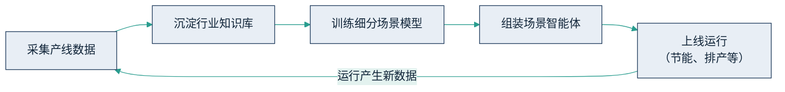

# 8.1 制造与基建：从质检到灯塔工厂

## 8.1.1 宏观图景：一年跃升，先读口径

制造业是这一轮 AI 落地声势最大的行业之一。据 IDC 调研（2025 年上半年、应用/试点口径），中国工业企业应用大模型与[智能体](../02_agent/2.1_definition.md)的比例，从 2024 年的 9.6% 升至 2025 年的 47.5%，这组数据被工信部等八部门 2026 年 1 月印发的[《“人工智能+制造”专项行动实施意见》](https://www.nda.gov.cn/sjj/zwgk/zcfb/0112/20260107214358696030895_pc.html)相关政策解读所引用。

读这个数字要先看口径：它统计的是“应用或试点”——只要有环节在用或在试，就计入分子。47.5% 不等于近半数工业企业已经规模化、深度应用；同一调研中“在研发、制造、供应链等多环节同时应用”的企业比例要低得多。更准确的读法是：一年之内，“试起来”从少数派变成了多数派，而“用出规模效益”仍是少数派。这个落差，正是第九章要解释的主题。这一跃升如下图。

图8-1 工业企业大模型与智能体应用比例一年跃升示意（据 IDC 调研，2025 年上半年、应用/试点口径，非规模化深度应用）

## 8.1.2 三家“智能工厂”：为什么先看谁在给自己发牌

具体到企业层面，制造业最常被拿来当标杆的是三类叫法接近、含金量却不同的工厂——“灯塔工厂”“超级工厂”“黑灯工厂”。三个词都在说“很先进”，但只有第一个有外部裁判。**“灯塔工厂”是世界经济论坛（WEF）与麦肯锡共同评选、需第三方现场核验的全球先进制造示范网络**，入选与否是它说了算；而“超级工厂”“黑灯工厂”多是企业自己给自己贴的营销标签，没有统一门槛，谁都能叫。读这一节请先记住这条口径线：下面三家里，只有中信戴卡是 WEF 认证的灯塔工厂，赛力斯和西安吉利的“超级工厂”“黑灯工厂”都是企业自命名——先分清谁在给自己发牌，再看数字，才不会把营销话术当成第三方背书。

### 中信戴卡：全球轮毂行业第一家灯塔工厂

**背景痛点。** 中信戴卡造的是铝制车轮。车轮表面的划痕、气孔、内部的铸造缺陷，原本靠人眼逐件目检，判定标准装在老师傅脑子里，既慢又难留痕、更难复查——这正是最适合让算法先上手的一类工序：高频、结构化、结果可核验。

**做法（具体到能学）。** 它没有停在“上一套 AI 质检”，而是把机器视觉、5G、柔性自动化等单点能力汇成覆盖全厂的智能化改造。最硬的一手是 **X 光无损探伤 AI 识别系统**：用千万张以上样本训练模型，取代九成以上的人工目检，X 光评片效率提升约 40%，并且能通过 5G 把不同工厂的片子集中到一处评判（跨地域集中评片），减少约 80% 的人员干预。质检只是抓手，全厂改造才是它够得上“灯塔”的原因。

**带口径的数据。** 据中信集团 2021 年 9 月官方公告，中信戴卡秦皇岛铝车轮六号工厂入选 WEF 与麦肯锡“灯塔工厂”，为全球汽车轮毂行业首家（✅✅ 多源：中信集团官方公告、中证网、21 世纪经济报道同源报道）。该六号工厂全厂指标：生产成本降低 33%、设备综合效率（OEE）提升 21.4%、产品不良率下降 20.9%、交付时间缩短 37.9%、能源使用效率提升 39%（✅ 单一权威口径；须注意这是**全厂多年改造的合并结果**，不能单独归因于 AI 质检）。仅就质检环节，官方口径为检测作业人员减少约 50%、质检效率提升 40%（✅ 官方口径）。

**问题 / 局限。** 三点要说破。其一，上面那组亮眼的全厂数字是**多项技术、多年投入叠加**的产物，把 33% 降本、39% 节能记到“AI 质检”头上是典型的归因错位。其二，X 光系统的效率、人员数字都是**厂商自报**，而质检最硬的指标——漏检率、误判率——并未公开；“取代九成人工”说的是替代比例，不等于质量更好。其三，“灯塔”是一次现场核验的结果，代表的是持续投入的终态，不是一套软件的即插即用。

**启示。** 灯塔工厂的价值不在某个模型，而在“把单点改善做成覆盖全厂的可测量指标体系”这件事本身；对读者而言，可学的是它的**起点选择**（先啃高频、结构化、可核验的质检），而非照搬它的终态。

### 赛力斯重庆两江超级工厂：自命名的“超级”

**背景痛点。** 赛力斯造新能源整车，问界系列订单起量后，交付速度与整车一致性的压力同时压上来。整车制造工序长、检测点多，人工既跟不上节拍，也难保证每台车的外观与装配都达到同一标准。

**做法。** 它走的是整线自动化路子：园区部署超 3000 台机器人，冲压、焊装、涂装等关键工序实现 100% 自动化（据华为与赛力斯披露，工厂 2024 年投产）。质检上主打两套 AI 视觉系统——\*\*“发丝级质检”**在暗房检测站布十多套工业相机，约 100 秒完成整车外观无死角扫描，覆盖 60 多个检测项、可达毫米级精度；**“天眼”\*\*用 40 多套相机覆盖 40 多个关键工序，把质量数据前移到产线上实时采集。

**带口径的数据。** 园区超 3000 台机器人、关键工序 100% 自动化、2024 年投产（✅ 华为与赛力斯披露）；“发丝级质检”约 100 秒扫完整车、覆盖 60 多检测项、毫米级精度，“天眼”40 多套相机覆盖 40 多工序，整体质量检测效率提升约 30%–40%（✅ 技术伙伴树根互联案例口径，厂商侧数据）。

**问题 / 局限。** 关键的一条：赛力斯“超级工厂”是**企业自命名**，截至本书写作并未进入 WEF 全球灯塔工厂网络名单（✅ 证否性结论）。“超级”是营销词，不是第三方认证——它先进不假，但含金量与“灯塔”不是一个量级的证据。此外，3000 台机器人、100% 自动化这类数字来自厂商与技术伙伴披露，缺少独立第三方复核；“质量检测效率提升 30%–40%”是效率口径，同样没有披露漏检率这类最终质量指标。

**启示。** 同样是“很先进”的工厂，“超级工厂”与“灯塔工厂”在证据等级上差一层：前者是自证，后者过了外部核验。读案例时把“谁在给自己发牌”这一问放在数字之前，能挡掉大量营销话术。

### 吉利西安黑灯工厂：自命名的“黑灯”

**背景痛点。** 吉利西安工厂要在同一条产线上兼容两大整车架构、多款车型的柔性混线生产，同时把用工规模和差错率压下来——这是传统整车厂用人海战术难以同时满足的三个目标。

**做法。** 它把主要工序做到“黑灯”（关灯无人）运行：部署约 696 台机器人，主要工序 100% 自动化；支持两大架构 6 款车型共线，切换车型约需 1 分钟；每台车建“一车一电子档案”，全流程可追溯。柔性与精度是它的招牌，星越 L 整车零部件累计误差控制在 0.5 毫米以内。

**带口径的数据。** 约 696 台机器人、主要工序黑灯 100% 自动化、一年上传生产数据约 5600TB、总员工不到 2000 人（约为同规模传统工厂的一半）；两大架构 6 款车型共线、约 1 分钟切换车型、星越 L 累计误差 0.5 毫米内、一车一电子档案（✅ 36 氪等媒体实探报道口径）。

**问题 / 局限。** 与赛力斯同理：吉利西安“超级智能黑灯工厂”是**企业命名**，并非 WEF 认证的灯塔工厂（✅ 证否性结论）。“黑灯”形容的是自动化程度高、现场用人少，不是一个有门槛的认证等级。上述机器人数量、误差、数据量多来自媒体实探与企业介绍，属于单一来源的量级口径，缺乏第三方核验；“员工约为传统工厂一半”是对比估算，参照的“传统工厂”口径本身并不严格。

**启示。** “黑灯”“超级”“智能”这类形容词堆叠得越密，越要回到那条口径线上问一句：这块牌子是谁发的？三家放在一起看，最值钱的一课不是任何一个百分比，而是学会先区分“外部核验”与“企业自命名”，再决定一个数字该给多大的信任权重。

## 8.1.3 海尔卡奥斯：数据飞轮怎么转起来

在这批标杆里，海尔卡奥斯值得单独拆开看，因为它回答了一个更难的问题：单点做成之后，怎么把一次成功变成可复用的能力。

**起点是一笔电费。** 空压站是很多工厂里最不起眼、也最耗电的角落——常年满负荷运转，靠老师傅的经验设定气压与台数组合。经验能把能耗压到一个水平，但压到哪儿算到头、还能不能再省，谁也说不清。据 21 世纪经济报道在 2025 世界人工智能大会（WAIC）期间的报道，海尔卡奥斯为这类高耗能环节做智能优化，在**已完成节能改造的工厂**基础上，再降约 5% 能耗。参照系很关键：这 5% 是在拧过一遍的毛巾上再拧出来的水，直接摊进全年电费，就是实打实的利润。

**做法不是买一个模型，而是搭一条流水线。** 海尔把 40 余年制造经验沉淀进“天智”工业大模型，据其公开披露，该体系内置 4700 余个机理模型、200 多项专家算法、110 多款智能体开发工具，已在家电、能源、石化等 9 大行业落地 45 个高价值场景。具体到单个场景，路径是四步：先采集产线运行数据，沉淀为行业知识库，再训练细分场景的小模型，最后组装成可自主执行的智能体；智能体运行中产生的新数据又回流到第一步，形成越用越准的闭环。这条闭环如下图所示。数据治理的方法论见 [9.2](../09_landing/9.2_data_readiness.md)，知识库的技术实现可参见 [RAG](../05_agent_tech/5.3_rag.md)。

图8-2 海尔卡奥斯“数据飞轮”闭环示意

**为什么是它做成了？** 三个条件缺一不可：海尔本身是制造巨头，几十年工艺沉淀可以固化成机理模型，这是数据飞轮的启动燃料；产线信息化底子厚，采数环节不用从零铺；更关键的是，卡奥斯本就是对外输出的工业互联网平台，有把一次场景成功产品化、再卖给下一家的商业动机——飞轮转起来，它才有生意。**可复制的前提**因此也清楚：不是买下同款平台，而是具备“能把隐性经验沉淀成数据、把单点改善做成可测量指标”的组织能力。

## 8.1.4 两类口径样本：厂商愿景与政府文件

制造与基建里还有两个常被引用的案例，正好演示两种要小心的口径。

* **西门子工业 Copilot（厂商愿景口径）**：据[西门子官方公告](https://press.siemens.com/global/en/pressrelease/siemens-industrial-copilot-expanded-adopted-thyssenkrupp)，蒂森克虏伯自 2025 年起在全球产线规模化采用，用于自动化代码生成、报错码解读。但宣传中“效率提升最高可达 50%（up to 50%）”是厂商目标，不是第三方实测均值，引用时不能省掉“最高可达”四个字。
* **广州地铁×中国移动（政府文件口径）**：施工智能监测系统入选 2025 年广州市“人工智能+”典型案例集，覆盖约 480 公里线路建设，节省人力 200 余人，落地金额超 6600 万元。施工监测全天候、规则明确、留痕可查，AI 替代的不只是成本，还有夜间与高危时段的人身风险。

## 8.1.5 如果你是腰部企业，最先卡在哪一步

把海尔的路径缩到腰部工厂，最先卡住的几乎从来不是模型，而是**采数**。老师傅的参数组合在脑子里，台账是纸面或分散的 Excel，产线设备连数据接口都没有——飞轮的第一格就转不动。所以腰部企业可复制的不是灯塔工厂的终态，而是它的起点：先选自家最痛、最可核验的一个环节（质检、能耗、安全监测），把相关的经验、台账和读数数字化，做出一个可测量的改善。工具可以买——西门子这类产品已大幅降低工程门槛；但沉淀在自家产线上的数据与知识，才是竞争对手拿不走、也是后续一切模型与智能体的原料。一句话：工具可以买，飞轮必须自己转。
