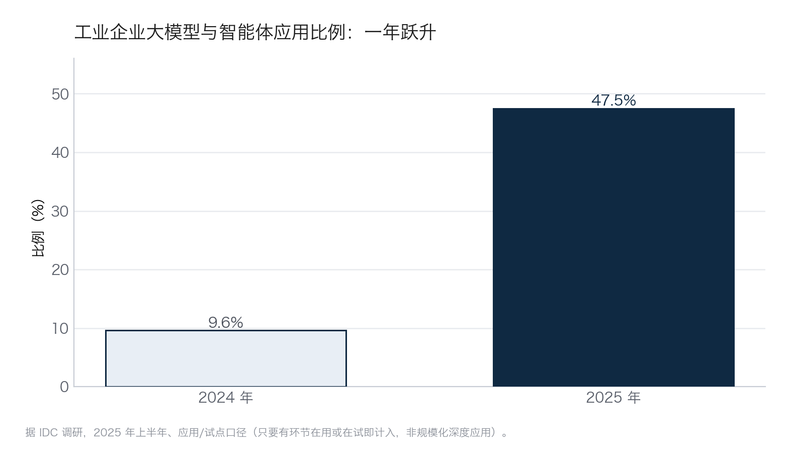
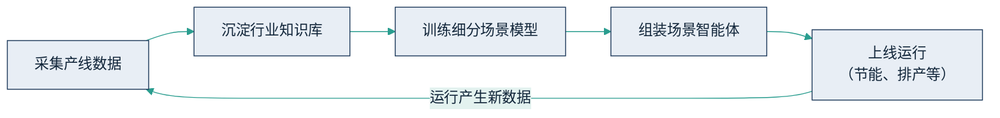

## 8.1 制造与基建：从质检到灯塔工厂

### 8.1.1 宏观图景：一年跃升，先读口径

制造业是这一轮 AI 落地声势最大的行业之一。据 IDC 调研（2025 年上半年、应用/试点口径），中国工业企业应用大模型与[智能体](../02_agent/2.1_definition.md)的比例，从 2024 年的 9.6% 升至 2025 年的 47.5%，这组数据被工信部等八部门 2026 年 1 月印发的[《“人工智能+制造”专项行动实施意见》](https://www.nda.gov.cn/sjj/zwgk/zcfb/0112/20260107214358696030895_pc.html)相关政策解读所引用。

读这个数字要先看口径：它统计的是“应用或试点”——只要有环节在用或在试，就计入分子。47.5% 不等于近半数工业企业已经规模化、深度应用；同一调研中“在研发、制造、供应链等多环节同时应用”的企业比例要低得多。更准确的读法是：一年之内，“试起来”从少数派变成了多数派，而“用出规模效益”仍是少数派。这个落差，正是第九章要解释的主题。这一跃升如下图。

图8-1 工业企业大模型与智能体应用比例一年跃升示意（据 IDC 调研，2025 年上半年、应用/试点口径，非规模化深度应用）

### 8.1.2 信通院典型案例：质检为什么先行

具体到企业层面，中国信通院 2025 年发布的典型案例集收录了一批制造标杆，透过它们的切入点，能看清 AI 在制造业最先落到哪些工序上。中信戴卡造的是铝制车轮，AI 先接的是质检环节——车轮表面的划痕、气孔、尺寸偏差原本靠人眼逐件看，机器视觉把这道判断标准化、留痕化，再把这类单点能力汇成覆盖全厂的智能化改造，才够得上“灯塔工厂”的称号。赛力斯造新能源整车，走的是灯塔工厂的整线路子：焊装、涂装、总装多个车间同步做数字化与柔性排产，AI 调度贯穿其间。西安吉利同样从整车制造的 AI 质检切入——焊点、涂层、装配这些高频重复、对错分明的检测点，最适合让算法先上手。这三家能先行，与其信息化底子直接相关：生产执行系统、质量追溯系统铺设多年，AI 接入时采数所需的“数字神经”已经在位。

“灯塔工厂”原指世界经济论坛与麦肯锡评选的先进制造示范工厂，如今泛化为智能化改造标杆的代称，它代表的是多年持续投入的终态，而非一次项目的产出。具体量化指标以案例集原文为准，本书不转引二手数字：入选标准是场景与做法的示范性，各家披露口径并不统一，横向比数字没有意义。

值得记住的是它们的共同起点——都从“高频、结构化、结果可核验”的环节切入。质检之所以是最典型的一类，正因为它同时满足这三条：样本量大、判定标准明确、对错可以复查，每一次误判都能回溯到具体图像与工件。

### 8.1.3 海尔卡奥斯：数据飞轮怎么转起来

在这批标杆里，海尔卡奥斯值得单独拆开看，因为它回答了一个更难的问题：单点做成之后，怎么把一次成功变成可复用的能力。

**起点是一笔电费。** 空压站是很多工厂里最不起眼、也最耗电的角落——常年满负荷运转，靠老师傅的经验设定气压与台数组合。经验能把能耗压到一个水平，但压到哪儿算到头、还能不能再省，谁也说不清。据 21 世纪经济报道在 2025 世界人工智能大会（WAIC）期间的报道，海尔卡奥斯为这类高耗能环节做智能优化，在**已完成节能改造的工厂**基础上，再降约 5% 能耗。参照系很关键：这 5% 是在拧过一遍的毛巾上再拧出来的水，直接摊进全年电费，就是实打实的利润。

**做法不是买一个模型，而是搭一条流水线。** 海尔把 40 余年制造经验沉淀进“天智”工业大模型，据其公开披露，该体系内置 4700 余个机理模型、200 多项专家算法、110 多款智能体开发工具，已在家电、能源、石化等 9 大行业落地 45 个高价值场景。具体到单个场景，路径是四步：先采集产线运行数据，沉淀为行业知识库，再训练细分场景的小模型，最后组装成可自主执行的智能体；智能体运行中产生的新数据又回流到第一步，形成越用越准的闭环。这条闭环如下图所示。数据治理的方法论见 [9.2](../09_landing/9.2_data_readiness.md)，知识库的技术实现可参见 [RAG](../05_agent_tech/5.3_rag.md)。

图8-2 海尔卡奥斯“数据飞轮”闭环示意

**为什么是它做成了？** 三个条件缺一不可：海尔本身是制造巨头，几十年工艺沉淀可以固化成机理模型，这是数据飞轮的启动燃料；产线信息化底子厚，采数环节不用从零铺；更关键的是，卡奥斯本就是对外输出的工业互联网平台，有把一次场景成功产品化、再卖给下一家的商业动机——飞轮转起来，它才有生意。**可复制的前提**因此也清楚：不是买下同款平台，而是具备“能把隐性经验沉淀成数据、把单点改善做成可测量指标”的组织能力。

### 8.1.4 两类口径样本：厂商愿景与政府文件

制造与基建里还有两个常被引用的案例，正好演示两种要小心的口径。

- **西门子工业 Copilot（厂商愿景口径）**：据[西门子官方公告](https://press.siemens.com/global/en/pressrelease/siemens-industrial-copilot-expanded-adopted-thyssenkrupp)，蒂森克虏伯自 2025 年起在全球产线规模化采用，用于自动化代码生成、报错码解读。但宣传中“效率提升最高可达 50%（up to 50%）”是厂商目标，不是第三方实测均值，引用时不能省掉“最高可达”四个字。
- **广州地铁×中国移动（政府文件口径）**：施工智能监测系统入选 2025 年广州市“人工智能+”典型案例集，覆盖约 480 公里线路建设，节省人力 200 余人，落地金额超 6600 万元。施工监测全天候、规则明确、留痕可查，AI 替代的不只是成本，还有夜间与高危时段的人身风险。

### 8.1.5 如果你是腰部企业，最先卡在哪一步

把海尔的路径缩到腰部工厂，最先卡住的几乎从来不是模型，而是**采数**。老师傅的参数组合在脑子里，台账是纸面或分散的 Excel，产线设备连数据接口都没有——飞轮的第一格就转不动。所以腰部企业可复制的不是灯塔工厂的终态，而是它的起点：先选自家最痛、最可核验的一个环节（质检、能耗、安全监测），把相关的经验、台账和读数数字化，做出一个可测量的改善。工具可以买——西门子这类产品已大幅降低工程门槛；但沉淀在自家产线上的数据与知识，才是竞争对手拿不走、也是后续一切模型与智能体的原料。一句话：工具可以买，飞轮必须自己转。
