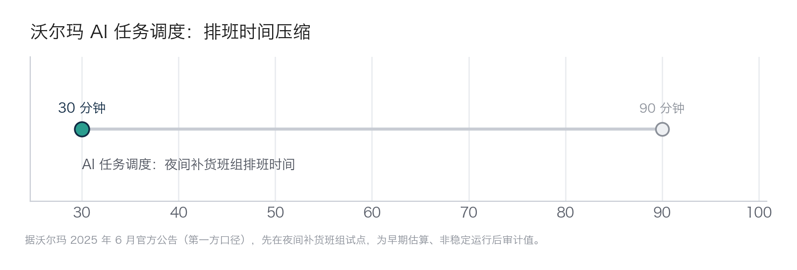

## 8.3 零售与电商：从降本到增收

零售与电商是 AI 离钱最近的行业——投放、推荐、客服，每一环都直接挂着交易额。也正因为离钱近，这个行业的宣传数字最密集，“读数的基本功”在这里最能派上用场。增收侧的两个标志性案例——亚马逊 Rufus 购物助手（据 CEO 财报口径，年化新增销售额超 100 亿美元）与阿里“全站推广”（把大量原本不投广告的中小商家转化为广告主）——已在 [7.2](../07_value/7.2_three_faces.md) 作为“增长”面孔连同完整口径展开，本节不再重复；转而聚焦一个把 AI 铺到一线的完整样本，再附两组要小心的数字。

### 8.3.1 京东与行业平均：先立读数的规矩

京东是研究零售 AI 的好样本：它把大模型铺进了投放、推荐、客服、直播多个环节，公开披露也相对密集。但正因为披露多，它也最能暴露一个问题——**同一家公司流传的数字，可信度天差地别**。我们先用京东的两组数据立读数的规矩，再看行业平均那条更需要警惕的引用。

**先说一组容易以讹传讹的数字。** 坊间常引“2024 年双 11 京东 AI 广告投放 ROI 提升 28%、推荐转化率提升 18%”这类说法，听上去精确，却几乎追不到一手出处——既非京东官方战报的口径，也不见于主流财经媒体的可核报道。本书的规矩是：追不到来源、对不上口径的数字，宁可不用。大促本身也不宜作全年参照——双 11 的流量结构、补贴强度、用户心智都与平日不同，任何大促同比数据都带着这层特殊性，外推为常态即失真。

**再看一组能追到口径的。** 2025 年 9 月，京东发布电商客服 Agent 原生应用“京小智 5.0”，基于 JoyAI 大模型与多 Agent 协作架构，覆盖售前导购、跟单、质检全链路。据京东官方披露、并经新浪财经、网经社等转载的一组**内测数据**（5 万家店铺样本）：转人工率降低 28% 以上，售前咨询转化率提升 37% 以上，用户满意度提升 15% 以上（✅ 单一权威一手来源，京东官方内测口径）。这组数字比坊间那组“双 11 ROI +28%”可靠得多，但**仍要打两道折**：一是“内测”不等于全量上线后的稳定值，样本店铺往往是配合度高、数据完整的一批，本身就偏乐观；二是“转人工率降低”和“转化率提升”都是厂商择优披露的正向指标，看不到它没披露的那些场景。同一家店的实测则更分散——某三星京东自营旗舰店反馈导购场景转化率提升 27.6%、转人工率降低 43%（京东披露的单店案例口径），既说明潜力真实，也说明单店波动极大，不能当平均。

京东这类投放、推荐、客服的效果之所以最先能拿出数字，是因为**归因相对干净**：反馈以小时计，且能做 A/B 测试（流量随机分两组、同期对比），效果可以较严格地归到算法本身。这是 AI 项目里最稀缺的品质——多数“提效”混杂着流程调整与人员变动，说不清多少真正归功于 AI。但“归因干净”只解决了因果问题，解决不了披露偏差：即便测得准，你看到的仍是厂商愿意给你看的那一面。

**一个把成本结构改写的旁例：京东言犀数字人。** 增收侧值得单独看一眼数字人直播。传统直播带货的痛点是“人”——真人主播时薪高、覆盖不了 0–8 点的非黄金档、稳定性差，中小商家尤其请不起。京东云言犀用大模型把数字人的制作门槛压了下来：据京东向第一财经披露，单个数字人生产成本已从数万元降到“两位数”，较真人拍摄降幅超 90%；训练素材也从去年的约 30 分钟视频，缩到今年一张照片或一段文字描述即可生成（京东官方口径，媒体报道未独立核实）。截至 2025 年一季度前后，言犀数字人服务超 9000 家商家、累计带来销售增量超 140 亿元（京东披露的累计口径，非单期收益）。单店层面也有零星数据：保健品牌汤臣倍健的直播间“AI 每小时成交比真人提升 2.6 倍”，童装巴拉巴拉的数字人贡献了约 15% 的直播 GMV（均为京东披露的单店案例口径）。

这些数字要按厂商披露来打折看：“累计销售增量 140 亿”是把 9000 家店的增量加总、且跨越较长时间，不能理解为某一场大促的收益；“比真人提升 2.6 倍”是择优披露的样板间，不是所有接入商家的平均。但即便打足了折，这个案例的**启示**依然清晰，且与沃尔玛那条相反相成：沃尔玛用 AI 把一线员工的时间省出来（降本侧），京东数字人则用 AI 把一项原本高门槛的能力（专业直播）降到中小商家用得起（增收侧），本质都是**把 AI 的边际成本压到接近于零，再乘以一个巨大的长尾**。可复制的前提也一样苛刻——需要一个能自摊研发成本的平台方（京东云）把工具 SaaS 化，单个商家并不具备自研数字人的条件。对腰部企业，真正的问题不是“要不要用数字人”，而是“选哪家平台的成熟工具、怎么把它嵌进自己的直播运营”。

**追不到原始口径的行业区间不能进预算。** “个性化推荐可使转化率提升 30%–50%”与“亚马逊 35% 的销售额来自推荐系统”都被大量转述，却找不到能同时说明样本、基线、时点与归因方法的一手出处。后一数字常挂在麦肯锡名下，实际辗转自约十年前的旧文；前一范围则混合了不同品类与基线。两者在本书中只作读数纪律的反例，不作为行业基准，更不能进入自家立项预期。正确做法是先定自家基线，再用 A/B 测试得到可核验增量。

### 8.3.2 沃尔玛：把 AI 发到 150 万一线员工手里

标杆案例往往押注一个明星应用，沃尔玛偏偏反着来——它把 AI 摊进一线员工的日常工具链，靠“人头 × 分钟”累积收益。这是零售业规模化最值得研究的一条路径。

**痛点**。150 万名一线员工，每天在做大量琐碎却耗时的事：排班、在货架间找货、给非母语同事解释流程、应付顾客问询。单看一件都不起眼，乘以 150 万人和 365 天，就是天文数字的隐性成本——这类“广、薄、碎”的痛点，恰恰是单点明星应用够不着的。

**做法**。据[沃尔玛 2025 年 6 月官方公告](https://corporate.walmart.com/news/2025/06/24/walmart-unveils-new-ai-powered-tools-to-empower-1-5-million-associates)（第一方口径），新一批工具全部跑在其自研机器学习平台 Element 上，把 AI 塞进多个日常触点：AI 任务调度（先在夜间补货班组试点）把排班时间从 90 分钟压到 30 分钟（如下图）；实时翻译支持 44 种语言、且认得“Great Value”这类自有品牌词；面向门店的对话式 AI 助手每周有 90 余万员工使用、每天处理约 300 万次查询；此外还有结合 AR 与 RFID 的服装盘点工具 VizPick。客服问题解决时长最多缩短约 40%（up to 40%）。

图8-3 沃尔玛 AI 任务调度排班时间压缩示意（据沃尔玛 2025 年 6 月官方公告、第一方口径，夜间补货班组试点的早期估算）

**为什么是它做成了，可复制的又是什么？** 沃尔玛做成，靠三样东西：一是规模本身——任何 per-head 的分钟节省，乘以 150 万人就值得投入；二是自研 Element 平台多年打底，数据治理与安全先行，铺开时不必临时补课；三是产品哲学——不赌单点，而把 AI 当作“发给每个人的工具”。可复制的不是这三样（腰部企业都不具备），而是它的**选择**：找到一线广而碎的通用痛点，用工具把时间省出来。

**口径提醒**。第一方数字真实，但属择优披露——“最多缩短约 40%”不是平均缩短 40%，排班的“早期估算”也还不是稳定运行后的审计值。第一方数字适合判断方向与量级，不适合直接抄进自家的投资回报测算。

### 8.3.3 如果你是腰部企业，最先卡在哪一步

沃尔玛的三样底子腰部企业都没有，但它的路径其实门槛最低——因为工具几乎都能 SaaS 化采购：排班、翻译、货架管理、客服质检，市面上都有现成产品，不必自研 Element。真正卡住腰部企业的，不在技术，而在一道组织决策：**省出来的一线时间去了哪里**。是让员工多服务顾客、把体验和复购做上去，还是直接换算成减员？想清楚这一步，项目才是一个效率故事；想不清楚，它就会变成一场士气事故，员工学会了新工具，却也学会了怎么应付它。还有一道隐性关卡是采用率——工具发下去没人用，等于没发，这也是为什么“给一线而不是给总部”本身就是成败的一半。
