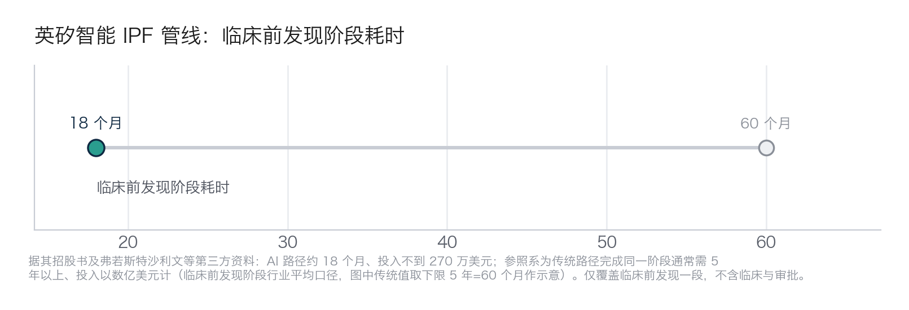

## 8.4 医药与生命科学：改写研发周期

医药是 AI“做成原来做不了的事”最接近字面意义的行业——新药研发以十年、十亿美元计，任何环节的数量级提速都是大事。但它也是口径被误读最严重的行业：“AI 让新药研发周期砍半”之类的说法流传很广。本节先把一个案例讲透，顺带立好参照系，再谈提速的边界。

### 8.4.1 英矽智能：18 个月背后，是 78 个分子

**痛点与起点**。传统新药的临床前发现——从确定疾病靶点到筛出可进入开发的先导化合物——是一个反复试错的物理过程：化学家合成一批分子、拿去测试、看结果、再改结构、再合成，一轮轮下来，动辄合成成千上万个化合物、耗时数年。英矽智能（Insilico Medicine，现已在港交所上市）想做的，是把这个“合成再测试”的物理循环，尽量换成“生成再预测”的计算循环。

**做法**。它自研了 Pharma.AI 平台，核心是两台引擎协同：生物学引擎 PandaOmics 从海量组学与临床数据里挖出新靶点，化学引擎 Chemistry42 再针对该靶点生成、优化候选分子。在特发性肺纤维化（IPF）这条管线上，PandaOmics 锁定了一个此前少有人做的新靶点 TNIK，Chemistry42 据此设计分子，最终选出代号“055”的候选药 rentosertib。据公司披露，从提出靶点到确定先导化合物，全程仅合成并测试了约 78 个化合物——这个数字最能说明 AI 改变了什么：不是让化学家跑得更快，而是把要真实合成的分子从成千上万压到几十个，其余的筛选在计算里完成。

**指标与参照系**。据其招股书及弗若斯特沙利文等第三方资料，这一阶段用时约 18 个月、投入不到 270 万美元。参照系必须同时给出：传统路径完成同一阶段通常需 5 年以上、投入以数亿美元计（临床前发现阶段的行业平均口径）。18 个月对 5 年以上、270 万对数亿——量级差距一目了然（时间维度如下图），但它只覆盖临床前发现这一段。

图8-4 英矽智能 IPF 管线临床前发现阶段耗时对比示意（据招股书及弗若斯特沙利文等第三方资料，仅覆盖临床前发现一段；传统值取 5 年下限作示意）

**后续进展**。该候选药 rentosertib 的 IIa 期临床结果于 2025 年 6 月发表于《自然·医学》（Nature Medicine），并已推进至 III 期临床；2026 年公司又与礼来达成潜在总额约 27.5 亿美元的研究合作（据公司公告与公开报道）。能否最终获批上市，仍要走完临床与审批全程——而这恰恰是 AI 尚未证明能大幅压缩的部分。

**为什么是它做成了，可复制的又是什么？** 英矽是一家 AI 原生公司，从靶点到分子的双引擎是自己一体化搭出来的，不是买来的模块拼装；它又刻意挑了 IPF 这种靶点新颖、传统方法难啃的适应症，让 AI 的“生成”优势有用武之地。但真正可复制的护城河，不是某台引擎，而是一条纪律：把每一次实验记录、每一组构效关系持续结构化地沉淀下来——没有这份底账，再强的平台也无米下锅。

**口径与局限**。这是单一管线的最佳案例，不是平台的平均成绩；AI 制药整体仍处“临床兑现期”，尚无 AI 原创药物完成全周期上市验证。这个案例也是第十章“颠覆”战略的锚点（见 [10.3](../10_strategy/10.3_three_strategies.md)）。

### 8.4.2 药明康德：一个被反复误读的“60%”

**背景与痛点**。英矽是 AI 原生的药企，从头把新药做出来；但产业里更多的钱和分子，其实握在**研发外包（CRO/CDMO）**手里——药企把发现、合成、测试等环节按项目外包出去，交给药明康德这类头部服务商去做。这类公司自己不是“AI 制药公司”，却因为一句被反复转述的“缩短 60%”，长期被外界误当成“靠 AI 造药”的典型。这个案例的价值，恰恰在于把口径掰回原样。

**做法（具体到能学）**。药明康德把 AI/机器学习嵌进它最标准化、最高频的一段——化合物设计与合成路线的选择：用模型预测分子性质、排序候选、规划合成路线，减少化学家在实验台前的试错轮次。它不改变“先有靶点、再设计分子、再进临床”的整体链条，只在链条中**某一个环节**上换用计算加速。对腰部药企的启发是：不必自建平台，这部分能力已被产品化成服务，可以按项目购买。

**带口径的数据**。据证券时报 2025 年 7 月报道，药明康德自研 AI 平台使**化合物设计周期缩短 60% 以上**（⚠️ 仅媒体转述、服务方单方口径，且限于“化合物设计”这一环节，非研发全程，宜与客户侧交付反馈相互印证）。这个 60% 必须钉死两个限定：一是**单环节**，不是把新药从立项到上市的周期砍掉六成；二是**服务方自报**，数字兼有招揽客户的功能。作为全球头部 CRO，它的真正意义在**外溢**——效率提升会通过价格与交付速度传导给整个行业，让不自建平台的中小药企也能按项目买到这部分能力。

**问题、局限与挑战**。最需要警惕的，是药明康德自己都要出面纠正的误读：**公司明确否认“用 AI 开发新药”**，其 AI 仅用于研发服务中的化合物设计等环节，与外界误传的“AI 制药公司”不是一回事（第一方澄清口径，✅✅）。把服务商讲成原创新药的 AI 公司，是投资叙事里最常见的贴金。更大的一条红线来自行业总口径：据投中网、亿欧 2025 年 4 月引述的 BCG 报告，AI 使医药研发**前端环节**提速**约 50%**、研发效率**约翻倍**（据披露/预测口径，⚠️ 保留“约”与限定语）。“前端”指靶点发现、化合物设计等临床前阶段；而新药从立项到上市还要走完 I–III 期临床与注册审批，平均周期十年上下。临床阶段的时间是刚性的——受试者要一个个招募，药要按方案一天天给，安全性数据必须靠时间积累，这些不因算法更聪明而缩短。

**启示**。把“单环节缩短 60%”或“前端提速约 50%”讲成“新药上市周期砍半”，是这个行业最常见、也最误导决策的口径滑移。正确的表述是：AI 把研发漏斗的入口做宽、做快、做便宜了，同样的钱能推进更多候选管线到临床门口——但漏斗后半段的通过率与耗时是否改善，要等未来几年的临床数据来回答。读一切医药 AI 数字，先问三件事：这是哪一段（单环节还是全程）、谁说的（服务方、厂商还是独立第三方）、是事实还是预测。

### 8.4.3 晶泰科技：有公开数据的 AI 制药，也有诚实的局限

英矽讲的是“一条管线做成了”，药明康德讲的是“一个环节被误读了”。要给这一节补上**有公开财务数字**的一角，晶泰科技（XtalPi，港股 02228）是个更完整的样本——它既证明了 AI 药物发现能拿到真金白银的订单，也把这门生意最诚实的局限暴露在了财报里。

**背景与痛点**。AI 制药最被质疑的一点是：漏斗前端再快，能不能换来收入？早期玩家大多在“烧钱做平台、拿不到大订单”的阶段徘徊。晶泰科技的定位是“AI+机器人”驱动的药物发现服务商，既自建管线，也对外接单——它需要用真实交易证明这套漏斗对客户有价值。

**做法（具体到能学）**。以它与希格生科（Signet Therapeutics）合作的胃癌新药 SIGX1094 为例，可以看清它的“漏斗打法”：先用 AI 做靶点验证与先导化合物发现、优化，把候选分子从**百万级**逐层筛到**近百个**、再收敛到**10–20 个**重点分子做真实合成与测试（⚠️ 晶泰官网单一披露口径）。据公司披露，从新靶点到设计出综合成药性更优的临床前候选化合物（PCC），仅用了**六个多月**；该项目从靶点发现到 IND（临床试验申请）获批约**三年多**。SIGX1094 已获美国 FDA 快速通道与孤儿药认定，并在北京大学肿瘤医院完成实体瘤 I 期临床首例给药——即已推进至临床阶段（✅ 公司公告与公开报道）。可学的是这套“计算里筛、实验室里验”的漏斗纪律：把要真实合成的分子压到几十个量级，其余在计算中淘汰，与英矽“78 个化合物”的逻辑同源。

**带口径的数据**。2025 年 8 月，晶泰科技宣布与 DoveTree 达成 AI 药物发现合作，**合作总额约 59.9 亿美元（约 470 亿港元），为迄今全球 AI 药物发现领域公开的最大单笔合作**（AA，公司公告）。但这个数字必须逐层拆开，否则最容易被误读为“到手 60 亿美元”：

- 已收到**首付款约 5100 万美元**（约 4 亿港元）；
- 另有**约 4900 万美元**的进一步付款资格；
- 其余**约 58.9 亿美元**为**潜在的监管里程碑、商业里程碑及销售分成**——属于**或有对价**，只有在管线推进达标、乃至最终上市销售后才可能兑现，绝大部分并非已确认收入（AA，公司公告口径）。

换句话说，“59.9 亿美元”是合作**总额上限**，不是收入。真正落袋的是 5100 万美元级别的首付款，其余是一张要靠十年临床去逐格点亮的“期权”。

**问题、局限与挑战**。财报把这门生意的软肋摊得很明白。据 2025 年中期业绩，晶泰科技上半年营收约**人民币 5.17 亿元、同比增长约 404%**，并**首次实现半年盈利**（AA，财报口径）。听上去是拐点，但要点明两条：其一，**这轮盈利主要由一次性首付款驱动**——仅 DoveTree 一笔约 5100 万美元的首付款，就占当期营收七成以上，属一次性收入，不代表可持续的经营性盈利能力；其二，把里程碑/或有对价与已确认收入混为一谈，是解读 AI 制药财报最常见的坑。对照 2024 年，公司仍处亏损，靠一笔超级订单的首付款翻正，说明这门生意的收入高度依赖大额 BD（商务拓展）交易的时点，**波动大、可预测性弱**。更根本的挑战与英矽一致：这些订单绝大多数价值兑现在**后端临床与上市**，而临床成功率与耗时，至今没有任何一家 AI 制药公司用完整周期证明能被算法显著改善。

**启示**。晶泰科技的样本，把 AI 制药的“喜”与“忧”摆在同一张表上：喜的是漏斗能提速、能签下创纪录的订单、能筛出推进到临床的分子；忧的是账面盈利可能只是一次性首付款的假象，几十亿美元的总额里绝大部分是或有对价。给管理者的读数纪律是：看到“XX 亿美元大单”，先分清**订单总额 vs 已确认收入**；看到“首次盈利”，先问**是一次性还是可持续**。医药 AI 值得投入，但值得投入的理由，不该建立在被口径滑移撑大的数字上。

### 8.4.4 如果你是腰部企业，最先卡在哪一步

英矽的主战场资金与数据门槛都高，腰部研发企业（不限于药企）若照搬“自建双引擎平台”，最先卡在数据——没有多年结构化沉淀的实验与构效数据，模型无从学起。可复制的是三件够得着的事：第一，情报环节先智能化，文献、专利、竞品管线的追踪与综述是大模型当前最成熟的能力区，投入小、见效快；第二，从今天起把研发过程数据化，这是英矽真正的壁垒，也是任何规模都能启动的纪律（数据就绪详见 [9.2](../09_landing/9.2_data_readiness.md)）；第三，借力而不自建，药明康德们已把 AI 能力产品化成服务，按项目购买比自建平台便宜一个量级以上。
