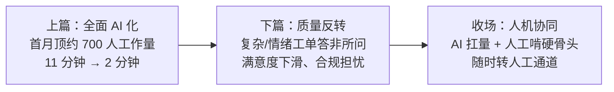

## 8.5 Klarna 完整复盘：光环与陷阱

Klarna 是瑞典的"先买后付"金融科技公司，其 AI 客服是全球被引用最多的智能体案例之一——既被用来证明 AI 的威力，也被用来证明 AI 的陷阱。两种引用都对，取决于讲到哪一段。多数场合只讲上篇，本节把上、下篇与收场讲全。

### 8.5.1 上篇：一份漂亮的账面

2024 年初，Klarna 与 OpenAI 合作的 AI 客服助手上线，覆盖 20 余个市场、支持 30 多种语言。据 Klarna 官方公告、财报披露及 CX Dive 等行业媒体报道：上线首月即承接约 230 万次对话，约占全部客服对话的三分之二，顶掉约 700 名全职客服的工作量；据此测算，年利润改善约 4000 万美元；客户问题平均解决时长从 11 分钟压缩到 2 分钟；单笔客服成本两年内下降约 40%。公司同期高调收缩客服侧招聘，CEO 反复对外强调 AI 已能承担人类员工的工作——这个案例一度成为全球企业董事会里"AI 替代人力"的标准论据。

这份账面是真实的，后来的反转并没有推翻这些数字——这一点必须先说清楚，否则整个案例的教训会被简化成"AI 不行"。

### 8.5.2 下篇：反转从哪里开始

问题出在账面覆盖不到的地方。复杂的、带情绪的工单——投诉、争议扣款、多步骤的纠纷处理——AI 频繁答非所问。客户本已窝火，得到的却是模板化的错位回复，等于火上浇油，满意度指标随之下滑。与此同时，AI 自主处理金融业务操作引发合规担忧：金融客服涉及消费者权益与争议裁决，这类责任无法委托给算法（智能体的风险图谱见 [12.1](../12_governance/12.1_risk_map.md)）。

2025 年，CEO Siemiatkowski 公开承认：当初以成本作为压倒性的评估因素来组织客服，结果就是更低的服务质量。这句出自当事人的检讨，比任何外部批评都更有分量。

### 8.5.3 收场：人机协同，而非推倒重来

Klarna 的调整常被媒体简化为"AI 失败、重新招人"，实际收场更有层次，值得逐条看清：

- **AI 没有下线**：继续承担大批量简单、重复咨询——据公司披露，2025 年年中 AI 仍处理约三分之二的客户对话；
- **人工重新加强**：招募远程灵活客服，专门啃复杂、高价值、高情绪的硬骨头；
- **通道始终敞开**：客户随时可以要求转人工，复杂工单自动升级。

下图概括了这条完整的轨迹。

图8-2 Klarna AI 客服三阶段轨迹示意

终局是人机协同：AI 扛量，人守质量与责任。既不是推倒重来，也不是把 700 人全部请回——那些宣称"Klarna 证明 AI 客服失败"的说法，与只讲上篇的宣传一样，都是半个故事。从经济账看，这个终局仍然大幅优于全人工的旧状态：三分之二的量由 AI 以极低边际成本承接，人工资源集中投放在客单价值与情绪风险最高的三分之一上——成本曲线与质量曲线第一次可以分开优化，这正是人机分工的本意。

### 8.5.4 教训：错不在 AI，在只盯一个数字

复盘全程，AI 客服在技术上自始至终正常运转——它确实接住了三分之二的量。出问题的是目标函数：当省钱压倒一切，质量必然下滑。这不是 AI 的错，是立项时只盯着一个成本数字的错。假如当初同时锁定成本与满意度两条指标线、按工单复杂度分层、给复杂工单保留人工通道，反转本可避免——Klarna 最终的收场方案，恰恰就是这三件事。

值得注意的是，反转的种子在最初的指标设计里就已埋下。上篇公布的四个数字——工作量、利润改善、解决时长、单笔成本——全部是成本与效率指标，没有一个衡量质量：满意度、复杂工单的解决质量、转人工率都缺席了。指标体系里没有的东西，组织就不会去守。等质量问题从客户投诉和社交媒体上倒灌回来时，纠正成本已远高于当初在指标里预留一条质量线的成本。

这也是第九章"像带新人一样带 AI"（[9.5](../09_landing/9.5_trust_control.md)）的反面教材：Klarna 相当于让新人入职第一天就独立接待最愤怒的客户，还撤走了主管。给管理者的启示可以收成三条：立项用双指标（成本加质量），部署按复杂度分层（AI 接得住与接不住的分开），并且永远保留人工升级通道。这笔学费 Klarna 已经交过，读者不必再交一遍。
