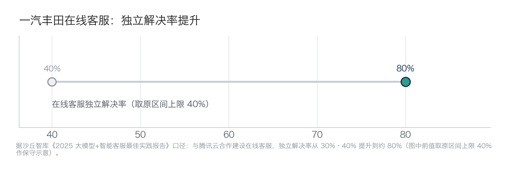
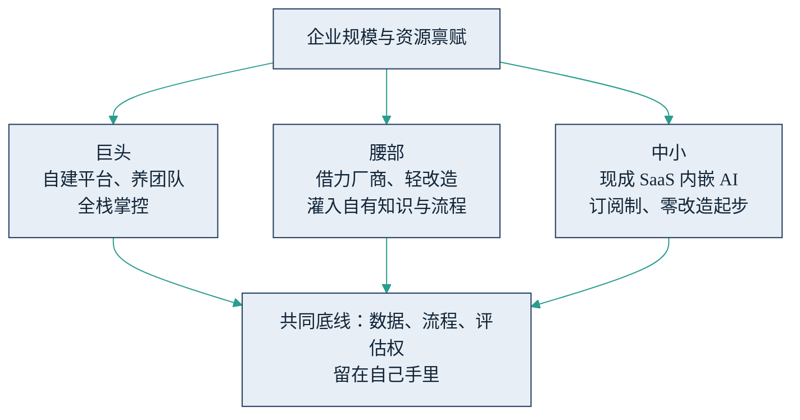

## 8.6 规模决定打法：巨头、腰部与中小企业

前五节的案例横跨行业，但还有一条比行业更重要的分界线：企业规模。同一项技术，千亿级巨头、百亿级腰部与更小体量企业的正确打法完全不同——读案例时抄错了段位，比不抄更危险。

### 8.6.1 三档画像

**巨头：自建平台、养团队、全栈掌控。** 邮储银行与中国外汇交易中心共建交易机器人，沃尔玛自研覆盖 150 万员工的一线工具，西门子干脆把工业 Copilot 做成对外销售的产品。共同点是有数据、有场景、有预算，把 AI 能力当作资产负债表上的长期资产来建设，目标是全栈掌控与对外输出。

**腰部：借力厂商、轻改造。** 宁波银行不改造老系统、以外挂对接方式接入 AI 风控（见 [8.2](8.2_finance.md)）；一汽丰田与腾讯云合作建设在线客服，独立解决率从 30%–40% 提升到约 80%（沙丘智库《2025 大模型+智能客服最佳实践报告》口径，如下图）；苏商银行智能客服自助解决率 75%。共同点是不自建平台：选一个成熟厂商，把自己的知识库与业务流程灌进去，把系统改造量压到最低。效果并不比巨头逊色——一汽丰田约 80% 的解决率就是明证——差别在于钱花在知识与流程整理上，而不是平台上。

图8-6 一汽丰田在线客服独立解决率提升示意（据沙丘智库《2025 大模型+智能客服最佳实践报告》口径，前值取原区间上限 40% 作保守示意）

**中小：现成 SaaS 内嵌 AI、订阅制、零改造起步。** CRM（客户关系管理软件）里的 AI 跟单摘要、客服软件里的智能回复、办公套件里的文档助手——按月订阅、即开即用、不合适就退订。这一档的本质是"搭便车"：SaaS 厂商正在把 AI 能力卷成标配，中小企业用订阅费换时间，把精力留给业务本身。这一档少有具名标杆案例，不是因为没人做，而是因为动作太小、太日常，不构成新闻——这本身就是这条路径的优点：风险小到不值得报道。

三档路径殊途，但汇入同一条底线，如下图所示。

图8-7 三档企业的 AI 落地路径示意

### 8.6.2 四维路径对比

三档打法的差异可以收敛到四个维度：自建还是采购、数据底子、人才配置、预算量级。

| 维度 | 巨头（自建为主） | 腰部（厂商共建） | 中小（SaaS 订阅） |
|---|---|---|---|
| 自建 vs 采购 | 核心场景自建，外围采购 | 平台采购，知识与流程自己灌 | 全部采购，随用随退 |
| 数据底子 | 数据中台成熟，专职治理团队 | 部分系统化，补课与项目并行 | 数据随 SaaS 使用顺带沉淀 |
| 人才配置 | 自建 AI 团队（数十至数百人） | 少量复合型人才＋厂商实施 | 一两名关键业务用户即可 |
| 预算量级 | 年投入千万至亿元级 | 年投入百万元级 | 年投入万元至十万元级 |

表中预算为常见量级参考，详细拆解见 [7.4](../07_value/7.4_budget.md)。四个维度中，最容易被误判的是数据底子：预算可以追加、人才可以外聘，唯独数据欠账没有捷径，多少钱都买不来自家没有记录过的历史。因此对表的正确用法是先对数据底子这一列，再看其余三列。同时需要强调，这张表是"当前位置"的描述，不是宿命：腰部企业做好知识沉淀，完全可能在细分场景上反超巨头的通用平台；反之，巨头预算堆出来的平台若没人用，一样归零。

### 8.6.3 用对参照物：四条决策提醒

第一，读案例先对段位。媒体标杆多是巨头，管理者看到"某银行自建大模型平台"时，先问一句：它的数据底子和预算量级与自己是不是同一档？不是，就去找同档企业的做法——宁波银行、一汽丰田这类腰部案例，参考价值往往高于巨头样板。

第二，规模决定的是路径，不是资格。三档企业都有各自够得着的打法，"我们太小，玩不起 AI"在 SaaS 订阅时代已不成立；真正的分水岭不是规模，而是有没有把自家知识与流程整理出来的意愿。

第三，路径不是终身制，换档要看信号。中小企业若发现某个 AI 场景已成为业务命脉、SaaS 的通用能力开始限制发挥，就该考虑升到厂商共建；腰部企业若出现三个信号中的两个——AI 场景从外围走向核心流程、每年付给厂商的账单接近自建团队的成本、数据敏感度上升到不宜出域——就值得评估局部自建。反方向同样成立：自建项目长期达不到厂商方案的效果，应当果断降档采购，而不是为沉没成本续费。

第四，无论哪一档，守住同一条底线：数据、流程、评估权留在自己手里。采购可以外包实施，不能外包判断——供应商怎么挑、合同怎么谈见 [6.3](../06_ecosystem/6.3_sourcing.md)；具体到每个场景该自建、采购还是暂缓，用 [10.4](../10_strategy/10.4_decision_matrix.md) 的 2×2 框架逐一落格。
