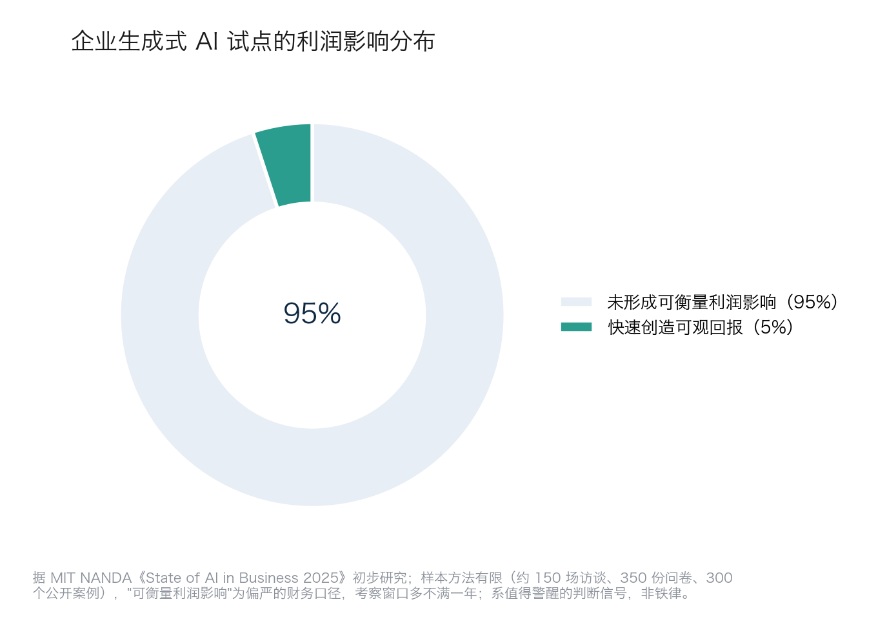
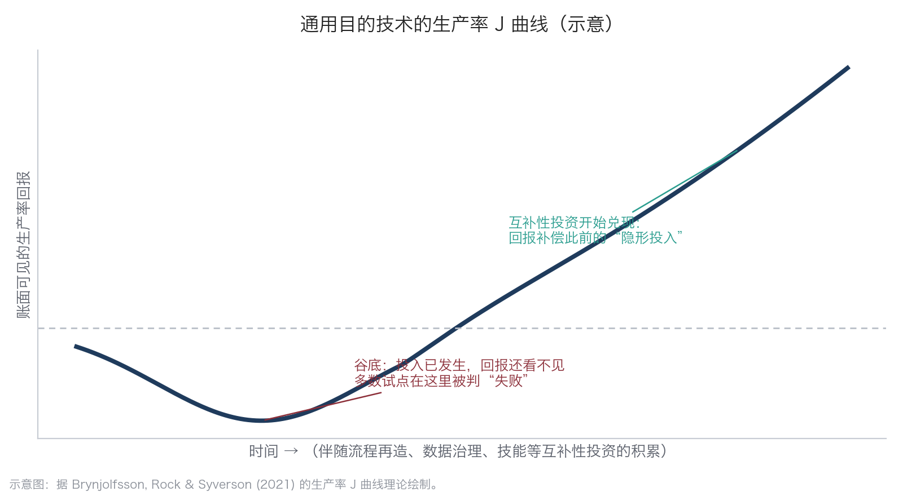

# 9.1 为什么多数试点没有回报

热潮之下，一个不容回避的事实摆在面前：多数企业的 AI 试点，至今没有换来可衡量的回报。本节先直面这组刺眼的数字，把口径与局限交代清楚，再给出一个经济学解释——问题往往不在技术本身，而在回报显现的方式。

## 9.1.1 一组刺眼的数字，及其口径与局限

2025 年夏，MIT NANDA 项目发布初步研究报告《The GenAI Divide: State of AI in Business 2025》，其中流传最广的结论是：约 95% 的企业生成式 AI 试点未形成可衡量的利润影响，只有约 5% 快速创造了可观回报（[报道参见 Fortune](https://fortune.com/2025/08/18/mit-report-95-percent-generative-ai-pilots-at-companies-failing-cfo/)）。同一研究的访谈样本还显示：与专业厂商合作的项目成功率约 67%，纯内部自建仅约 33%。

这组数字必须连同口径一起读，它至少有三点局限。第一，样本与方法有限：研究基于约 150 场企业负责人访谈、350 份员工问卷和 300 个公开部署案例的分析，属初步研究，研究者也承认企业普遍不愿完整披露失败情况。第二，“可衡量的利润影响”是一个偏严的财务口径：大量分散在个人层面的效率改善（写作提速、检索省时）真实存在，只是难以在损益表上归因。第三，考察窗口很短：被统计的试点多数运行不满一年，而下文将说明，通用目的技术的回报本来就很少出现在第一年的账面上。因此，95% 是一个值得警醒的判断信号，不是一条铁律——它证明的是“轻易就能做成”被严重高估了，而不是“AI 无用”。

把这组对比画出来，两块面积的悬殊本身就是本章要回答的问题：为什么绝大多数试点停在了没有账面回报的那一侧。

图9-1 企业生成式 AI 试点的利润影响分布示意

同期还有一个常被并列引用的数字：Gartner 于 2025 年 6 月[发布预测](https://www.gartner.com/en/newsroom/press-releases/2025-06-25-gartner-predicts-over-40-percent-of-agentic-ai-projects-will-be-canceled-by-end-of-2027)，到 2027 年底，超过 40% 的智能体项目将因成本升级、商业价值不清或风险控制不足而被取消。注意，这是预测而非已发生的统计，它应当放在什么位置理解，本节末尾再谈。

## 9.1.2 败因清单：几乎都不在技术

MIT 研究把失败的核心归因于“学习鸿沟”（learning gap）：通用工具嵌不进企业的具体工作流，不能从反馈中持续改进，而组织也没有为此做出相应改造。换成经营语言，反复出现的败因就三件事：

* **数据没就绪**——AI 接进来，却发现关键数据散在纸面、微信和互不相通的表格里（9.2 节展开）；
* **流程没打通**——给旧流程配了个助手，节拍、审批、考核原封不动，个体提效被组织摩擦吃掉（9.3 节展开）；
* **目标没定义**——立项时没有可量化的验收标准，跑了半年说不清成败（9.4 节给出定目标的方法）。

模型能力本身，很少是第一败因。这与第八章案例的观察一致：同样的模型，有企业做出了写进财报的回报，也有企业停在演示环节。

## 9.1.3 生产率 J 曲线：回报去哪儿了

对这个现象，经济学有一个成熟的解释。经济学家 Erik Brynjolfsson 与合作者提出的“生产率 J 曲线”（[Brynjolfsson, Rock & Syverson, 2021](https://www.aeaweb.org/articles?id=10.1257/mac.20180386)）指出：通用目的技术落地初期，企业必须先完成大量互补性无形投资——流程再造、数据治理、技能培训、组织调整。这些投入在会计上大多计为当期费用，不形成账面资产；于是报表呈现的是“投入很多、产出不显”，测得的生产率甚至先降后升，轨迹呈 J 形。[第 1.2 节](../01_essence/1.2_llm_base.md)讲过电气化的先例：工厂用电动机替换蒸汽机后二十余年生产率才爆发，因为回报要等到围绕电力重新设计厂房与流程之后才释放。

下图画出这条曲线的走势：左半段先下探——互补投资已经发生、账面回报却还看不见，多数试点恰恰在谷底附近被判“失败”；跨过谷底，前期的“隐形投入”开始兑现，回报才进入加速释放的右半段。

图9-2 通用目的技术的生产率 J 曲线示意

值得注意的是，这个判断不只来自经济学家。[第 3.1 节](../03_why_now/3.1_conditions.md)引述过的 OpenAI“能力悬垂”（capability overhang，又译“能力过剩”）报告，在这里获得了第二重含义。当时它印证的是“能力已跨过可用门槛”；换到 J 曲线的视角看，它印证的则是另一半——模型已经能做到的，与企业实际用出来的之间存在巨大鸿沟，而这道鸿沟正要靠使用侧的互补投资去填。两者互为印证：连模型供给方都承认“能力已经够用，却没被用出来”，恰恰说明瓶颈不在技术，而在流程、数据与队伍。能力悬垂，正是 J 曲线左半段的技术侧成因。

J 曲线给管理者两个推论。其一，95% 里相当一部分试点并非“做错了”，而是尚处曲线左半段——互补投资没有完成，回报自然不可见。其二，J 曲线不能当遮羞布：真正的分水岭在于企业是否在做互补投资。在补数据、改流程、练队伍的，是“回报暂时看不见”；只买了工具、其余一切照旧的，是“回报永远不会来”。区分这两者，也是 9.6 节判断一个试点该续命还是该止损的核心依据。

## 9.1.4 炒作周期里的 40%

再看 Gartner 那个 40% 的预测应当放在哪里。Gartner 自己的技术成熟度曲线（Hype Cycle，又译“炒作周期”：新技术通常经历期望膨胀高峰、幻灭低谷、稳步爬升的舆论周期）在 [2025 年 8 月的评估](https://www.gartner.com/en/newsroom/press-releases/2025-08-05-gartner-hype-cycle-identifies-top-ai-innovations-in-2025)中，将 AI 智能体置于“期望膨胀高峰”，而生成式 AI 正滑向“幻灭低谷”。按这条曲线的规律，高峰期立项的项目出现四成出清，是每一代技术都发生过的正常现象——正如互联网泡沫的破裂并未否定互联网。因此，40% 的取消预测不是“方向错了”的证据，而是“高峰期入场需要纪律”的提醒：被出清的，多半是没有数据、流程与目标支撑的项目——而这三样，正是接下来几节的主题。
