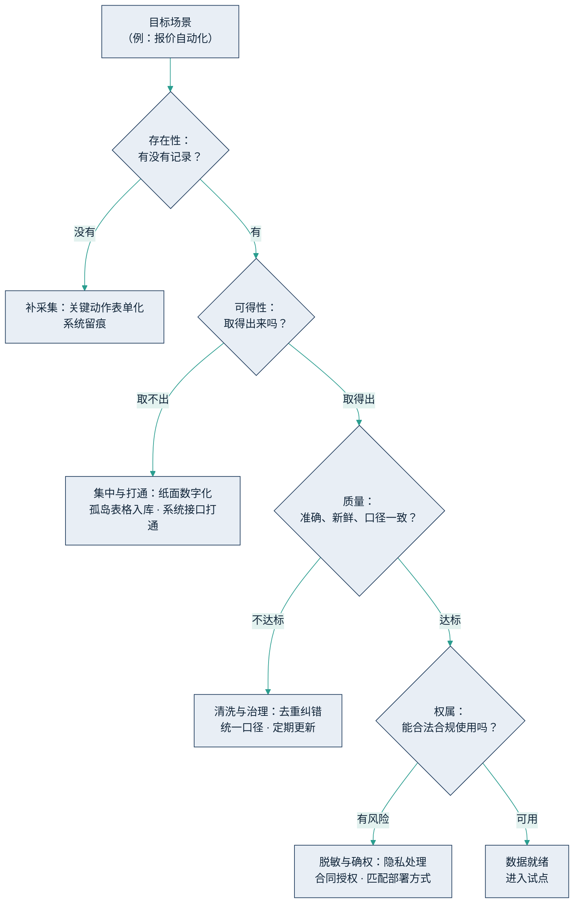

## 9.2 数据就绪：最大的成本，最深的护城河

在[第 7.3 节](../07_value/7.3_cost_benefit.md)的四类成本中，数据基础是最大的一块，也是最常被低估的一块——大多数栽跟头的项目，栽在这里。原因不难理解：模型可以买、工具可以租，唯独数据没有捷径，只能自己一寸一寸补。本节把"数据就绪"拆成一张可操作的自查清单，说明补课的正确顺序，最后讨论最深的一层——把老师傅的经验变成数据。

### 9.2.1 四维自查：数据到底有没有准备好

判断一个场景的数据是否就绪，依次问四个问题。

**存在性：关键环节有没有留下记录？** 许多企业的核心环节根本没有数字化痕迹：报价靠老师傅心算，工艺参数靠手感，客户承诺在电话里。AI 无法学习不存在的东西。若记录缺失，第一步不是上模型，而是补采集——把关键动作表单化、系统留痕。

**可得性：有记录，但取得出来吗？** 更常见的窘境是"名义上有数据"：一部分在纸面单据上，一部分在员工微信里，一部分在各管一段、互不相通的 Excel 里，还有一部分锁在供应商的系统中。数据散落等于没有——AI 找不到那根打通的"数字神经"。

**质量：取出来了，但准不准、新不新、口径一不一致？** 同一个"客户等级"字段，销售部与财务部含义不同；库存数是上个月的；重复、错漏从未清理。喂给 AI 的数据不可靠，产出必然不可信，再强的模型也救不回来。

**权属：能不能合法合规地用？** 是否包含个人信息、是否触及《个人信息保护法》与行业监管要求、与客户和供应商的合同是否允许这批数据用于模型调用或检索、涉外业务能否出境。权属问题不解决，前三关做得再好也不能上线；数据分级与部署方式的匹配，见[第 6.4 节](../06_ecosystem/6.4_deployment.md)。

下图把四维自查串成一条针对单个目标场景的检查路径：任何一关不过，都对应明确的补课动作，而不是推倒重来。

图9-3 数据就绪四维自查示意

### 9.2.2 补课的顺序：从场景倒推，够用即可

最常见的错误，是把数据就绪理解成"先建一个大而全的数据平台"：立项三年、动辄千万，AI 场景还没影子，预算先烧完了。这是把信息化时代"横向铺开"的打法，错套在了 AI 化"纵向切入"的节奏上。

正确的顺序恰好相反。第一步，从目标场景倒推：先定场景（方法见 9.4 节），列出该场景所需的最小数据集——报价自动化需要的不过是历史报价单、成本表和客户档案，仅此而已。第二步，只对这个最小数据集做四维自查，补最短的那块板。第三步，够用即上，在试点运行中滚动补课：每做成一个场景，就沉淀下一块治理好的数据资产，供下一个场景复用。

用 9.1 节的 J 曲线语言说：互补性投资应当围绕场景分期投入、逐步验证，而不是在回报完全不可见时一次性重注押上。数据治理是伴随试点长出来的，不是在试点之前竣工的。

### 9.2.3 把老师傅的经验变成数据

数据就绪最深的一层，是隐性经验的知识化。多数行业里最值钱的知识不在任何系统中，而在老师傅的脑子里——什么样的单子能接、什么信号说明设备要出问题、跟哪类客户报价该留多少余地。这类知识不做转化，AI 永远学不会；人一走，企业也就失去了。

转化的路径可以很朴素：先做结构化访谈，把"手感"逼成语言——在什么情况下、看什么信号、做什么决定、为什么；再整理成 SOP（标准作业程序）与典型判例；然后沉淀为可检索的知识库；最后通过 [RAG](../05_agent_tech/5.3_rag.md) 接入智能体，让数字员工带着企业的经验干活。本土制造业已有类似实践：海尔卡奥斯以"采集数据—建知识库—训练细分模型—汇成智能体"的模式做工厂节能，在已节能工厂的基础上再省约 5% 能耗（据 21 世纪经济报道对 2025 世界人工智能大会的报道）。

这也解释了本节标题的后半句。模型正在变成公共品，像水和电，谁都买得到；而经过治理的专有数据与知识化的行业经验，买不到、也抄不走。本书的题眼——行业经验和数据是 AI 时代最稀缺的入场券——落到操作层面就是这一节：经验在知识化之前只是个人资产，知识化之后才成为企业资产。数据就绪的投入之所以值得，正因为它同时是四类成本中最大的一块，和竞争对手最难跨越的一道护城河。
