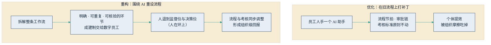

## 9.3 优化还是重构：工作流再造

数据之外，第二块必须补齐的互补性投资是流程。真正落地的企业与停在试点的企业，差别往往可以浓缩成一个词：前者在**重构**，后者只在**优化**。

### 9.3.1 两条路径：换轮子与换汽车

多数企业的做法是优化：给员工人手配一个 AI 助手，原来怎么干还怎么干，只是手边多了个帮手。效果有没有？有，但很有限。原因在于，流程的节拍、审批链和考核标准一样没动——员工写材料快了两小时，材料仍要在三级审批里躺三天；个体的提效被组织的摩擦吃掉，损益表上自然看不见。这本质上是在旧流程上打补丁。

领先者走的是另一条路：围绕 AI 重新设计整条流程。把流程拆开，逐段检查哪些环节明确、可重复、结果可核验，把这些环节成建制地交给数字员工；人从逐笔经手的一线位置，退到监督位与决策位。这种人机分工方式称为“人在环上”（human on the loop）：人不再插手每一步操作，而是监督整条流水线的运行，在关键节点拍板、在异常出现时介入——区别于“人在环中”（human in the loop，每一步都需人审批放行）。这对区分并非新造的词，它源自自主系统治理领域的长期讨论；笔者在企业实践中较早主张，AI 时代的管理者应主动从“人在环中”走向“人在环上”——把人的价值从“逐笔审批”迁移到“设定边界、监督全局、处置异常”，这一判断如今正逐渐成为业界共识。打个比方：优化是给旧马车换一副好轮子，重构是直接换成汽车——路线、车夫、驿站都得跟着重排。

两条路径的结构差异，可以用一张图对照。

图9-4 优化与重构两条路径对比示意

### 9.3.2 重构，就是 J 曲线要求的那笔投资

把 9.1 节的理论接上：生产率 J 曲线说，通用目的技术的回报要等互补性无形投资完成后才释放——而工作流重构，正是这笔投资的主体。只做优化的企业，相当于没有支付互补性投资，于是永远停留在 J 曲线起点附近的浅层收益；账面上“AI 没什么用”，其实是“企业没为 AI 改变什么”。

电气化的历史几乎是逐字重演的剧本（详见[第 1.2 节](../01_essence/1.2_llm_base.md)）：早期工厂只是把中央蒸汽机换成中央电动机，厂房布局、传动轴、工序编排一切照旧，生产率几乎没有变化；直到一代工程师围绕“每台机器自带电机”重新设计厂房与流水线，电力的红利才真正兑现——前后隔了二十余年。今天“给每个员工发一个 AI 助手”，就是当年“把蒸汽机换成电动机”的翻版。

[第 8.5 节](../08_cases/8.5_klarna.md)的 Klarna 复盘也可以从这个角度重读：其客服变革不是给客服人员配助手，而是重构了整条服务流程——AI 成建制承接大量简单工单，人工专司复杂与情绪化工单，中间留出随时升级转人工的通道。哪怕经历了质量波动的反复，最终稳定下来的形态仍是一条围绕 AI 重排过的流程，而不是旧流程加补丁。

### 9.3.3 重构怎么推进：从试点里长出来

需要立刻补一句：重构是方向，不是起手式。一上来就宣布“全公司流程重造”，是把 AI 化重新做成了三年期的信息化工程，风险与阻力都会失控。稳妥的路径是让重构从试点里长出来：先用小场景试点（9.4 节）验证哪些环节 AI 确实能稳定交付，攒下数据与信任（9.5 节）；当一条流程上被验证的环节连成片时，再把这一段流程围绕 AI 重排，同步调整岗位分工与考核口径；跑稳一段，再推进下一段。

以一条报价流程为例。优化版：销售收到询价，用 AI 助手查资料、起草报价单，再走原有的三级审批——单点提速，全程仍要两天。重构版：客户询价直接进入智能体，自动完成客户识别、成本测算与报价初稿，常规单据按预设规则即时报出，只有超出授权区间的非常规单据才升级到人审批——人从“逐单经手”变成“守例外”，整条流程从两天压到两小时。可以看到，重构改变的不是某个人的工作方式，而是单据的流向和审批的定义。

同时要清醒：重构动流程、动考核、动岗位，本质是一场组织变革，而不是一次 IT 采购。员工会担心饭碗，中层会捍卫既有流程的权力边界，出了问题的责任归属需要重新划定。这一关没有一把手亲自下场推不动——为什么 AI 的第一个用户应该是管理者自己，见[第 10.1 节](../10_strategy/10.1_first_user.md)。

判断一家企业走到哪一步，有个简单的观察点：AI 上线之后，组织结构图和考核表改过没有。一张没有任何变化的组织结构图，往往意味着这仍是一次优化——而 J 曲线的右半段，只属于完成重构的企业。
