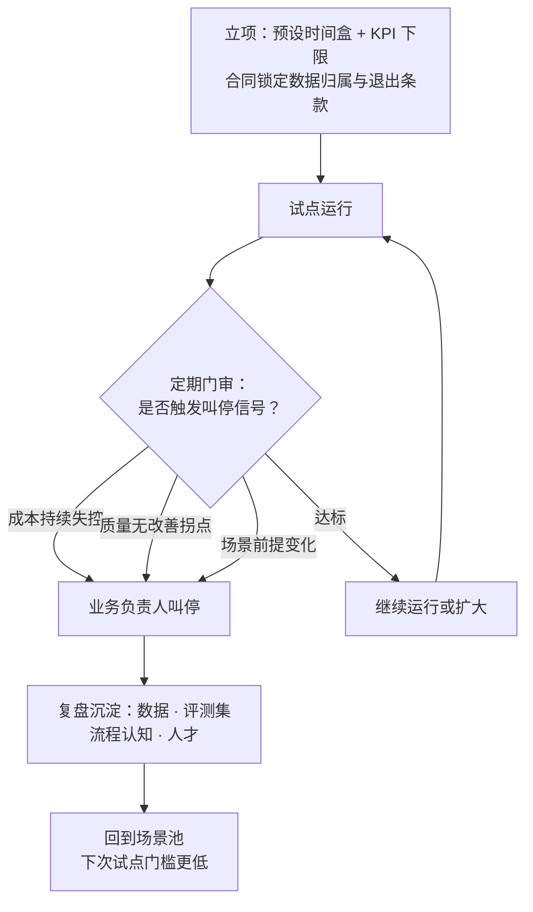

## 9.6 止损的纪律：退出信号与复盘沉淀

9.4 节五步法的最后一句是"不成就停"——说着容易，做着最难。项目一旦启动，就有了预算、团队和面子，停下来的决定往往一拖再拖。9.1 节引过 Gartner 的预测：到 2027 年底，超过 40% 的智能体项目将被取消。这个数字与其读成警告，不如读成常态：技术出清期，试点组合里必然有相当比例做不成。真正的分水岭不在"有没有项目失败"，而在失败是被动烂尾，还是主动止损。主动叫停不是失败，是组合管理——如同投资组合允许单笔亏损、追求整体回报，试点组合的健康度也取决于能否及时收割赢家、果断关掉输家。这与[第 10.5 节](../10_strategy/10.5_pacing_reporting.md)"可逆的小额多下注"是同一枚硬币的两面：敢多下注的前提，是每一注都停得下来。

### 9.6.1 立项就预设退出条件

止损纪律的第一条：退出条件在立项时定，而不是在评审会上吵。立项时各方最冷静，此时写下两样东西：一是时间盒（time box，预先固定的试验期限，如 8—12 周），到期必须评审，不允许"再给一个月"式的无限展期；二是 KPI 下限——对照 9.4 节定下的可量化目标，明确低于什么水平即触发止损评审。预算量级可参照[第 7.4 节](../07_value/7.4_budget.md)的试点档位。同时在供应商合同中锁定三样东西：数据归属、过程资产（提示词、评测集、流程文档）的交付义务、无违约金的退出条款——这正是[第 6.3 节](../06_ecosystem/6.3_sourcing.md)合同三底线的用武之地。

### 9.6.2 三类叫停信号，与叫停权归属

评审时看三类信号，任何一类持续出现，即启动止损程序。

**第一类，成本持续失控。** 单次任务成本或月度运营成本显著超出预算，且连续两个评审期没有下降趋势。注意口径：偶发超支可以容忍，要盯的是趋势——成本曲线不收敛，规模化只会放大亏损。

**第二类，质量不达标且无改善拐点。** 用[第 6.5 节](../06_ecosystem/6.5_evaluation.md)的评测集与抽检数据说话：通过率长期停滞在验收线以下，或不升反降。这里要与 J 曲线区分开——J 曲线说的是财务回报滞后，不是质量指标停滞；判断依据是改善的斜率：还在稳步爬坡的，可以续命；连续多期躺平的，就是拐点未至的信号。

**第三类，场景前提变化。** 业务方向调整使场景不再重要、监管新规改变合规成本、或基础模型能力代际跃升使自建方案失去意义——通用产品一次升级就覆盖了定制开发的全部价值。前提没了，执行得再好也该停。

叫停权归属必须事先写明：**归业务负责人**，不归供应商，也不归投入最深的项目组。供应商的理性选择永远是"再优化一轮"；项目组则深陷沉没成本谬误（sunk cost fallacy，决策偏误的一种：因为已经投入很多而继续追加投入——理性决策只应看未来的成本与收益，已花的钱不应影响是否继续）。把评估权和叫停权留在自己手里，还有一层作用是防供应商绑架：数据格式私有化、流程知识只沉淀在供应商团队，都会让"停不下来"变成对方的谈判筹码——这也是立项合同要锁数据归属与过程资产的原因。

### 9.6.3 止损之后：把学费变成资产

止损不等于清零。一个规范关闭的试点，至少留下四样可复用的资产：其一，治理过的数据——按 9.2 节四维补过课的数据集与统一口径，下个场景直接可用；其二，评测集——针对本企业业务攒下的测试用例，是最难买到的质检工具；其三，流程认知——哪些环节 AI 能稳定交付、哪些必须人把关的边界清单与 SOP；其四，人——完整经历过一轮试点的业务骨干。用 J 曲线的语言说：账面亏损的试点，留下的恰恰是无形资产；它们让下一次试点起点更高、成本更低。复盘用一页纸即可：目标与实际对照、触发了哪类信号、沉淀资产清单、对下一个场景的建议。

下图把本节的纪律串成一条闭环流程——注意终点不是"结束"，而是回到场景池。

图9-4 止损决策与资产沉淀闭环示意

把三节连起来看：预设退出条件让停下来不伤感情，三类信号让停下来有据可依，资产沉淀让停下来不白交学费。一个建立了止损纪律的组织，反而是最敢尝试的组织——因为它知道，每一次体面的撤退，都在为下一次进攻降低成本。
