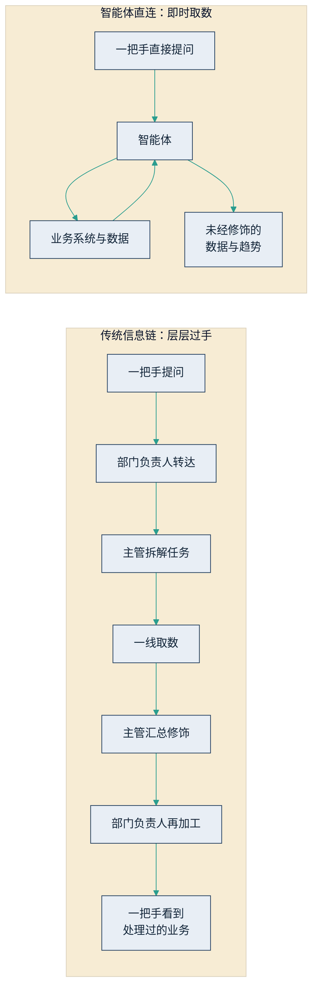

## 10.1 AI 的第一个用户，是你自己

进入战略篇，第一件事不是画蓝图，而是回答一个更直接的问题：一把手本人，用过智能体吗？高管课堂上有一个屡试不爽的小调查——"过去一个月，亲手用智能体从头到尾完成过一件真实工作的，请举手"，举手者通常寥寥。这不是批评，而是本章的起点：在为企业做 AI 战略决策之前，领导者需要先消除自己与这项技术之间的距离。

### 10.1.1 层层过手的信息链

传统科层组织里，一把手了解业务的标准方式是一条双向的信息链：问题沿组织层级往下传，答案再一层层往上报。这条链有两个固有缺陷。

第一是慢。一个问题从经营例会传到一线，再把数字汇总上来，往往以天甚至周为单位计——市场变化的节奏早已快过汇报的节奏。

第二是走样，这一点更致命。信息每经过一双手，都会被"处理"一遍：坏消息被磨圆，难题被绕过，功劳被重新分配。这并非哪个下属品行不端，而是科层组织的结构性现象——组织研究长期以来的共识是，上行信息会被系统性过滤，越往上，越接近汇报者希望上级看到的版本。结果是，一把手日常看到的是一份"处理过"的业务；而决策质量，从来不会超过决策者所依赖的信息质量。

智能体第一次提供了另一条通路。下图将两条信息通路并置对比：左侧是层层过手的传统链条，右侧是智能体直连业务数据的新通路。

图10-1 传统信息链与智能体直连的对比示意

### 10.1.2 绕过中间层，看未经修饰的数据

智能体之所以能提供这条新通路，技术上依靠的是[工具调用](../05_agent_tech/5.2_tool_use.md)与 [RAG](../05_agent_tech/5.3_rag.md)——它可以直连业务系统与数据库，按自然语言指令即时取数。对一把手而言，这意味着两件从前做不到的事：其一是即时，想到就问，不必等汇报周期；其二是未经修饰，看到的是数据本身与趋势本身，没有人替你过滤，也没有人替你解释。

顺带的收益是拉平部门之间的沟通成本。过去一个跨三个部门的口径问题——销售口径的收入、财务口径的收入、供应链口径的出货为什么对不上——往往要扯上一个星期；如今一把手可以自己把三个数并排拉出来，让差异当场现形。

需要说清的是，这不是要取消中间层，更不是鼓励事事越级。中间管理层的价值将从"信息搬运与解释"迁移到"判断与执行"（第十一章展开）。但对一把手而言，拥有一条不经修饰的取数通路，本身就改变了组织内的博弈结构——当下属知道最高决策者随时可以直接看到原始数据，汇报中的水分会自然收敛。

更重要的理由，第九章已经给出：AI 落地本质上是一场组织变革，一把手不亲自下场，项目注定停在试点（[9.1](../09_landing/9.1_why_fail.md)）。而"亲自下场"的第一步不是批预算、听汇报，而是亲手使用。供应商的演示与下属的转述，都替代不了亲手使用形成的手感：它哪里靠谱、哪里会一本正经地出错（[4.3 幻觉](../04_llm/4.3_hallucination.md)），只有用过才有体感——而这种体感，正是后面几节所有战略判断的地基。

### 10.1.3 每周亲手完成一件真实小事

落到操作层面，建议只有一条：每周亲手用智能体从头到尾完成一件真实的小事。三个关键词缺一不可。真实——用真数据、真问题，而不是看演示；完整——从提出问题到验收结果全程亲手，不让秘书或助理代跑；小——控制在半小时内能完成。最容易上手的是"把文件交给它"这一类：把一份竞品财报交给它提炼要点与风险，把三家供应商的报价单丢给它比对隐藏条款的差异——上传即可完成，今天就能开始。等这类做顺了，再往前一步试"让它直连业务系统取数"，比如拉取本月各区域毛利并解释异常。这一步依赖 IT 先接通数据通路（见 [9.2](../09_landing/9.2_data_readiness.md)），多数企业尚未打通；在打通之前，从"把文件交给它"练起就够了——而哪天你能直接把数取出来，本身就是数据就绪迈过的一个里程碑。

坚持一个季度，通常会得到三样东西。其一，对能力边界的手感——知道什么活可以放心交给它、什么活必须人来把关，这是读多少报告都换不来的判断力。其二，对自家数据底子的直观认知——哪些数取不出来、哪些系统连不上，本身就是最真实的数据就绪诊断（[9.2](../09_landing/9.2_data_readiness.md)）。其三，全组织的信号效应——一把手每周都在用，AI 就不再是应付检查的摆设，这比任何动员令都有效。

本节与 [9.4 起步五步法](../09_landing/9.4_five_steps.md)的分工是：9.4 讲组织如何跑通第一个业务场景，本节讲领导者个人的使用习惯。两者并行、互为支撑——个人的手感为组织的场景选择提供直觉，组织的场景落地反过来校准个人的判断。
