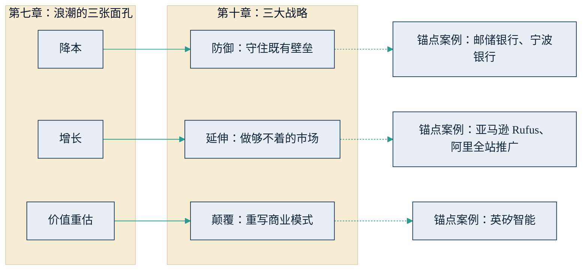

## 10.3 三大战略：防御、延伸、颠覆

问对了问题，接下来是选路。面对同一股浪潮，一把手手里有三张牌：防御、延伸、颠覆。三张牌没有高下之分，只有与企业禀赋、行业位置合不合适之分；一家企业也完全可以在不同业务线上同时打出两张牌。三大战略并非凭空而来，它们与第七章"浪潮的三张面孔"（[7.2](../07_value/7.2_three_faces.md)）一一对应：降本对应防御，增长对应延伸，价值重估对应颠覆。下图给出这组对应关系与本书的锚点案例。

图10-2 浪潮的三张面孔与三大战略的对应关系示意

### 10.3.1 防御：用 AI 把现有生意做厚

防御是守成之战：用 AI 压住成本、守住既有壁垒，把现在这摊生意做得更厚、更硬、更难被啃动。适合的情形是：市场份额领先、壁垒尚在，但执行成本占比高，且行业的成本及格线正在被 AI 拉低。

锚点案例来自银行业（详见 [8.2](../08_cases/8.2_finance.md)）。邮储银行的"邮小宝"是全市场首个以主承销商身份运行的信用债交易机器人，信用债询价效率提升约 95%，货币市场交易 22 秒完成（据邮储银行 2025 数字金融大会披露，多家媒体印证）；宁波银行则以"不改造老系统"的方式对接 AI 风控，风险识别时间从 24 小时缩短到 2 小时。两家的共同点是不追逐新叙事，把 AI 精确打在自己最厚的业务环节上，让原有壁垒的单位成本再降一截。

防御的陷阱在于把它做成单纯的降本。第七章已论证：降本红利是对称的，你降对手也降，终将被竞争抹平。防御要成立，省下的成本必须转化为护城河的加厚——更低的定价、更快的响应、更多沉淀下来的专有数据——否则只是延缓了及格线的到来。

### 10.3.2 延伸：做原来够不着的市场

延伸是拓新之战：用 AI 去做原来受限于人手与成本、想做而做不了的生意。经济逻辑很直白——当单次服务、单次触达的执行成本趋近于零，原来"算不过账"的长尾客户与长尾场景，突然变得可服务。

两个锚点案例已在 [7.2](../07_value/7.2_three_faces.md) 作为"增长"面孔详细展开，这里只取其战略含义（口径与数字详见 7.2，零售行业背景另见 [8.3](../08_cases/8.3_retail.md)）。海外的亚马逊 Rufus，把原本不擅长搜索的顾客也接进了购物流程，为平台带来了以年化百亿美元计的新增销售；国内阿里的"全站推广"，则把大量原本不投广告的中小商家变成了付费广告主，成为一块季度总额近八百亿元的客户管理收入的重要推手之一。两个案例的共性在于：AI 在这里不是替谁省钱，而是把原来够不着的需求——不擅长搜索的顾客、不会投广告的商家——纳入了服务半径。这正是延伸战略的落点：不是在既有市场里再抠出一点成本，而是把服务半径本身推向从前算不过账的长尾。

### 10.3.3 颠覆：自己革自己的命

颠覆是另起一摊：不修补旧模式，直接用 AI 重写一套商业模式——自己革自己的命，免得等别人来革。锚点案例是英矽智能（详见 [8.4](../08_cases/8.4_pharma.md)）：从靶点发现到先导化合物约 18 个月、投入不到 270 万美元，而传统流程通常需要 5 年以上、数亿美元（据其招股书与弗若斯特沙利文资料，引用时参照系必须一并给出）。该公司已于 2025 年 12 月底在港交所主板挂牌。它的意义不在于"药企用 AI 提效"，而在于把药物发现流程本身重构为 AI 原生的商业模式——管线的生成速度与成本结构，与传统药企不在同一条成本曲线上。

颠覆为什么难？[3.4](../03_why_now/3.4_first_mover.md) 已用柯达与诺基亚说明：败因不是技术，而是组织惯性——克里斯坦森的颠覆式创新理论指出，在位者的资源分配流程天然偏向存量业务，宁可让新技术烂在手里。颠覆战略正是对组织惯性的主动对冲：与其等新进入者用新成本结构进攻，不如自设一摊，让新模式在体内长大。

### 10.3.4 新护城河为什么成立：VRIN 检验

三大战略殊途同归，都指向同一个终点：把竞争优势迁移到 AI 抹不平的资源上。这件事有现成的理论工具——资源基础观（Resource-Based View，Barney，1991）认为，一项资源要构成可持续竞争优势，须同时满足四个条件：有价值（Valuable）、稀缺（Rare）、难以模仿（Inimitable）、不可替代（Non-substitutable），合称 VRIN。

用这把尺子逐项检验：模型本身有价值但不稀缺——它正在公共品化，人人可租用；执行效率有价值但可模仿——正在被全行业拉平；而专有数据四条全占——在业务中自然沉淀、对手拿不到、难以复制、无法用公开数据替代。行业判断力——几十年经验凝成的"什么单该接、什么客户该放"——高度难以模仿；客户信任与渠道则几乎不可替代。这正是第七章"价值搬家"判断的理论根据：护城河从执行环节，迁向数据、判断力与信任。

还可补一句动态能力理论（Dynamic Capabilities，Teece）：在技术快变期，感知机会、抓住机会、重构资源配置的能力本身，就是更高阶的竞争优势——三张牌之间的切换能力，比任何一张牌都值钱。因此无论选择防御、延伸还是颠覆，检验标准是同一条：这项投入，是否让企业的 VRIN 资源变得更多、更厚。
