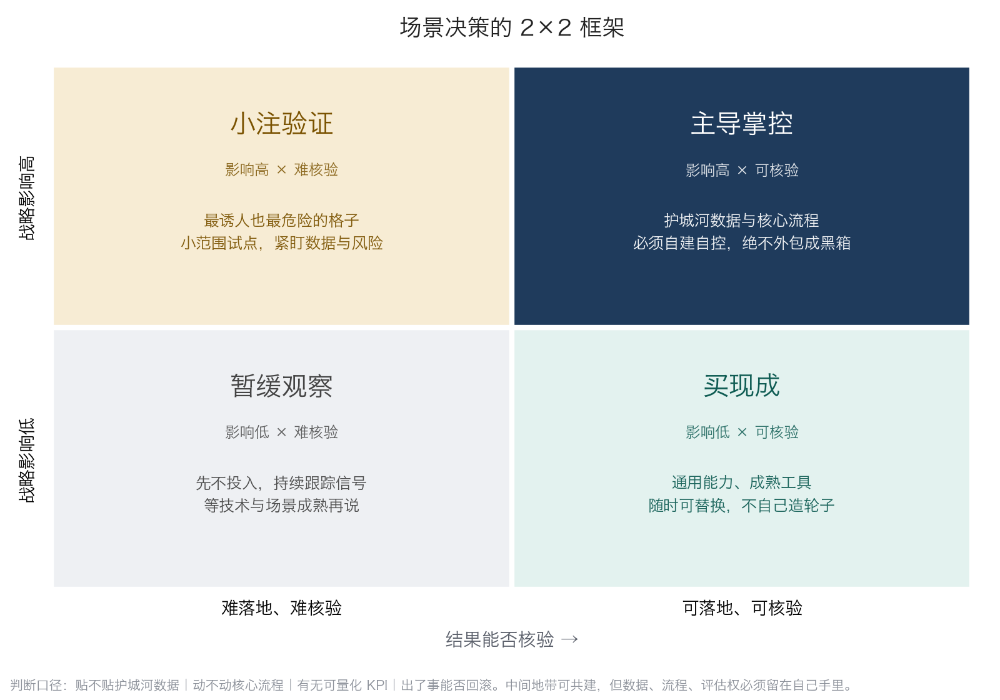

## 10.4 场景决策的 2×2 框架：自建还是采购

战略定了方向，落到一个个具体场景——智能客服要不要上、AI 质检自己做还是买、编程智能体选谁家——不必逐案争论“这个要不要做 AI”。把候选场景放进一张 2×2 矩阵，多数争论会自动消失。

### 10.4.1 两条轴：可核验性与战略影响

横轴问一件事：这个场景能不能落地、能不能核验——流程理得清吗？结果验得了吗？这与第二章给出的任务判据一脉相承（[2.4](../02_agent/2.4_scenarios.md)）：可核验性决定“现在就做”的成功率。横轴右侧是对账、询价、质检、客服应答这类标准、重复、对错查得清的场景；左侧则是结果开放、标准模糊、短期难以验证的场景。

纵轴问另一件事：战略影响高不高——它贴不贴护城河数据？动不动核心流程？纵轴决定的不是做不做，而是该不该假手于人。第七章的交易成本视角（[7.1](../07_value/7.1_value_shift.md)）在此落地：越贴近核心、资产专用性越高的环节，越应当自营；越通用的能力，越适合外购。

两条轴交出四个格子。下图给出矩阵全貌：四格各标注了行动含义，图下方同时画入了落格用的四条判断口径，各格的典型场景则在下一小节的表里逐一列出。同一场景在不同企业可能落位不同，落格本身就是一次战略讨论。

图10-3 AI 场景决策的 2×2 矩阵示意

### 10.4.2 四个格子的行动含义

四个格子各自对应一种明确动作，先用一张表总览，再逐格展开。

| 格子 | 位置 | 行动 | 典型场景 |
|---|---|---|---|
| 买现成 | 低影响 × 可核验 | 用成熟工具，随时可替换 | 会议纪要、文书初稿、通用问答 |
| 主导掌控 | 高影响 × 可核验 | 自建自控，绝不外包成黑箱 | 自有数据风控、定价、核心排产 |
| 暂缓 | 低影响 × 难核验 | 不投入，持续观察信号 | 赶热点的展示型应用 |
| 小注验证 | 高影响 × 难核验 | 小范围试点，紧盯数据 | 可能重写模式的新业务 |

买现成：这一格是通用能力，市面上成熟工具众多、随时可替换，自己造轮子毫无必要。原则只有一条——快速上、随时换，不做深度绑定。

主导掌控：这一格是护城河所在——用自有数据训练的风控与定价、决定交付质量的核心流程。它必须自建、必须攥在自己手里，绝不能外包成一个看不懂的黑箱。原因在 [9.2](../09_landing/9.2_data_readiness.md) 已经讲透：把护城河数据喂给外部方案，等于出钱替别人建护城河；而核心流程一旦黑箱化，企业将失去对自己生意关键环节的理解与掌控——出了问题既说不清原因，也谈不动价格。

暂缓：影响低又难落地的场景，最理性的动作是不动——放进观察清单，等工具成熟、成本下降或核验手段出现，再重新评估。暂缓不是否决，而是把注意力留给值得的格子。

小注验证：高影响、难落地，这是四格中最诱人也最危险的地带——故事最大，不确定性也最大，多数轰轰烈烈立项、悄无声息下马的 AI 项目都葬在这一格。正确姿势是下小注：小范围试点、事先明确验证什么、紧盯数据与风险，跑通了再加码，跑不通按纪律退出（衔接 [10.5](10.5_pacing_reporting.md) 与 [9.6](../09_landing/9.6_exit_discipline.md)）。

### 10.4.3 判断口径与合作底线

给每个场景落格时，用四条口径自问：一，贴不贴护城河数据；二，动不动核心流程；三，有没有可量化的 KPI；四，出了事能不能回滚。前两条定纵轴，后两条定横轴——四条都答清楚，格子自然落定；有一条答不出，说明场景本身还没想透，先回到 [10.2](10.2_right_question.md) 的两问。

现实中大量场景处于自建与采购之间的中间地带，可以与供应商合作共建，但底线只有一条：三样东西必须留在自己手里——数据（训练与运行沉淀的数据归属）、流程（业务流程的定义权）、评估权（用什么标准验收、何时叫停由谁说了算）。丢掉任何一样，共建都会在两三年后退化为深度绑定。这三条如何转化为供应商评估问题与合同条款，见 [6.3](../06_ecosystem/6.3_sourcing.md) 的供应商五问与合同三底线；本节回答需求侧的“这个场景落哪一格、要不要自建”，6.3 回答供给侧的“跟谁做、怎么谈”。

最后一点提醒：矩阵是动态的。可核验性会随工具与评测手段的成熟不断右移——昨天的“小注验证”可能变成今天的“主导掌控”，昨天的“暂缓”可能变成今天的“买现成”。建议每半年把全部场景重新落一次格，把矩阵当成滚动的投资组合地图，而不是一次性的立项文件。
