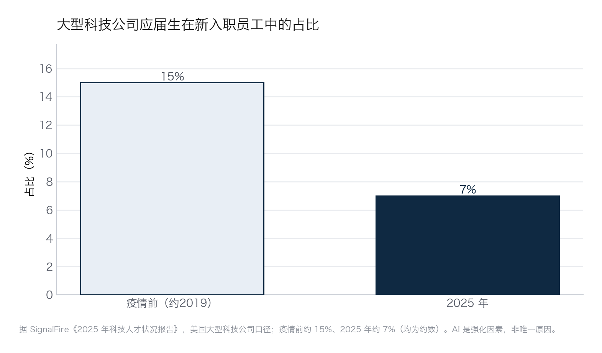
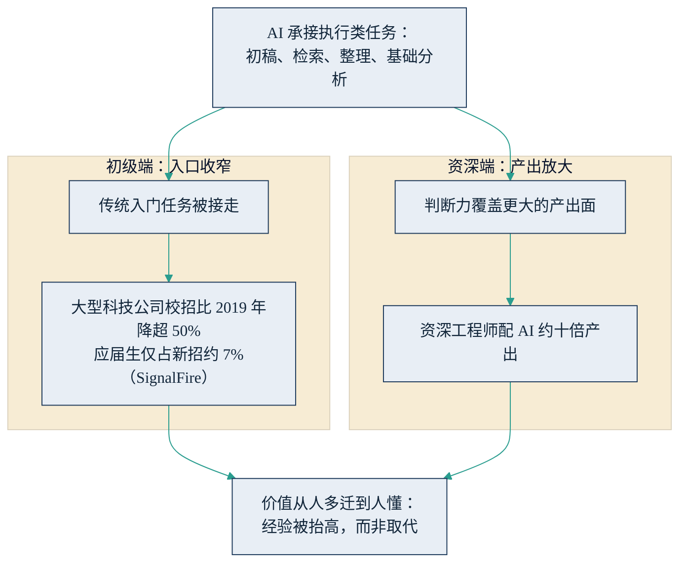

# 11.1 就业市场的两端分化

讨论组织与人才如何升级之前，先把就业市场正在发生的事实摆清楚。围绕“AI 会不会造成失业”的争论充满情绪，但 2024 年以来积累的数据已经足以勾勒出一个比“会”或“不会”精确得多的图景：就业市场的两端正走向相反的方向——初级岗位的入口在收窄，资深者的产出在被放大。看懂这个分化，是本章一切组织与人才决策的前提。

## 11.1.1 初级端：入口正在收窄

先看反应最快的科技行业。风险投资机构 SignalFire 基于其覆盖数亿份职业档案的人才数据平台发布的《2025 年科技人才状况报告》显示：美国大型科技公司的应届生招聘量比 2019 年下降超过 50%，应届生在新入职员工中的占比降至约 7%，而疫情前这一比例约为 15%。裁员方面，据 Crunchbase 与 layoffs.fyi 的追踪（美国科技公司、公开报道口径），2025 年全年科技行业裁员约 12.7 万人。

其中最能说明“入口收窄”的是应届生占比这个结构指标——它剔除了整体招聘规模的波动，直接反映大厂给新人留的门有多宽。下图对照疫情前后两个时点，占比几乎腰斩。

图11-1 大型科技公司应届生占新招比例的收窄示意

这些数字必须带着口径读。校招收缩与裁员潮中，AI 是一个强化因素，但不是唯一原因：高利率环境、疫情期间过度扩张后的回调、上市与融资窗口收紧，都在同一时期发挥作用。把 12.7 万人的裁员全部记到 AI 账上，与否认 AI 有任何影响，是同样不严谨的。

分辨率更高的证据来自学术研究。斯坦福数字经济实验室的 Brynjolfsson 等人与人力资源服务商 ADP 合作，基于覆盖数百万雇员的真实工资单数据完成了《煤矿里的金丝雀？》（Canaries in the Coal Mine?，2025）研究，得到三个关键发现：自 2022 年底以来，22—25 岁年轻雇员在 AI 暴露度（职业任务内容可被 AI 承担的程度）最高的职业——如软件开发、客服——中的就业人数相对下滑约 13%，而同一职业中资深雇员的就业持平甚至上升；下滑集中在 AI 主要用于“自动化”（替人干活）的职业，在 AI 主要用于“增强”（帮人干活）的职业中变化不明显；市场的调整主要通过雇佣数量而非薪酬发生。截至 2026 年年中，该团队持续更新的跟踪数据显示这一趋势尚未逆转。

机制并不难理解。初级岗位在传统组织中承担双重功能：用相对便宜的人力完成流程性执行，同时充当未来骨干的培养管道。AI 恰好接走了第一个功能——初稿、检索、整理、基础分析正是大模型最擅长的任务类型。问题在于第二个功能被连带损伤：入口收窄之后，未来的资深者从哪里来？这个“管道问题”在 2026 年尚无行业级答案，本章 11.4 与 11.5 会分别给出组织与个人层面的应对。

## 11.1.2 资深端：经验被放大

另一端的方向完全相反。博通 CEO 陈福阳（Hock Tan）给出过一个广为流传的估算：一位顶尖的资深工程师配上 AI，一周可以完成过去十位工程师三个月才能完成的设计工作——粗略折算约十倍产出。需要说明口径：这是一位 CEO 对自家团队的估算，不是第三方对照实测，应当听量级、不听精度。但它指向的方向与多方观察一致：AI 对资深者的放大效应，显著强于对初级者。

原因在于 AI 放大的究竟是什么。智能体接走的是执行，而执行的前后两端——把任务定义清楚、判断产出是否合格——恰恰是经验的领地（[4.2 与 AI 协作](../04_llm/4.2_delegation.md)对此有系统展开）。资深工程师知道该做什么、什么算好、哪里容易错，AI 把他从“亲手执行”中解放出来，判断力得以覆盖十倍的产出面。而新手面对同样的工具，最大的困境是无法判断 AI 交回来的东西对不对——放大器接在了空输入上，倍数再高也放大不出东西。

## 11.1.3 价值从“人多”迁到“人懂”

把两端放在一起，就是下图的结构：同一个原因——AI 让执行变得廉价——在职业阶梯的两端产生了相反的效果。

图11-2 就业市场两端分化的机制示意

这个分化对组织结构的含义是直接的：靠人头规模取胜的模式在贬值。传统的金字塔形人力结构——大量初级执行层支撑少量资深判断层——正在向中间粗、两头细的形态演变；按人头计费的行业（外包、部分咨询与专业服务）感受到的冲击最直接，因为它们出售的正是“执行”这种快速降价的商品（参见 [7.1 价值迁移](../07_value/7.1_value_shift.md)）。

这也再次验证了全书的题眼：行业经验和数据，是 AI 时代最稀缺的入场券。这一轮变化中，经验没有被取代，而是被抬高了——过去一份经验的杠杆是带一个几人团队，现在是带一批不知疲倦的数字员工。对企业而言，真正的问题因此从“要不要减人”变成“如何让懂的人放大、让新人尽快变懂”；对个人而言，则是如何积累那些 AI 放大得动的资产。这两个问题，正是本章余下四节的主题。
