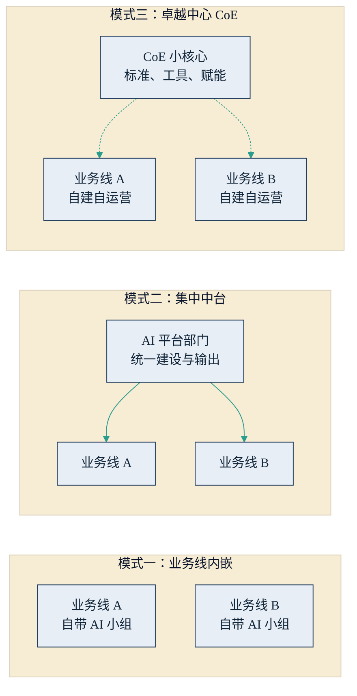

## 11.3 组织设计：AI 能力放在哪里

岗位之后是结构。企业决定投入 AI 之后，第一个组织问题是：AI 能力——人才、平台、预算、数据——在组织图上放在哪里？这个问题看似是技术部门的编制问题，实际决定了 AI 与业务、与护城河的距离。本节给出一条选址主线、三种组织模式的比较，以及一个被反复验证的提醒：落地的最后一公里是组织变革，不是 IT 采购。

### 11.3.1 主线：离护城河越近，越要攥在自己手里

第七章与第十章已经建立了判断的底座：新护城河是专有数据、判断力与信任（[7.1](../07_value/7.1_value_shift.md)），战略上贴近护城河的场景应当“主导掌控”（[10.4](../10_strategy/10.4_decision_matrix.md)）。这条逻辑在组织内部同样成立，而且多出一层含义：贴护城河的 AI 能力，不仅不能外包给供应商，也不宜集中到一个与业务隔着两层汇报关系的部门。触碰核心判断与专有数据的能力，应当长在业务里，由最懂这块业务的人主导，技术角色作支撑；反过来，通用性强、市场供给成熟的能力——办公助手、通用客服组件——可以集中采购、全员共享，没有必要在每条业务线重复建设。一句话概括选址主线：能力离护城河的距离，决定它离业务的距离。

### 11.3.2 三种模式：内嵌、中台、卓越中心

实践中的组织方案基本是三种模式及其混合。业务线内嵌，指各业务单元自带 AI 小组，就地发现场景、就地开发运营。集中中台，指把 AI 能力集中到一个共享平台部门统一建设、对各业务输出（“中台”是国内企业界对这类共享能力部门的通称）。卓越中心（CoE，Center of Excellence），指由一个小规模专家团队负责定标准、建工具、做培训赋能，而应用的开发与运营留在业务线，形成“小核心、大外围”。下图并列展示三种模式的结构差异。

图11-3 AI 能力的三种组织模式示意

三种模式的取舍可以用一张表对比：

| 维度 | 业务线内嵌 | 集中中台 | 卓越中心（CoE） |
|---|---|---|---|
| 响应速度 | 快，贴近业务 | 慢，需排队 | 较快 |
| 能力复用 | 弱，易重复建设 | 强 | 中，靠标准与模板 |
| 治理与安全 | 弱，标准不一 | 强 | 中，标准统一、执行分散 |
| 适用阶段 | 试点期、场景少 | 规模化后、复用资产厚 | 扩展期、多场景并行 |

模式选择不是选美，而是与阶段匹配。试点期只有一两个场景，内嵌最快，让最懂业务的人贴身把第一个场景跑通；场景多起来之后，重复建设与标准缺失的代价开始显现——三条业务线各买一套平台、各定一套安全规则——这时适合设立 CoE，统一选型、安全与[评估标准](../06_ecosystem/6.5_evaluation.md)；只有当可复用的资产（数据管道、评测体系、公共组件）足够厚时，中台化才有意义。信息化时代的教训值得记取：过早建大中台，离业务太远，很容易从赋能者变成瓶颈和成本中心。方向上，多数企业的合理路径是“内嵌起步、CoE 定标准、成熟资产逐步沉淀为平台”，而不是一步到位画一张宏大的组织图。

### 11.3.3 最后一公里：组织变革，而不是 IT 采购

见过足够多项目之后会发现一个规律：技术全部就绪的项目，照样可以在最后一公里翻车，而且翻车方式高度雷同。其一，员工抵触——把 AI 当成来抢饭碗的，表面配合、实际弃用；其二，责任不清——AI 出了错算谁的没人说得清，于是谁都不敢真用；其三，流程与考核纹丝不动——工具上了，但流程没有围绕它重排（[9.3](../09_landing/9.3_workflow_rebuild.md)），考核也不区分用与不用，员工凭什么改变工作习惯？

对策同样是三条，逐一对应。第一，把“升级而非取代”讲成具体安排而不是口号：被解放出来的时间用于什么、岗位职责怎么调整、转岗通道是什么，白纸黑字写清楚——员工抵触的从来不是工具，是不确定性。第二，权责先行：明确“人在环上”的验收责任与豁免边界（[9.5](../09_landing/9.5_trust_control.md)），让敢用 AI 的人有安全感，而不是多背一层风险。第三，流程与考核同步动：把 AI 使用嵌入标准作业流程，把用得好的团队在资源与考核上体现出来——考核不动，一切动员都是白搭。

值得注意的是，这三条没有一条在 CIO 的权限范围内能单独完成——调岗位、动考核、改流程，都是经营决策。这正是“一把手工程”的准确含义（[10.1](../10_strategy/10.1_first_user.md)）：一把手不亲自下场使用、不亲自拍板组织安排，项目大概率停在试点。归根结底，企业买的不是一项技术，而是要学会经营一种新型劳动力；劳动力的事，从来都是一把手的事。
