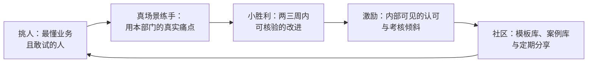

## 11.4 复合型人才：培养优于争抢

组织结构确定之后，最现实的约束是人：谁来把 AI 能力接到业务上？多数企业的第一反应是去市场上抢。本节先说明为什么抢不到、也不必抢，再用两个标杆案例展示"培养"路线能走到什么程度，最后给出可操作的培养路径。

### 11.4.1 抢不到，也不必抢

眼下最稀缺的人才画像，是"既懂业务、又会用 AI"的复合型人才。稀缺到什么程度：市场上抢也抢不到几个，薪酬溢价被推到同级岗位的数倍。而且外聘存在一个结构性弱点——抢来的人会用 AI，却不懂你的业务：不熟悉行业的隐性规则，不掌握企业的专有语境，没有内部的信任网络。入职半年，往往还停留在"会用工具、不知道该用在哪"的状态。

真正决定人才策略的，是两种能力习得周期的不对称：把一个懂业务的人训练到会用 AI，以月计；把一个会用 AI 的人培养到懂业务，以年计，有些行业要以十年计。周期短的一侧自己补，周期长的一侧市场上买不到——结论因此非常明确：培养优于争抢。从最懂业务的人里，挑出敢试、愿折腾的那几个，把他们喂成复合型人才。这也是全书题眼在人才问题上的投影：行业经验和数据，是 AI 时代最稀缺的入场券；AI 技能当然也要有，但那是门票里便宜的那一半——便宜到企业可以自己印。

### 11.4.2 两个标杆：Moderna 与摩根士丹利

培养路线能走多远，Moderna 给出了标尺。先说明这个案例的性质：它是组织采用与全员赋能的标杆，不是"AI 研发新药"的研发案例——医药研发的证据链在 [8.4](../08_cases/8.4_pharma.md)。据 OpenAI 官方案例（第一方口径），Moderna 自 2023 年起向全员部署 ChatGPT Enterprise，并鼓励员工自建定制 GPT（把提示模板与企业知识封装成可复用小应用的机制）：约两个月内，员工做出 750 多个定制 GPT；法务团队采用率达到 100%，用"合同伴侣"类应用做合同摘要与条款比对。这个案例的要害不在 750 这个数字，而在这些应用的作者——绝大多数不是 IT 部门开发的，是业务与职能部门的员工自己动手做的。法务，一个通常被认为离技术最远、对风险最敏感的部门，成了采用率最高的部门。哈佛商学院随后将其写成教学案例《Moderna：让 AI 民主化》（Moderna: Democratizing Artificial Intelligence），着眼点同样是组织而非算法。

摩根士丹利提供了另一个维度的证据：变革管理。其财富管理部门的 AI 助手上线后，98% 以上的顾问团队在使用，内部研究文档的可得性从约 20% 升至约 80%（OpenAI 与摩根士丹利官方口径）。这里值得研究的不是工具，而是 98% 这个采用率本身——企业软件的常态是"买了没人用"，98% 是管出来的：上线前建立严格的回答质量评测体系，由业务与合规专家持续校验，再把工具嵌进顾问的日常工作流而不是另开一个入口。高采用率是变革管理的成果，不是产品的自然属性。

### 11.4.3 培养路径：真场景、小胜利、社区

两个标杆背后的方法，可以提炼为一个循环，如下图所示。

图11-3 复合型人才的培养飞轮示意

循环里有三个要素。第一，真场景练手。培养复合型人才最无效的方式是送去上通用课程——听懂了原理，回到岗位仍不知从何下手。有效的方式是把本部门最费人、最重复的真实痛点当训练场：拿真数据、真流程练，练完的东西直接上岗。场景怎么挑、怎么起步，[9.4 起步五步法](../09_landing/9.4_five_steps.md)已给出操作细节。第二，小胜利激励。两三周内能核验的改进——报价从两天压到两小时、周报自动生成后人工只做校核——胜过任何宏大规划；再配上内部可见的认可与考核倾斜，让第一批人的收益被全组织看见。第三，社区分享。把第一批人的模板、案例、踩坑记录沉淀成内部资产，定期分享——Moderna 的员工自建 GPT 能滚到 750 个，靠的正是"人人可建、建完可共享"的社区机制，而不是某个部门的集中生产。

这个飞轮的产出，是一种新的岗位画像：这批人未必会写代码，但会把业务任务翻译成 AI 可执行的委托、会核验产出、会判断什么不能交给 AI——用第二章的语言说，是会带[数字员工](../02_agent/2.1_definition.md)的人，像 [9.5](../09_landing/9.5_trust_control.md) 说的那样"像带新人一样带 AI"。企业真正要配的不是几个 AI 工程师，而是一批这样的"数字领班"。技术会越来越便宜、越来越好买，这批人身上的业务经验与判断力，才是买不到的那部分。
