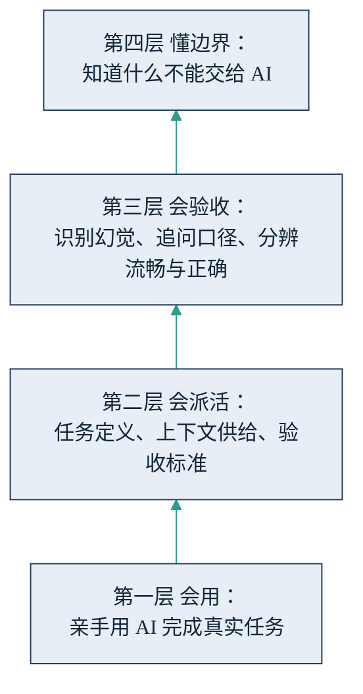

## 11.5 给管理者个人的行动清单

前四节谈的都是企业该怎么办。这一节换一个视角——也是全书唯一一次——只谈管理者个人：在这场变化里，你自己的技能、职业资产与组织内影响力，应当怎么经营。它不需要公司立项，也不需要任何人批准，今天就可以开始。

### 11.5.1 个人技能栈：会用、会派活、会验收、懂边界

管理者与 AI 协作的能力，可以整理成四层递进的技能栈，如下图所示，自下而上逐层构建。

图11-6 管理者个人技能栈的四层结构示意

第一层，会用：亲手用 AI 从头到尾完成真实任务，而不是停留在"听过汇报、看过演示"。[10.1](../10_strategy/10.1_first_user.md) 建议的"每周亲手完成一件真实小事"，就是这一层的最低练习量——没有第一层的手感，上面三层都是空中楼阁。第二层，会派活：把模糊的业务意图翻译成清晰的任务委托，做好任务定义、上下文供给、验收标准三件事（[4.2](../04_llm/4.2_delegation.md)）——这恰是管理者本已具备的委托能力，只是要求更高的精度。第三层，会验收：能核验 AI 的产出——识别[幻觉](../04_llm/4.3_hallucination.md)、追问数字口径、分辨"流畅"与"正确"。在执行变廉价的时代，验收是新的稀缺技能：产出可以无限供给，把关的能力不能。第四层，懂边界：知道什么不能交给 AI——决断、担责、拿捏分寸（见 11.2），以及流程理不清、结果验不了的任务（[2.4](../02_agent/2.4_scenarios.md)）。四层是严格递进的：不会用就谈不上会派活，不会验收的派活等于失控，而不懂边界的人，用得越熟练越危险。

这个技能栈还配有一层朴素的成本意识：不少企业已开始对 AI 使用设配额（预算量级见 [7.4](../07_value/7.4_budget.md)），会用的人也要会省——把昂贵的深度推理留给真正难的任务，日常事务交给轻快便宜的模型。这正是 [4.4](../04_llm/4.4_model_choice.md) 所讲"按任务分级配模"在个人层面的翻版。

### 11.5.2 经营"AI 放大得动"的经验资产

11.1 描述的初级路径重构，对个人职业的含义可以说得更直白：靠年限自动升值的扶梯停了，但电梯还在——前提是分清自己积累的资产里，哪些 AI 放大得动，哪些正在贬值。放大得动的：对行业的结构化判断（什么单能接、什么风险致命）、把"什么算好"说清楚的能力、跨部门与客户的信任网络、处理例外与危机的经验。正在贬值的：纯执行的熟练度、信息搬运、格式化产出的速度——这些正是 11.2 里四类被接管工作的核心。

由此有两条行动。其一，把经验显性化。脑子里的判断标准，只有沉淀成文档、清单、评测标准，才能成为 AI 的上下文——[4.2](../04_llm/4.2_delegation.md) 说过，经验以上下文的形式成为模型的燃料。说不出来的经验放大不了，写下来的经验才有杠杆；对管理者，整理自己的"判断清单"本身就是最高回报的 AI 投资。其二，对年资尚浅的管理者：主动去争取 AI 干不了的经历——谈判、危机处理、带团队打硬仗、当着客户拍板。初级执行经验的市场价值在下降，而这些"高摩擦"经历构成未来的可放大资产，比多学一个工具重要得多。

### 11.5.3 从小胜利到证据链：在组织内推动 AI

如果所在组织还没动起来，不必等公司战略落地——在组织里推动 AI，最可靠的影响力来源不是热情，而是证据。做法是从自己团队里挑一个可核验的小场景（选择标准与操作步骤见 [9.4](../09_landing/9.4_five_steps.md)）：最费人、最重复、结果最好量化的那件事。动手之前先记下基线数据——这件事现在花多少人时、多少钱、错多少。没有基线，日后的一切成效都是口说无凭。跑上两三个月，攒出一条完整的证据链：场景、做法、基线、结果、踩过的坑。

向上汇报时，用四段式框架，而不是热情陈述。问题：哪个业务痛点、损失多少，用对方在乎的口径说。试点方案：范围多小、花了多少、风险怎么控——人在环上、可回滚（[9.5](../09_landing/9.5_trust_control.md)）。数据：基线对结果，口径老实，不顺利的地方照说不误。下一步请求：要什么资源与授权，明确而克制——扩展到某一个相邻场景，而不是"全面推广"。这个框架与 [10.5 向董事会讲账](../10_strategy/10.5_pacing_reporting.md)同构，对上沟通的纪律是相通的：别把话说满，让数据替你说话。说满的人透支信用，拿数据说话的人积累信用——在 AI 这个噪音极大的议题上，信用本身就是稀缺资产。

最后收拢一句：这份清单的四个动作——练技能栈、攒经验资产、做小胜利、讲证据链——没有一个需要等待授权。这正是把它放在全章末尾的用意：企业的升级可以规划、可以等待时机，个人的升级只能自己动手，而且宜早不宜迟。
