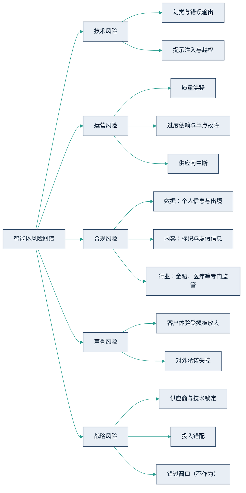

## 12.1 智能体的风险图谱

多数企业对智能体风险的认知是散点式的：法务担心数据泄露，客服负责人担心对外口径，CIO 担心系统宕机，董事会则笼统地担心“出事”。各说各话的结果，是每次上会都在重复同样的争论，却始终凑不出一张能拍板的全景图。治理的起点，是先把风险看全——用一张图谱把分散的担忧归类，让董事会、业务与技术团队说同一种语言。对企业而言，智能体的风险可以归为五类。

### 12.1.1 五类风险

**技术风险：模型本身会出错。** 三个主要敞口是幻觉（模型以确定的口吻编造事实）、提示注入（攻击者用一段精心构造的文本诱导智能体执行本不该执行的指令）与越权操作。技术成因与工程防线本书已有专门讨论——幻觉的机理见 [4.3](../04_llm/4.3_hallucination.md)，攻击面与防线见 [5.6](../05_agent_tech/5.6_security.md)——此处只强调治理含义：这类风险源于大模型的概率本质，只能围堵、不能根除。制度设计必须默认“它一定会出错”，把人工审批节点与回滚机制当作标配，而不是可选项。

**运营风险：系统整体会退化。** 一是质量漂移：模型版本升级、业务数据变化或用户行为迁移，都可能让昨天合格的智能体今天悄悄出错——没有[第 6.5 节](../06_ecosystem/6.5_evaluation.md)的评测集与线上监控，漂移根本无从察觉。二是过度依赖：员工技能萎缩、流程失去人工兜底，一旦服务中断，业务瞬间失能。三是供应商中断：API 停服、模型版本退役、价格调整，都在供应商单方面控制之内——这正是[第 6.3 节](../06_ecosystem/6.3_sourcing.md)坚持退出条款的原因。

**合规风险：规则会追上来。** 分三个层面：数据合规（个人信息保护、数据出境）、内容合规（AI 生成内容的标识义务、虚假信息责任）与行业监管（金融、医疗等领域的准入、审查与专门规定）。违规成本从责令整改、罚款到暂停业务不等，且随监管落地逐年抬升。监管地图在 12.2 展开。

**声誉风险：客户替你测试，社交媒体替你放大。** [第 8.5 节](../08_cases/8.5_klarna.md)的 Klarna 复盘是最完整的样本：账面省下的钱是真的，复杂情绪工单上受损的客户体验也是真的——当省钱压倒质量，品牌折价会回头收账。另一个常被引用的判例：据公开报道，2024 年加拿大一家航空公司的官网聊天机器人向乘客虚构了退票政策，裁决机构认定企业必须兑现。智能体对外说的每一句话，客户和法律都可能视为企业的正式承诺。

**战略风险：方向错了，执行越好损失越大。** 一是锁定：把核心场景外包成黑箱，数据与流程主导权旁落——[第 10.4 节](../10_strategy/10.4_decision_matrix.md)的“主导掌控”格正是为此设防。二是投入错配：在错误的场景上下重注。Gartner 2025 年曾预测，到 2027 年底将有超过 40% 的智能体项目被取消——注意这是预测而非统计，但它提示的错配风险是真实的。三是错过窗口：一张诚实的风险图谱必须包含“不作为”这一项——[第 3.4 节](../03_why_now/3.4_first_mover.md)已论证，风险是不对称的，晚追赶的代价远大于早探索。

五类风险各有源头、各有对策，汇成一张总览图如下。

图12-1 智能体的五类风险图谱示意

### 12.1.2 自主度越高，缰绳越紧

五类风险的敞口大小，与一个变量近似成正比：智能体的自主度。[第 9.5 节](../09_landing/9.5_trust_control.md)给出了 L0–L3 的授权阶梯，从“只出建议”到“自动执行、仅异常升级”。自主度每升一级，出错的爆炸半径就扩大一圈：L0 的错误止于一条尚未被采纳的建议，L3 的错误可能是一笔已经发出的退款、一个已经对外承诺的价格。因此，审批与管控的严格程度必须与自主度同步爬升——这是本章贯穿始终的总原则。

| 自主度等级（沿用 9.5） | 典型形态 | 风险敞口 | 审批与管控要求 |
|---|---|---|---|
| L0 只出建议 | 人审阅后自行执行 | 最小 | 部门负责人审批即可上线 |
| L1 执行前逐笔放行 | AI 拟好动作，人逐笔确认 | 有限 | 权限白名单＋操作留痕 |
| L2 自动执行＋抽检 | AI 执行，人按比例复核 | 中高 | 分级审批＋评测门槛＋回滚机制 |
| L3 自动执行、仅异常升级 | 对外动作可能自动发生 | 最大 | 治理委员会审批、强制审计、事故预案演练 |

这条正比关系也是后两节的主线：12.2 的监管要求（欧盟按风险分级施加义务、中国对面向公众的服务从严）与 12.3 的治理要件（按风险分级审批），本质上都在回答同一个问题——在多大的自主度上，套多紧的缰绳。给风险定级不是为了少做，而是为了敢做：知道哪里必须严，才敢在别处放开手脚。
