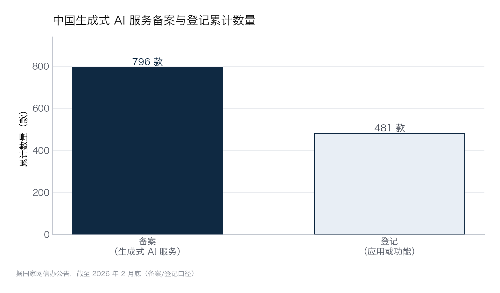
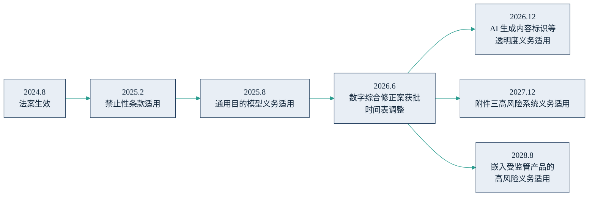

## 12.2 监管地图：中国规则优先，兼看欧美

合规不是项目上线前的补考，而是场景设计之初的边界条件——哪些数据能用、哪些内容要标、哪些服务要备案，在立项时就应当画进图纸。三大法域的节奏与风格迥异：中国“小切口、快迭代”，按服务形态逐项立规；欧盟“一部大法”，统一分级、分步生效；美国联邦立法缺位，行业与州规则拼图。本节状态核实至 2026 年 7 月；监管变动频繁，重大决策前应以最新官方文本为准。

### 12.2.1 中国：管理与促进并行

目前中国尚无一部统一的“人工智能法”（相关立法仍在研究推进中），现行规则沿“算法—深度合成—生成式 AI—内容标识”的路径逐项建立，主干如下表。

| 规则 | 施行时间 | 管什么 | 对企业的核心要求 |
|---|---|---|---|
| 《互联网信息服务算法推荐管理规定》 | 2022 年 3 月 | 推荐、排序、生成合成等算法 | 具有舆论属性或社会动员能力的服务须算法备案 |
| 《互联网信息服务深度合成管理规定》 | 2023 年 1 月 | 换脸、拟声等深度合成技术 | 显著标识、真实身份核验、安全评估 |
| [《生成式人工智能服务管理暂行办法》](https://www.cac.gov.cn/2023-07/13/c_1690898327029107.htm) | 2023 年 8 月 | 面向境内公众的生成式 AI 服务 | 内容合规、训练数据来源合法、安全评估与备案 |
| [《人工智能生成合成内容标识办法》](https://www.cac.gov.cn/2025-03/14/c_1743654684782215.htm) | 2025 年 9 月 1 日 | 所有 AI 生成合成内容 | 显式＋隐式双标识，传播平台核验与提示 |
| 数据出境规则（安全评估办法及 2024 年跨境流动新规） | 2022 年 9 月起 | 重要数据与个人信息出境 | 安全评估、标准合同或认证三条通道，附豁免情形 |

三个要点值得管理者留意。第一，备案与登记是面向公众提供服务的门票：据国家网信办[公告](https://www.cac.gov.cn/2026-03/17/c_1775482074695536.htm)，截至 2026 年 2 月底，累计已有 796 款生成式 AI 服务完成备案、481 款应用或功能完成登记（公告口径）；基于已备案模型开发的应用走登记程序即可，负担明显更轻。两条通道的累计规模对比如下图，也直观说明了“备案重、登记轻”的分工。

图12-2 中国生成式 AI 备案与登记累计数量示意

第二，《标识办法》2025 年 3 月由四部门联合发布、9 月 1 日施行，确立“双标识”：显式标识是用户看得见的文字、图形提示，隐式标识是嵌入文件元数据的水印，配套强制性国家标准同步实施——凡对外输出 AI 生成内容的产品都应逐项自查。第三，涉及个人信息与重要数据出境的场景须走法定通道，数据分级与部署方式的匹配见[第 6.4 节](../06_ecosystem/6.4_deployment.md)。

约束之外，政策同样是东风。国务院 2025 年 8 月印发的[《关于深入实施“人工智能+”行动的意见》](https://www.gov.cn/zhengce/content/202508/content_7037861.htm)（国发〔2025〕11 号）提出：到 2027 年，新一代智能终端、智能体等应用普及率超 70%；到 2030 年超 90%。把管理规则与行动意见放在一起读，政策取向相当清晰：管住内容与数据的底线，把应用的油门踩到底。对企业，合规不是负担的同义词——备案名录、典型案例集本身就是市场信号与背书渠道。

### 12.2.2 欧盟：一部大法与布鲁塞尔效应

欧盟[《人工智能法案》](https://eur-lex.europa.eu/eli/reg/2024/1689/oj)按风险分级监管：不可接受风险直接禁止，高风险系统承担严格义务（风险管理、数据治理、日志、人工监督等），有限风险承担透明度义务，最低风险基本不管。罚则最高为 3500 万欧元或全球年营业额的 7%（针对违反禁止性条款，两者取其高）。法案 2024 年 8 月生效后分步适用，原定 2026 年 8 月对高风险系统全面适用；但时间表在 2026 年发生重大调整——欧盟通过“数字综合修正案”（Digital Omnibus）推迟高风险义务：独立清单类（附件三）高风险系统推迟至 2027 年 12 月，嵌入受监管产品的高风险义务推迟至 2028 年 8 月。该修正案于 2026 年 5 月达成[政治协议](https://www.consilium.europa.eu/en/press/press-releases/2026/05/07/artificial-intelligence-council-and-parliament-agree-to-simplify-and-streamline-rules/)，6 月先后获欧洲议会与理事会批准，截至本书成稿正待刊登官方公报后生效。修正后的关键节点如下图。

图12-3 欧盟《人工智能法案》合规时间线（含 2026 年修正）示意

对出海企业，两点判断。其一，“布鲁塞尔效应”——欧盟凭市场准入让自身规则事实上外溢为全球标准——在 AI 领域依然成立：只要产品或服务进入欧盟市场，无论企业设在哪里都须合规。其二，推迟不是取消：风险分级自查、技术文档、日志留存这些基础工作建设周期长，等 2027 年节点临近再启动必然被动。

### 12.2.3 美国：联邦缺位，州法拼图

目前美国仍无统一的联邦 AI 立法，规则由既有行业监管（金融、就业、医疗各管一段）与州立法拼合，且州层面变动剧烈。举三例：得克萨斯州《负责任人工智能治理法》2026 年 1 月生效，义务主要限于政府使用场景；加利福尼亚州 SB 53 同月生效，要求前沿模型开发商公开安全框架、报告安全事件；科罗拉多州 2026 年 5 月废止并替换了其 2024 年的 AI 法，新法实质义务 2027 年才启动。联邦层面虽有行政令推动限制州级立法，但目前尚无联邦法律或司法判决实际取代州法。对中国企业，美国合规的要点是按目标州逐一核对清单，而不是等待一部统一大法。

### 12.2.4 给中国企业的合规行动要点

境内底线，五个动作：一，对公众提供生成式服务的，完成安全评估与备案或登记；二，AI 生成内容落实显式＋隐式双标识；三，数据分类分级，个人信息与出境场景走法定通道（见 [6.4](../06_ecosystem/6.4_deployment.md)）；四，单独核对所在行业主管部门的专门规定（金融、医疗、汽车等）；五，训练数据来源合法性与投诉举报机制留痕备查。

出海梯度，按市场递进：进欧盟，先做系统风险分级自查，高风险场景即刻启动文档与日志建设，盯住 2026 年末的透明度节点与 2027 年 12 月的高风险节点；进美国，按目标州核对，重点关注就业、信贷、医疗等高敏感用途；所有法域的义务最终汇入一张统一的合规台账——它与 12.3 的智能体注册清单，是同一张表的两面。
