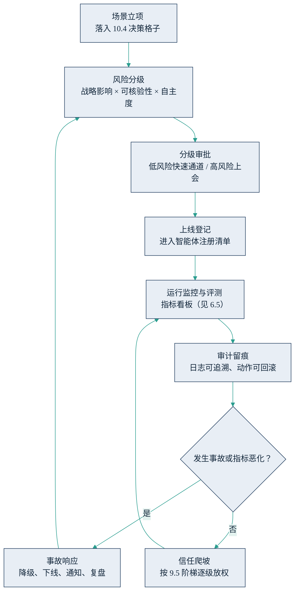

## 12.3 企业 AI 治理体系

一种常见的误解把治理当成刹车：合规部门设卡，业务部门绕行，AI 项目在审批队列里慢慢冷却。实际恰恰相反——治理是加速器。没有治理的企业，每一次放权都是一次赌博，管理层只敢让智能体永远停留在“出建议”；治理完善的企业，因为知道错误会被拦截、损失可以回滚、责任有人认领，才敢把真实业务放心交给智能体，才敢沿着 [9.5](../09_landing/9.5_trust_control.md) 的授权阶梯往上走。道理与刹车相同：刹车系统越好的车，才敢开得越快。

### 12.3.1 治理体系的六个要件

**责任地图。** 每个在产智能体必须有唯一的责任人，审批者即担责者：谁批准上线、谁批准提级授权，谁就为相应后果负责。智能体可以执行，但不能担责——签字权永远在人；责任写不清楚的场景，就是还没到上线时候的场景。

**智能体注册清单。** 一份在产智能体台账，登记用途、责任人、模型与版本、可访问的数据与工具权限、自主度等级、上线日期、评测与事故记录。没有登记，就没有治理——绕开台账私自上线的“影子智能体”，是内部审计的第一目标。这份清单同时是 [12.2](12.2_regulation.md) 合规台账的载体：当监管或客户问起“你们有哪些 AI 系统、各处于什么风险等级”，答案应当能够一键导出。

**按风险分级审批。** 与[第 10.4 节](../10_strategy/10.4_decision_matrix.md)的决策格子直接联动：战略影响与可核验性决定场景落在哪个格子，再叠加 [12.1](12.1_risk_map.md) 的自主度维度，就得到审批分级——低风险场景走快速通道，部门内审批、模板化上线；高风险场景上治理委员会。分级的要义不是把所有项目都管起来，而是把审批力气花在刀刃上：让八成低风险场景比没有治理时跑得更快，才能换来对两成高风险场景管得更严的组织耐心。

**审计留痕与可回滚。** 把 9.5 的项目实践升格为统一标准：日志留存的范围、时长与稽核责任方写进制度，高风险动作强制设计撤销机制或冷静期。留痕的价值在事后：“出了什么错、为什么、谁该改什么”，只有可追溯才可改进。

**人工审批节点。** 制度明确哪些动作必须过人的手：对外承诺与定价、资金变动、人事决定、合规敏感输出。节点可以随信任积累动态放宽，但放宽本身要走变更审批，而不是项目组自行决定——这是“人在环上”从原则变成制度的关键一步。

**事故响应预案。** 分级响应标准、一键下线开关、内外部通知义务、限期复盘。与[第 9.6 节](../09_landing/9.6_exit_discipline.md)的复盘纪律衔接：事故不是治理的失败，掩盖事故才是；每一次复盘都应沉淀为评测集的新用例与制度的新条款。

六个要件不是六份孤立的文件，而是一个运行闭环：场景从立项落格开始，经分级审批、登记上线、监控审计，最终在事故响应或信任爬坡中回到起点。

图12-4 企业 AI 治理闭环示意

### 12.3.2 四原则如何升格为制度

[第 9.5 节](../09_landing/9.5_trust_control.md)给出了项目级的四条可信可控原则，并预告了与本节的衔接。当试点从一个变成十个，项目组的自觉必须升格为企业的制度，对应关系是：人在环上，升格为分级授权与责任归属制度（责任地图＋人工审批节点）；权限最小化，升格为统一权限矩阵与审批流（注册清单中的权限字段）；全程可回滚留痕，升格为企业级审计日志标准；小场景起步，升格为按风险分级的立项与评审制度。

这个顺序本身就是方法论。治理制度不应从零起草，而应把已被试点验证的实践写成条文——从纸面出发的治理往往悬空，从项目实践升格的治理自带可行性证明。反过来，制度一旦建立，又降低了每个新试点重新发明护栏的成本：治理与落地互为加速。

### 12.3.3 国际参考框架

两个国际框架可作对表之用，一笔带过。[NIST《人工智能风险管理框架》](https://www.nist.gov/itl/ai-risk-management-framework)（AI RMF）以治理、映射、测量、管理四大职能组织风险活动，免费公开，适合作为跨团队对齐风险语言的工具，2024 年另有生成式 AI 专项指南；[ISO/IEC 42001](https://www.iso.org/standard/81230.html) 是可认证的 AI 管理体系标准，适合需要向海外客户或供应链证明治理水平的企业。两者都只是骨架——填进骨架的场景清单、风险分级与审批规则，只能来自企业自己的业务。治理体系的成熟度，最终不看引用了哪个框架，而看那张注册清单是否真实、那个闭环是否真的在转。
